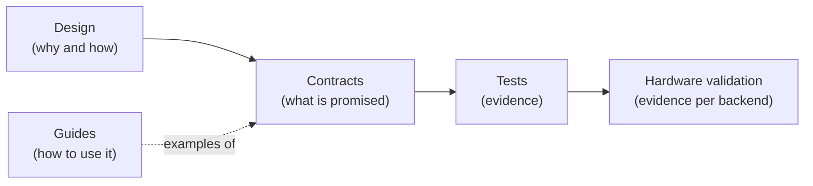

# Contracts

The guides show how to use Tack. The contracts state what Tack promises:
what is guaranteed, what the caller must ensure, and what happens when
either side gets it wrong. When a guide and a contract disagree, the
contract governs. When a contract and the code disagree, the discrepancy is
a defect to report, not a reading to choose between.

!!! warning "Status"

    The [kernel language contract](../reference/language-contract.md) is a
    **draft under review**. It was baselined at `05174e1` and last updated
    for the fifth numerical-semantics increment on 2026-10-03. The other
    three pages describe release candidate `745e01f`. Their statements are
    read from the source at that hash and cite where each one lives.

## How to read a contract

Every statement in a contract carries one of five labels. The language
contract defines the first four in its
[Status and interpretation](../reference/language-contract.md#status-and-interpretation)
section:

| Label | Meaning |
|---|---|
| **Required** | "An intended correctness property. A current violation is a compiler defect, including when existing examples happen to work." |
| **Current behavior** | "Describes the implementation without making that behavior a permanent language guarantee." |
| **Proposed** | "A policy this draft recommends but that needs agreement before becoming a public guarantee." |
| **Open** | "No portable result is promised by this draft for that case. An open decision is not permission to change existing behavior silently." |
| **Required caller constraint** | An obligation on the program, not on Tack. Violating it leaves the result outside the contract. Tack does not promise a diagnostic, so a missing diagnostic is not a defect. |

The fifth label covers obligations that the language contract states as
"access only in-bounds elements and initialized values; write only to
writable storage". It is the counterpart of **Required**. A failed
**Required** property is a bug in Tack. A violated caller constraint is a
bug in the program, even when Tack happens to produce the expected answer.

Two more conventions apply on every contract page:

- **Errors are part of the contract.** When a page says that something is
  *rejected*, it names the exception type and where the exception is
  raised: at decoration, at first dispatch, on every dispatch, or at
  inspection. It also gives the shape of the message. A rejection raised
  before compilation or launch leaves field storage unchanged.
- **Current behavior is not a promise.** It is recorded so that you can
  rely on it today and so that any change to it is deliberate. Don't build
  a portable program on a **Current behavior** item when a **Required**
  item or a caller constraint covers the same ground.

## The map

| Contract | Scope | Status |
|---|---|---|
| [Kernel language contract](../reference/language-contract.md) | What a kernel means: supported constructs, execution and ordering, memory and aliasing, integer and floating-point semantics, reductions, workgroups, atomics and specialization identity. Regression IDs LC1–LC8 | Draft under review, normative for the compiler hardening work |
| [Backend capabilities](backend-capabilities.md) | The `Backend` base class, the meaning of each capability attribute, the capability matrix for each backend, and what each capability rejects and when | Describes `745e01f` |
| [Runtime API](runtime-api.md) | `tack.init`, fields and their host operations, reductions, pointer and DLPack interop, `tack.inspect`, the decorators, kernel call rules, environment variables and exception types | Describes `745e01f` |
| [Conformance and validation](conformance.md) | How each contract area is tested, which oracles the tests use, how a hardware validation is run and recorded, and the current status of each backend | Describes `745e01f` |

The language contract is long because it defines semantics. The other three
pages are shorter and more mechanical. They describe the surface around the
language, and you can check most of their statements by reading one
function.

## Contracts and the rest of the documentation

- **[Design](../design/index.md)** explains *why* Tack is built the way it
  is and *how* the implementation meets its contracts. For example,
  [Specialization and Caching](../design/specialization-and-caching.md)
  explains why the variant key includes baked shape constants, while the
  contract says only that reusing a variant must behave like a fresh
  compile.
- **Contracts** say *what* is promised. They describe a mechanism only when
  it is observable, such as which pass raises an error.
- **Tests** are the evidence. [Conformance](conformance.md) maps each
  contract area to its test modules. Expected values come from independent
  oracles, such as Python integers, NumPy, exact rationals and reference
  renders, and never from recording Tack's own output.
- **Hardware validation** is the evidence that a backend meets the contract
  on a real device. A CPU run doesn't validate GPU execution, and a
  host-side syntax check of generated GPU source doesn't validate device
  behavior.
- **Guides** ([User's Guide](../users-guide/index.md) and
  [Developer's Guide](../developers-guide/index.md)) are examples. They
  aren't an exhaustive specification, and parts of them predate the
  contracts.

## Changing a contract

- A change to a **Required** item, or a decision on an **Open** item,
  changes the contract text and its tests together. The language contract
  says this explicitly for device assertions, and the rule applies
  everywhere.
- Don't waive a failing numerical case by marking it as an expected
  failure. The [regression baseline](../reference/language-contract.md#regression-baseline)
  keeps LC1–LC8 as ordinary assertions.
- Report a discrepancy between code and contract. Don't resolve it by
  editing whichever side is easier. The language contract is under human
  review, and changes to it go through that review.
