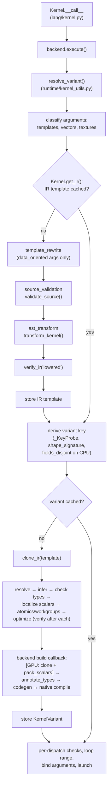

# Compilation Pipeline

This page follows one kernel call from `Kernel.__call__` to a running
native kernel. For each stage it names the module and function responsible,
what the stage takes in and hands on, the invariants it establishes, and
what it rejects. It is the "how" behind the
[kernel language contract](../reference/language-contract.md). The
companion page [Specialization and Caching](specialization-and-caching.md)
covers the cache key in depth.

The pipeline has three tiers with very different lifetimes, and most of the
design follows from keeping them apart:

| Tier | Built | Keyed by | Lives in |
|------|-------|----------|----------|
| **IR template** | Once per *lowering specialization* | vector widths, texture extents, template structure | `Kernel._ir` / `Kernel._ir_cache` |
| **Compiled variant** | Once per *variant key* | argument types and categories, baked-in shapes, … | the backend's `_cache` |
| **Dispatch** | Every call | — | nothing is retained |

A warm call touches only the third tier and the key derivation that leads
to it. Validation, lowering, the IR passes, verification, code generation
and native compilation run only when something new is needed.

## Overview

## Stage 1: entry

**`Kernel`** (`packages/tack-core/src/tack/lang/kernel.py`). The
`@tack.kernel` decorator only captures the function. `Kernel.__init__`
reads its source with `read_source` (`lang/func.py`, a wrapper around
`inspect.getsource`), dedents it and parses it with `ast.parse`. Nothing
is validated or lowered at decoration time. If the source cannot be read
(a function created by `exec()`, a bare REPL, or `python -c` before
Python 3.13), `read_source` raises `RuntimeError` at once, naming the
function and chaining the `OSError`. A kernel is compiled from its source
text, so there is nothing to fall back on. `@tack.func` reads device
functions through the same helper.

**`Kernel.__call__`** asks `tack.runtime.dispatch.get_backend()` for the
active backend (initializing the CPU backend if none was chosen) and calls
`backend.execute(self, args, kwargs)`. Every backend's `execute` begins with
`resolve_variant()` in `packages/tack-core/src/tack/runtime/kernel_utils.py`
and passes it a backend-specific `build` callback. The CPU backend also
passes `specialize_disjoint=True`. HIP and Level Zero pass their own
`store_texture_shapes`, because their texture lowering depends on the device.

`Kernel.__call__` is also where errors get the kernel's name. It
translates them by exception type:

| Raised inside the pipeline | Reaches the caller as |
|---|---|
| `UnsupportedSyntaxError` | unchanged (it already names the kernel and source position) |
| `TypeError` | `TypeError("Kernel '<name>': …")`, chained to the original. A message that already starts with the kernel's name (argument count, backend dtypes, atomic targets) keeps it, so the name appears once |
| other `RuntimeError`, including `NotImplementedError` and `IRVerificationError` | `RuntimeError("Kernel '<name>' failed on <BackendClass>: …")`, chained, with any inner `Kernel '<name>': ` prefix removed. A message containing "compilation failed" is shortened to its `error:` lines |
| `AttributeError` caused by fields allocated by a different backend | `RuntimeError` explaining that `tack.init()` replaced the backend |
| anything else (`NameError`, `ValueError`, …) | unchanged |

## Stage 2: argument classification

`resolve_variant` first rejects keyword arguments with
`NotImplementedError`, which `Kernel.__call__` reports as a `RuntimeError`.
It then classifies the positional arguments. This runs on every dispatch:

- `_detect_template_args` finds `@tack.data_oriented` objects (anything
  with a true `_data_oriented` attribute) and records their parameter
  indices.
- `_expand_template_args` removes them and appends each template's field
  attributes and then its runtime (instance) scalars, each group sorted by
  attribute name, taking templates from the highest index down. This order
  matches the parameters that `rewrite_templates` appends, which is what
  lines the expanded argument tuple up with the IR's parameter list.
- `_detect_vector_fields_from_args` maps parameter names to `_vector_n` for
  `tack.Vector.field` arguments. `_detect_texture_fields` maps parameter
  names to `Texture3D.shape_3d`.

## Stage 3: the IR template

`Kernel.get_ir(vector_fields, template_args, texture_fields)` returns the
lowered, verified IR for this *lowering specialization*. Vector widths,
texture extents and template objects change what the frontend emits
(scalarized component loads, sampling code, inlined method bodies,
constants), so each combination gets its own template:

- with no vectors, textures or templates, the single `Kernel._ir`;
- otherwise `Kernel._ir_cache[key]`, with
  `key = Kernel._make_cache_key(vector_fields, template_args, texture_fields)`.

Lookups are lock-free. A miss takes the module-level `_transform_lock` (an
`RLock`) and checks again before building, so concurrent first calls lower
a template once. Building is `_verified_transform`: `transform_kernel(...)`
followed by `verify_ir(function, 'lowered')`. A template that fails
verification raises before it is stored, so it is never cached.

### 3a. Template rewrite

For `@tack.data_oriented` arguments, `rewrite_templates` in
`packages/tack-core/src/tack/lang/template_rewrite.py` works on a deep copy
of the kernel's Python AST, before any IR exists. `classify_template_attrs`
sorts the object's public attributes three ways:

- class-level numeric attributes become `ast.Constant`s (compile-time
  constants);
- instance numeric attributes and `Field` attributes become synthetic
  parameters;
- `@tack.func` methods are resolved with `self` removed, into a map local
  to this transformation.

Generated method calls carry a `_tack_template_call` marker, so a user
function that happens to share the generated spelling stays distinct.
Synthetic names are reserved with `fresh_name` against every name in the
kernel and its methods. The IR and the code generators never see a
template object. The rewrite rules are in
[Template System](../developers-guide/07-templates.md).

### 3b. Source validation

`transform_kernel` constructs a `KernelTransformer`. Its `visit_Module`
calls `validate_source()`
(`packages/tack-core/src/tack/lang/source_validation.py`) on the kernel's
`FunctionDef` before lowering a single statement. `_SourceValidator` is an
allow-list visitor. Its `generic_visit` rejects every AST node type not in
`_SUPPORTED`, and dedicated visitors handle the constructs whose support
depends on context. Among other things it rejects:

- parameters that are not plain positional ones, and default values;
- non-numeric constants, except docstrings and `print` labels;
- expression statements that are not calls, and keyword arguments;
- atomics and `barrier()` used as values, and `barrier()`/`thread_id()`
  with arguments;
- `for`/`while` with `else`, and literal zero or negative `range` steps;
- `break` out of the parallel loop, and `continue` outside a loop;
- `return` in a kernel, and `return` inside a loop in a device function;
- calls that are neither a statically bound `@tack.func` nor a kernel
  intrinsic (resolved through `CallBindings`, below).

Each rejection raises `UnsupportedSyntaxError`, a `NotImplementedError` and
so also a `RuntimeError`. The message names the kind (`Kernel` or
`Device function`), the function, the construct, and its line and column in
the captured, dedented source.

Validation exists because lowering is selective. Before it, the
transformer silently dropped statements it had no case for: an `assert`
vanished from the IR without a diagnostic (contract regression **LC4**).
Validating the *original* source, rather than relying on the transformer's
own fallbacks, also catches constructs the transformer would never visit,
such as statements after a `return` in a device function. See the
[source contract](../reference/language-contract.md#source-and-supported-constructs).

### 3c. AST transform

`KernelTransformer` (`packages/tack-core/src/tack/lang/ast_transform.py`)
lowers the validated AST to the tree of nodes defined in
`packages/tack-core/src/tack/lang/ir.py`. The decisions that matter for the
rest of the pipeline are these:

- **Loops.** The kernel body's one `for … in range(...)` becomes the
  single `IRParallelFor`, *normalized to start at zero*. A kernel without
  one, a second one, or one inside a top-level `if` or `while` raises
  `UnsupportedSyntaxError` at the definition or the loop
  (`_visit_parallel_for`). A nonzero start or a step
  is moved into the body as `i = start + idx * step`, because every backend
  launches its grid over `[0, n)` and never sees the start (regression
  **LC5**). Nested loops become `IRSequentialFor`, and their `range`
  arguments are captured into temporaries so they are evaluated once, on
  entry. `tack.ndrange(a, b)` or `(a, b, c)` becomes one parallel loop
  that keeps its dimensions (`dims`, `extents`), which each backend binds
  from a launch of that shape; workgroup kernels and four or more
  dimensions use a loop over the product with the indices recovered by
  `//` and `%` in the body (`lang/parallel_dims.py`).
- **Field indexing.** `f[i, j]` linearizes to `i * IRDimSize(f, 1) + j`.
  `f.shape[k]` and `len(f)` lower to `IRDimSize`. A dimension index that is
  not a literal is rejected.
- **Vectors.** Vector expressions are scalarized into per-component names
  (`_component_name`), and a vector-field load expands into one load per
  component.
- **Evaluation order.** `_visit_ordered` and `_capture_value` hoist the
  statements produced by expression-level inlining (`_pre_stmts`). When a
  later operand has side effects, they capture earlier operands into
  temporaries first. Together they preserve left-to-right evaluation.
- **Statements outside the loop.** `_visit_body` checks each statement
  lowered outside the parallel loop with `_check_outside_parallel_loop`.
  A field or array store, atomic, barrier, block reduction or `print`
  there raises `UnsupportedSyntaxError` at its source position, since such
  statements may run any number of times per launch. The check runs on the
  lowered statement, so effects arriving through inlined device functions,
  template methods, vector stores or tuple unpacking are caught too, and
  nested bodies are checked first, so the position is the innermost
  statement's. See
  [Parallel Execution](parallel-execution.md#statements-outside-the-parallel-loop).
- **`continue`.** `_mark_outermost_continues` flags each `continue` that
  belongs to the parallel loop, so code generators end the iteration rather
  than the kernel (regression **LC8**).
- **Unbound names.** `_check_names_bound` raises `NameError` when a name is
  read but never bound. The message gives the source position and, if the
  read came from an inlined device function, its name. Kernels do not
  capture Python values from the enclosing scope.

`KernelTransformer.visit` turns any `NotImplementedError` raised during
lowering into an `UnsupportedSyntaxError` with the kernel name and the
node's position, so the transformer's own refusals read like the
validator's.

### 3d. Device-function binding and inlining

`CallBindings` (`packages/tack-core/src/tack/lang/call_bindings.py`)
answers "what does this call name refer to?" statically. A bare name is
looked up in the defining function's closure cells and then in its
globals. An attribute is followed only through module objects
(`vars(module)`), never by evaluating a property or an arbitrary
expression. A name that the function assigns, or binds as a parameter, is
*dynamic* and shadows any outer binding.

A name that resolves to a `Func` is a device function to inline. An
unbound bare name, or a name bound to the same-named object in `builtins`,
`math` or `tack`, is an intrinsic; lowering then decides whether it knows
it. Anything else raises `NotImplementedError` ("not a statically bound
@tack.func or a supported kernel intrinsic"), which surfaces as
`UnsupportedSyntaxError`.

`_inline_func_body` then works through these steps:

1. Build `CallBindings` for the *callee's* namespace, and validate its
   original `FunctionDef` with `validate_source(kind='Device function')`.
2. Reject arity mismatches (`TypeError`) and recursion (`_active_funcs`).
3. Allocate fresh names for parameters, locals and return slots.
4. Restructure returns with `_structure_returns`, so every `return` is the
   last statement on its path. Statements after an `if` that returns are
   copied into its branches (regression **LC7**).
5. Rename the body with `_NameRenamer`, which also turns each `return`
   into assignments to the result slot or slots.
6. Emit parameter assignments (`__<func>_<param>_<N>__ = <arg>`), except for textures
   and shared or local arrays, which are aliased directly.
7. Lower the renamed body with the callee's bindings active.

Bindings are consulted when an IR template is built. A cached template
keeps the inlined bodies, so rebinding a device function later does not
update existing kernels. The contract asks callers to recreate the kernel
instead.

### 3e. Fresh names and identifier encoding

Every generated name (`__eval_N__`, `__step_idx_N__`, inlined locals,
template parameters, vector components, scalar packs, localized scalars)
comes from `fresh_name` in `packages/tack-core/src/tack/lang/ir_names.py`.
It appends a deterministic suffix until the spelling is unused. The IR
therefore keeps Python's own names and never collides with a user binding.

Target-language spelling is a separate, later concern, handled in
`packages/tack-core/src/tack/codegen/identifiers.py`:

- `kernel_entry_name` encodes the kernel name for every backend. That
  includes LLVM: llvmlite's symbol lookup needs ASCII, and a kernel must
  not collide with a libm symbol.
- The GPU generators call `rename_gpu_bindings`. It returns a codegen-only
  copy (`transform_ir(..., copy_nodes=True)`) in which every binding is
  `tack_var_` plus an injective encoding. ASCII identifiers keep a readable
  form with `_` and `Z` escaped; everything else becomes UTF-8 hex.

No vendor keyword lists are consulted. A parameter called `float` or
`threadIdx` is simply encoded.

### 3f. Lowered verification

`verify_ir(function, 'lowered')` checks the newly built tree (see
[the verifier table](#verification-at-pass-boundaries)). Its failures are
compiler bugs rather than user errors. It runs once per IR template.

## Stage 4: variant key derivation (every dispatch)

With the template in hand, `resolve_variant` takes these steps:

1. It calls `check_workgroup_support` on the template. Backends that
   declare `supports_workgroups` return at once. On the CPU, the set of
   workgroup primitives the kernel uses is memoized on the template
   (`_workgroup_features`), and using any of them raises
   `NotImplementedError`.
2. It infers argument types on a **`_KeyProbe`**, a stand-in carrying a
   fresh list of `_ProbeParam`s, by running `infer_param_types` and the
   backend's `store_texture_shapes` on it. The template's own parameters
   are not written to. Otherwise two threads dispatching the same kernel
   with different dtypes could read each other's annotations between write
   and read, and fetch a variant compiled for the other call's types.
3. It computes `shape_signature(template, name_to_field)` and, on the CPU,
   `fields_disjoint(template, effective_args)`.
4. It builds the key with `kernel_variant_key` and looks it up in the
   kernel's slot of `backend._cache`.

What goes into the key, and why, is the subject of
[Specialization and Caching](specialization-and-caching.md).

## Stage 5: variant construction (miss only)

On a miss, `resolve_variant` runs the common passes on a private copy. The
order matters: each step relies on annotations an earlier one established,
and each verification boundary rechecks the whole tree.

| # | Step | Function | Establishes | Rejects |
|---|------|----------|-------------|---------|
| 1 | Copy | `clone_ir(template)` | a private, fully independent IR graph | — |
| 2 | Resolve | `resolve_ir` (`lang/ir_resolve.py`) | every `IRDimSize` outside the parallel loop's end becomes a constant, following `@tack.func` field aliases; `shared_like`/`local_array_like` dtypes and texture extents are filled in | unknown field: `RuntimeError` |
| | | `verify_ir(…, 'resolved')` | | |
| 3 | Infer | `infer_param_types` (`lang/type_inference.py`), `store_texture_shapes` | `type_annotation`, `_is_field`, `_is_texture` and `_texture_shape` on every parameter | wrong argument count or unsupported argument type: `TypeError` |
| | | `verify_ir(…, 'inferred')` | | |
| 4 | Check types | `check_dispatch_types` | every field dtype is in `backend.supported_dtypes` | `TypeError` naming the kernel, parameter, dtype and backend |
| 5 | Localize scalars | `_localize_outer_scalars` (`runtime/kernel_utils.py`) | a scalar parameter, or a local bound before the loop, that the loop body assigns to becomes a fresh local, seeded at the top of each iteration (regression **LC6**) | — |
| | | `verify_ir(…, 'localized')` | | |
| 6 | Atomics | `check_atomic_support`, `check_atomic_alignment` (`lang/atomic_support.py`) | each atomic target is a global field parameter of a dtype the backend supports, and suitably aligned | `TypeError` (target or dtype), `ValueError` (alignment) |
| 7 | Workgroups (GPU) | `check_workgroup_participation`, `check_workgroup_launch` (`lang/workgroup_participation.py`) | collectives sit in provably uniform control flow; records whether the variant needs full 256-lane groups | `ValueError` |
| 8 | Optimize | `optimize_ir` (`lang/ir_optimize.py`) | conservative copy propagation only | — |
| | | `verify_ir(…, 'optimized')` | | |
| 9 | Record | `ir_func.disjoint_fields = disjoint` | the CPU no-overlap promise, for codegen | — |
| 10 | Build | the backend's `build(ir_func, effective_args)` | see below | backend compiler errors |

Scalar localization runs after inference because it needs `_is_field`. It
runs before packing because packing rewrites every read of a scalar
parameter into a load from the pack buffer, so on GPU an assignment to that
name would otherwise be lost. Outer locals are renamed for a different
reason: on the CPU the statements before the loop run once per chunk, so
without a per-iteration copy an iteration's assignment would carry into
the next iteration of its chunk. The rename deliberately skips the parallel
loop's `end`, which must keep naming the parameter for host evaluation.

Copy propagation is the only Tack-level optimization. Loop-invariant code
motion and common-subexpression elimination were removed because they
lacked memory and control-flow safety analysis. An invariant address is
not an invariant value, and hoisting out of a zero-trip loop changes
behavior (regression **LC1**). LLVM and the vendor compilers still
optimize the generated code. [IR Passes](../developers-guide/04-ir-passes.md)
describes each pass in detail.

### The backend build callback

| Backend | Build steps | Code generator | Native compilation |
|---------|-------------|----------------|--------------------|
| CPU | `annotate_types` → `verify_ir('typed')` | `generate_llvm_ir` (`codegen/llvm_gen.py`) | `llvm.parse_assembly` and `verify()`, O3 pipeline, MCJIT, `get_function_address` |
| Metal | `clone_ir` → `pack_scalars` → `verify_ir('packed')` → `annotate_types` → `verify_ir('typed')` | `generate_msl_source` | `newLibraryWithSource_options_error_` (fast math off), then a compute pipeline |
| CUDA | same as Metal | `generate_cuda_source` | NVRTC → PTX → `cuModuleLoadData` |
| HIP | same as Metal | `generate_hip_source` | hipRTC → code object |
| Level Zero | same as Metal | `generate_opencl_source` | `oclocInvoke` → SPIR-V → `zeModuleCreate` |

GPU backends pack scalars on *another* clone. Packing rewrites the
parameter list, and dispatch needs the unpacked IR to evaluate the launch
range against the original arguments. `KernelVariant.ir` keeps the
pre-packing IR. The payload holds the compiled kernel, the `pack_info`,
and the pack buffers, which are allocated once per variant. The CPU
annotates the variant's IR in place, since nothing else reads it.

Annotation (`annotate_types` in `lang/ir_type_annotate.py`) can still
reject a program: a negative literal integer exponent and a non-f32 block
reduction both raise `TypeError`. Code generators re-check atomic support
and workgroup participation on their own input, because direct generation
can receive IR that no dispatch prepared.

The finished `KernelVariant(ir, payload, requires_full_workgroups,
atomic_targets, written_fields)` is stored under its key. `written_fields`
lists the index and name of each field argument the kernel may store to
(all of them when a store can't be traced), and the variant carries its
own `dispatch_lock`. If any step raised, nothing is
stored. The next call retries the variant (and fails the same way) rather
than finding it cached in a broken state.

## Stage 6: dispatch (every call)

On a hit or a miss, `resolve_variant` ends with the checks that depend on
this call's *values*. When the variant needs full workgroups,
`check_workgroup_launch` requires the logical count to be a multiple of
256. `check_atomic_alignment` checks the alignment of the current atomic
targets' storage, and `check_writable_fields` refuses a read-only field
(from `field_from_ptr` without `writable=True`, or a read-only DLPack
import) bound to a parameter in `written_fields`, with `ValueError`. The
backend then takes over:

1. It evaluates the launch count with `_get_loop_range(variant.ir, args)`.
   This interprets the parallel loop's `end` against the arguments, with a
   texture standing for its source field; it understands constants, scalar parameters, `IRDimSize`, and `+ - * //`
   over those. GPU backends return without launching when the count is not
   positive, and refuse a count past what one grid can index with
   `check_launch_size()` (`ValueError`).
2. It replaces each `Texture3D` argument with the storage the texture owns,
   its hardware image or private field (`bind_textures`).
3. On GPU, it writes the scalar values into the cached pack buffers
   (`_update_pack_fields`) and appends those buffers to the argument list.
   CUDA, HIP and Metal do this and the launch under the variant's
   `dispatch_lock`; Level Zero under its backend `_launch_lock`.
4. It launches. The CPU backend chooses between a serial call and its
   thread pool (see [CPU Threading Policy](cpu-threading.md)); GPU
   backends launch a grid.

## Verification at pass boundaries

`verify_ir(function, stage)` in
`packages/tack-core/src/tack/lang/ir_verify.py` is a read-only check of
one `IRFunction`. Every stage runs the structural checks, and later stages
add more. A failure raises `IRVerificationError` (a `RuntimeError`) that
names the kernel, the stage, the node kind and the structural path, for
example `function.body[0].body[2].value`.

| Stage | Called from | Adds |
|-------|-------------|------|
| *(all)* | — | every node is a registered kind in a valid role (statement, expression, parameter); required attributes are present; names are nonempty; operators come from the known sets; constants are numeric; no cycles; parameter names are unique; exactly one top-level `IRParallelFor`, starting at constant `0`; no field store, atomic, block reduction, barrier or print outside it; sequential loops sit inside it; `break` targets a sequential loop; each `continue`'s `outermost` flag matches its loop; no `IRReturn`; every name read is bound somewhere in the function |
| `lowered` | `kernel._verified_transform` | nothing further; a `shared_like` allocation may still lack its dtype |
| `resolved` | `resolve_variant`, `inspect` | no `IRDimSize` or `IRAttribute` outside the parallel loop's end; allocation dtypes are `ScalarType`s; texture extents are three positive integers |
| `inferred` | `resolve_variant`, `inspect` | every parameter has a `ScalarType` and a boolean `_is_field`; every field load, store and atomic names a field parameter, an allocation, or a pointer copy of one |
| `localized` | `resolve_variant`, `inspect` | rechecks the above after scalar localization |
| `optimized` | `resolve_variant`, `inspect` | rechecks the above after copy propagation |
| `packed` | GPU `_build_variant`, `inspect` | no scalar parameter remains |
| `typed` | every `_build_variant`, `inspect` | every scalar expression outside the host-evaluated loop end has a `ScalarType` `dtype`; comparisons, Boolean operations and `not` have `i32`; every assignment has a storage type or is a pointer copy |

The verifier deliberately does **not** prove definite assignment: its
binding check asks whether a name is bound anywhere in the function, not on
every path. Nor does it prove bounds safety, race freedom, barrier
uniformity, alias safety of future optimizations, or numerical
equivalence. Those remain the job of the contract tests, the differential
tests and hardware validation (see
[Conformance and Validation](../contracts/conformance.md)).

### Why verification runs only on misses

Verification walks the entire tree several times per variant, and for
large kernels such as the path tracer it is a noticeable part of cold
compilation. What it checks is a property of the IR, and a cached
variant's IR does not change, so re-verifying on a hit would re-prove a
fact already established for the same tree. The warm path therefore
performs no verification walks, and its cost does not grow with kernel
size. The price is paid once, on the first call of each variant.
Verifying incrementally, instead of rechecking everything at each
boundary, is a possible future saving that would keep every boundary's
guarantees.

## IR ownership: templates are immutable

The template returned by `get_ir()` is shared by every dispatch of every
variant built from it. Passes mutate IR in place: `resolve_ir` *replaces*
`IRDimSize` nodes with constants, inference writes annotations onto
parameters, and packing rewrites the parameter list. Running them on the
template had two failure modes, both seen before the current design:

- **Consumed nodes.** Once the first call had resolved a 2-D field's row
  stride into a literal, no `IRDimSize` remained for a second shape to
  resolve. The IR itself was stale, not only the compiled code.
- **Published annotations.** Annotations written onto shared parameters
  were visible to concurrent dispatches computing their keys.

So the template is treated as immutable. The only writes it ever receives
are memoized facts derived from its source alone (`_shape_deps`,
`_written_params`, `_written_flags`, `_workgroup_features`), which do not
depend on any call's arguments. All mutation happens on copies made by
`clone_ir`.

### `clone_ir` rather than `copy.deepcopy`

`clone_ir` in `packages/tack-core/src/tack/lang/ir_traversal.py` produces
the same result as a deep copy, faster for this kind of data:

- Registered IR node types (the keys of `CHILD_FIELDS`) are plain attribute
  containers. Cloning one is `object.__new__(kind)` plus a cloned
  `__dict__`, which skips `deepcopy`'s generic `__reduce_ex__`
  reconstruction for every node.
- *Every* attribute is copied, including pass annotations and metadata,
  not only the structural children. A clone is a complete, independent
  graph.
- One identity memo spans the whole graph, so shared nodes stay shared and
  cycles are preserved rather than duplicated. The sharing is real: an
  `ndrange` dimension node appears both in the loop's end and in its
  `extents`, and a range's start both in an extent and in the body.
- `ScalarType` instances keep their identity, because type maps compare by
  identity. This matches `ScalarType.__deepcopy__`. Other metadata falls
  back to `copy.deepcopy` with the same memo, and a keep-alive list stops
  object ids from being reused during the copy.

Structural cycles are still invalid IR. `clone_ir` copies them faithfully
and the verifier rejects them. Adding a node type with `__slots__` or a
custom copy protocol would mean revisiting this fast path.

The other two traversal primitives share `CHILD_FIELDS`, so all three agree
on what a child is and fail loudly (`TypeError: Unknown IR node`) on an
unregistered kind:

- `walk_ir(root)` yields nodes in preorder and raises `ValueError` on a
  cycle.
- `transform_ir(root, rewrite, copy_nodes=False)` rewrites children in
  postorder, in place. With `copy_nodes=True` it shallow-copies each node
  first, which is how `rename_gpu_bindings` makes its codegen-only copy.

## Inspection

`tack.inspect(kernel, *args, mode=...)`
(`packages/tack-core/src/tack/lang/inspect_kernel.py`) runs the same
pipeline without the cache and without a launch. `_prepare_ir` clones the
template and runs resolve, infer, the backend's `_store_texture_shapes`,
`check_dispatch_types`, localize, the atomic and workgroup checks,
optimize and annotate, with the same verification stages, so it rejects
what dispatch would and makes the same texture decision. For
`mode="source"` on a GPU backend it then packs and re-annotates (`packed`,
`typed`). On the CPU it computes the disjoint-fields bit for the given
arguments, so the LLVM it shows is the variant those arguments would run.
`mode="optimized"` is the CPU module after O3; on other backends it raises
`ValueError` once the kernel's own checks have passed. Inspection never
populates the variant cache.

## Related pages

- [Specialization and Caching](specialization-and-caching.md): the variant
  key and cache lifetime.
- [Principles](principles.md): translate-or-reject, specialization, and
  correctness by default.
- [Developer's Guide: AST Transform](../developers-guide/02-ast-transform.md),
  [IR](../developers-guide/03-ir.md),
  [IR Passes](../developers-guide/04-ir-passes.md),
  [Codegen](../developers-guide/05-codegen.md).
