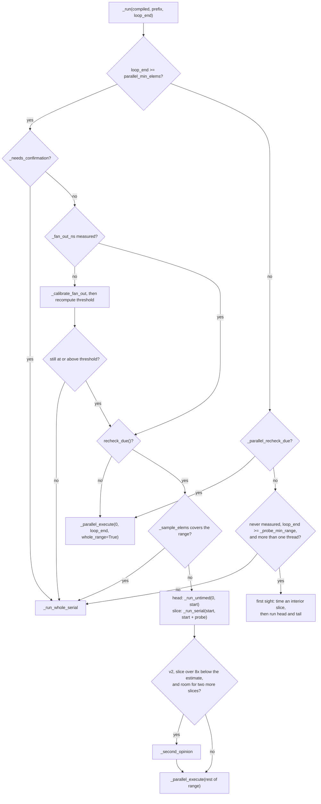

# CPU Threading Policy

Every CPU dispatch makes one decision before it runs: execute the loop range
on the calling thread, or split it into chunks and fan them out over a
persistent thread pool. This page explains how that decision is made, why,
and what is and is not promised about it.

The whole policy lives in `packages/tack-core/src/tack/runtime/cpu.py`:
per-kernel state on `CompiledKernel`, decision and measurement code on
`CPUBackend`, entered through `CPUBackend._dispatch`. The
[runtime chapter](../developers-guide/06-runtime.md) and the
[backends guide](../users-guide/08-backends.md#cpu) carry short versions.

!!! summary "In one paragraph"
    The backend compares two *measured* costs: how long this kernel takes per
    element when run serially, and how long it costs to wake the pool. Both are
    estimated continuously from real dispatches and folded into a per-kernel
    integer threshold (`parallel_min_elems`), so the decision is one integer
    comparison. Because each estimate can only be refreshed by one kind of
    dispatch, the policy periodically runs the *other* kind on purpose, so a
    wrong decision in either direction is eventually re-measured. Every path
    executes each loop index exactly once, so the decision affects speed only.

## The problem

### What a fan-out costs

`CPUBackend._parallel_execute` divides `[start, end)` into `num_threads`
contiguous chunks of `ceil(total / num_threads)` elements and submits one
`call_range` per chunk to a `ThreadPoolExecutor`. The compiled kernel is
called through ctypes, which releases the GIL for the call, so chunks run
concurrently while the calling thread waits on the futures. Arguments are
marshalled once per dispatch (`CompiledKernel.bind`); only the loop bounds
differ between chunks.

Creating futures, waking threads, re-acquiring the GIL and joining costs on
the order of a hundred microseconds or more. `_calibrate_fan_out`'s
docstring records an empty probe at 223 µs against a real 1024-element
fan-out at 235 µs, on the 10-core Apple silicon machine the policy was first
written on (August 2026). A fan-out pays only when the serial run it
replaces takes meaningfully longer.

### Why no fixed threshold works

The module docstring records the crossover — the range above which a fan-out
wins — for three f32 kernels on that machine:

| Kernel body | Character | Crossover |
|---|---|---:|
| `out[i] = x[i]*2 + 1` | memory bound | ~4,000,000 |
| `sqrt(..) + sin(..)` | ~10 flop/element | ~130,000 |
| 20-iteration inner loop | ~120 flop/element | ~4,000 |

The break-even moves by three orders of magnitude with arithmetic intensity,
so any element count is wrong for most kernels. The original policy threaded
every range above 1024 elements, below all three: for the memory-bound kernel
a 65,536-element dispatch took 30.7 µs serially and 262.3 µs threaded, and
threading won only at 4,194,304 elements (559 µs against 485 µs).

A threshold in elements also silently encodes the thread wake-up cost and
timer resolution of the machine it was chosen on. So the module writes down
no thresholds in elements or nanoseconds, only *ratios* — how much margin to
demand, how much of a sample to trust, how far one sample may move an
estimate — which carry across machines.

### What a wrong decision costs

| Error | What happens | Size |
|---|---|---|
| **Over-eager**: fanned out, serial would have won | The dispatch pays a whole fan-out to save less than that | Up to ~10x slower per dispatch in the measurement above, on every dispatch while the estimate stays wrong |
| **Under-eager**: ran serially, parallel would have won | Speedup not taken | Bounded by the serial run; near the crossover, small by definition |

The asymmetry shapes the design. Where the policy must err, it errs toward
serial: estimates that are too high are distrusted, estimates that are too
low are believed, and priors for the fan-out cost are pessimistic.

## The cost model

### Two paths, one crossover

With serial rate `r_s` (ns per element), fan-out cost `F`, and aggregate
parallel rate `r_p` (ns per element of the whole range when fanned out):

```
serial ≈ n · r_s      parallel ≈ F + n · r_p      crossover n* = F / (r_s − r_p)
```

`CPUBackend._min_elems` stores the crossover scaled by a margin `M`:

```
parallel_min_elems = max(num_threads, int(F · M / rate))
    v1: rate = r_s        v2: rate = r_s − min(r_p, 0.9 · r_s)
```

**v1** assumes perfect division of the work, `parallel ≈ F + T_serial / P`,
and drops `r_p`. Its margin of 2.0 (`_PARALLEL_BREAK_EVEN`) covers the
break-even factor `P / (P − 1)` for any thread count. But real kernels do not
reach speedup `P`: the effective speedup `P_eff = r_s / r_p` ranged from 1.5
to 9.2 across the kernels measured in the module's comments, and the margin
v1 really applies is `M · (1 − 1/P_eff)`. For a bandwidth-bound kernel with
`P_eff ≈ 1.5` that is 0.67 — below break-even, so the fan-outs it permits
near the crossover lose.

**v2** keeps `r_p`. Until a fan-out has measured it, `r_p` is 0.0 and the
expression is exactly v1's, so "not measured yet" needs no special case. The
`0.9 · r_s` clamp keeps the denominator positive when a noisy `r_p`
approaches `r_s`, and caps a v2 threshold at ten times v1's for the same
inputs.

The `max(num_threads, …)` floor keeps chunks at one element or more. An
unmeasured kernel, or a one-thread backend, gets `_NEVER` (`1 << 62`).

### The margin

| Policy | `_margin()` |
|---|---|
| v1 | `_PARALLEL_BREAK_EVEN` = 2.0 |
| v2 | `clamp(1 + _MARGIN_K · cv, _MARGIN_MIN, _MARGIN_MAX)` = `clamp(1 + 1.3 · cv, 1.0, 2.5)` |
| either, with `TACK_CPU_MARGIN` set | that value |

A margin insures against mis-estimates, so v2 sizes it by how unreliable the
estimates currently are. `cv` is a smoothed relative deviation of new fan-out
samples from the stored estimate (`_update_fan_out_knot`; weight
`_CV_SMOOTHING` = 0.10, one sample capped at `_CV_SAMPLE_CAP` = 3.0).
`_margin()`'s docstring records why: on one machine, a quiet run wanted the
smallest margin tried while a loaded run needed at least 1.5.

Before any fan-out sample has been compared, `cv` is 0 and v2's margin is
1.0. `_V2_MARGIN` (1.5) is stored as `CPUBackend.margin` under v2, but
`_margin()` returns that attribute only under v1.

### One integer compare on the hot path

`parallel_min_elems` is stored on the `CompiledKernel`, so the common case in
`_run` is a single `loop_end >= compiled.parallel_min_elems`. `_set_serial_cost`
recomputes it after every timed serial run and every v2 fan-out (through
`_record_parallel_cost`); `_run` recomputes it after the first calibration.

Being cached, the threshold is priced with the fan-out estimate *at the
moment it was recomputed*. The comment in `_dispatch` makes the trade
explicit: a fresher estimate could only have changed the next decision. The
paths that call `_fan_out_estimate()` directly — `_serial_is_affordable`,
`_sample_elems`, `_run_untimed`, `_parallel_recheck_due` — read the current
value.

## What is measured, and how

### Serial rate: `ns_per_elem`

`_run_serial` times one `call_range` with `time.perf_counter_ns()` and
subtracts the kernel's fixed per-call cost:

```
sample = max((elapsed − call_overhead_ns) / elements, _MIN_NS_PER_ELEM)
```

`call_overhead_ns` is measured once per compiled kernel by
`_measure_call_overhead`, the minimum of five calls on an empty range. An
empty range runs no iterations, so the probe is safe on any kernel, including
ones that accumulate with atomics. Without the subtraction the call's cost is
charged as per-element work; the comment in `_run_serial` records a cheap
kernel reading 2.6x too expensive and fanning out where serial was faster.
`_MIN_NS_PER_ELEM` (1e-3) keeps an all-but-empty kernel reading as measured.

The raw sample is kept in `last_sample`; the estimate moves asymmetrically,
with weight `_COST_SMOOTHING` (0.25) and outlier ratio `_MAX_SAMPLE_RATIO` (8):

| Sample vs. estimate `prev` | New estimate | Why |
|---|---|---|
| no estimate yet | the sample | nothing to smooth against |
| more than 8x higher | `prev + 0.25 · (8·prev − prev)` = 2.75x `prev` | usually a descheduled run; a real rise still arrives in a few dispatches |
| more than 8x lower | the sample, outright | easing down from a far-too-high estimate would keep losing fan-outs for thousands of dispatches |
| otherwise | `prev + 0.25 · (sample − prev)` | ordinary smoothing |

Under v2, two more rules depend on whether the range was **scattered**.
`CompiledKernel.scattered` is true initially and after any fan-out, and is
cleared when a serial run covers the whole range. A serial run over a
scattered range first pulls data back from other cores' caches, or faults in
untouched pages, so its sample is an upper bound:

- A **clean** sample sets `rate_confirmed`; the first clean sample, if lower
  than the smoothed result, is believed outright.
- A **scattered** sample may lower the estimate but not raise it, while a
  serial run of the current range is [affordable](#confirmation-and-affordability).
  Where serial is expensive, a rise is real evidence and is kept.

`_set_serial_cost` then floors the estimate at `serial_floor_ns`
([below](#parallel-rate-ns_per_elem_parallel)) and recomputes the threshold.

### How much to time: `_sample_elems`

A recheck times a slice, so measuring does not cost the dispatch its
parallelism. The slice targets a *duration* — work worth
`_SAMPLE_OVERHEAD_RATIO` (10) times the fixed call cost being subtracted —
which is two elements of an expensive kernel or thousands of a cheap one.

Sizing a sample from the estimate it is meant to check is circular, so two
guards override the target:

1. **At least 1/64 of the range.** Otherwise a corrupt-high estimate asks for
   a handful of elements, whose timing is nearly all fixed cost, which keeps
   it corrupt; the docstring records an estimate still 640x high after four
   dispatches of three-element samples.
2. **Timed whole if a fan-out would cost as much.** The test is
   `loop_end · guard_rate ≤ _fan_out_estimate()`, with
   `guard_rate = max(serial_floor_ns, min(rate, _PROBE_REFERENCE_NS_PER_ELEM))`.
   Believing the estimate only up to the 24 ns/element reference rate stops a
   corrupt-high estimate from forcing a too-short slice on a small range; a
   trusted parallel rate lifts the cap, so a genuinely expensive kernel is
   not re-run whole on every recheck. The docstring records the old
   element-count guard making every 384² frame of a 3500 ns/pixel volume
   renderer recheck as a whole-frame serial run (0.75 s against 100 ms
   threaded).

### Fan-out cost: `_fan_out_ns` and the idle curve

**Calibration.** The first time a range looks worth threading,
`_calibrate_fan_out` fans out *empty* ranges through the real path five times
and stores the minimum as `_fan_out_ns`. A pure-Python no-op probe would
understate it (the docstring: 122 µs against the real path's 223 µs). Until
then `_DEFAULT_FAN_OUT_NS` (200 µs) stands in, high on purpose so being wrong
only delays the first fan-out. Under v1, `_fan_out_ns` is the fan-out cost
for the life of the backend.

**The idle curve (v2).** A dispatch after a pause pays more than one after
another fan-out, because idle cores descend into deeper sleep states, and the
shape differs by machine. The comment on `_FAN_OUT_GAPS_MS` records idle
fan-outs at 2.45x the back-to-back cost on a 2-socket Xeon and 3.81x on an
M1 Max (August 2026), the Xeon's penalty complete by 10 ms and the M1 Max's
still growing at 50 ms; `_FAN_OUT_IDLE_PRIOR`'s comment adds 2.1x on a
1-socket Xeon (October 2026). So v2 keeps the cost as a curve over
*idleness*, with knots at 0, 10 and 50 ms.

`_fan_out_estimate()` takes the gap since `_last_dispatch_ns` — set at the end
of every v2 fan-out and refresh, and not by serial runs, which leave the
workers idle — and interpolates piecewise-linearly with two rules on read:

- **Monotone.** A longer pause cannot make threads wake faster. This is
  imposed on read, not on the stored knots: enforced on storage it made the
  curve a ratchet that could only rise (comment at the end of
  `_record_fan_out`).
- **Unmeasured knots are steps.** A knot still holding its prior prices only
  gaps at or beyond it; ramping toward it priced a dispatch's own preamble as
  partly idle.

**Seeding without sleeping.** The hot knot is the median of three empty
fan-outs taken after the calibration reps (the first reps also start the
pool's threads and read high). The idle knots start at `_FAN_OUT_IDLE_PRIOR`
(4x hot, above every ratio measured), marked unmeasured, and each is replaced
by the first fan-out measured nearest it and moved to the gap where that
happened (`_update_fan_out_knot`). The previous design calibrated them by
sleeping through each gap: 180 ms of `time.sleep` inside whichever dispatch
first looked worth threading.

**Keeping it current.** A startup measurement records whatever the machine
was doing at startup, so two paths refine the curve:

- **Free samples:** `_record_fan_out`, after every v2 fan-out, takes elapsed
  time minus the slowest worker's span — both measured — when the work is at
  most `_FAN_OUT_MAX_WORK_SHARE` (35%) of the dispatch, where the subtraction
  is well conditioned. It updates the nearest knot with weight
  `_FAN_OUT_SMOOTHING` (0.15).
- **Scheduled samples:** `_refresh_fan_out`, after every v2 dispatch once a
  curve exists. If `_FAN_OUT_REFRESH_NS` (100 ms) has passed since the last
  measurement, or the knot nearest the current gap still holds its prior, it
  times one empty fan-out at the current gap. If the dispatch arrived cold
  (gap over 5 ms) and the hot knot is over `_FAN_OUT_HOT_REFRESH_NS` (1 s)
  old, it also warms the pool and records the minimum of three more as the
  hot knot.

Learning only from real fan-outs deadlocks: load raises the estimate, which
raises thresholds, which stops the fan-outs that would lower it. An empty
fan-out has no work to subtract, so it can always be measured. The refresh
runs after the dispatch, never before, so it neither delays the caller nor
disturbs what the dispatch measures.

### Parallel rate: `ns_per_elem_parallel`

Under v2, `_parallel_execute` times each worker *inside* the worker, around
its `call_range` only. A worker's own rate is roughly the serial rate — the
speedup comes from running chunks together, not from cheaper elements — so
`_record_parallel_cost` converts and smooths (weight 0.25):

```
r_p sample = median(worker ns/element) / workers_that_ran
```

counting only workers whose span reached `_RP_MIN_WORKER_NS` (1 µs).

- **Why in-worker timing.** `r_p` used to be inferred as
  `(elapsed − fan_out_estimate) / elements`, charging every fan-out error to
  `r_p`. Near the crossover, where work and fan-out are the same size by
  definition, no ratio guard could both admit samples and keep them honest.
- **Why the median.** The dispatch waits for its slowest worker, but under
  load the max is whichever worker was descheduled: `_record_parallel_cost`'s
  docstring records the max at 10–134x the fitted rate on a loaded M1 Max
  (August 2026), the median at 0.5–6.3x. The minimum worker and per-thread
  CPU time were tried on a 1-socket Xeon (October 2026) and scored worse;
  workers returning from ctypes together queue for the GIL, a real cost the
  median tracks.
  For an even number of workers it is the lower of the two middle values
  (`_worker_median`). The upper one of two workers is the slower worker,
  the max again: on a two-thread machine, stalling one worker for 2 ms
  raised the serial estimate of a 0.3 ns/element kernel 1900 times through
  the floor below, with no serial sample taken (October 2026). With two
  workers the lower median is the minimum, the statistic that scored worse
  on the Xeon across many workers; with two there is no third value, and
  the choice is between a statistic one preempted thread controls and one
  that misses the second worker's wait for the GIL. It has not been scored
  on a two-thread machine.

**The serial floor.** A fan-out cannot make an element cheaper than it is
serially, so `r_s ≥ r_p` — if `r_p` is trustworthy. Short spans are not: a
worker's clock stops only once it has the GIL back, and the comment on
`_RP_BOUND_SPAN_RATIO` records 256-element chunks of a 1 ns/element kernel
reading 60–340 ns/element across 16 workers. So a fan-out qualifies as a
bound only when its median measured span reaches

```
trusted_span = _RP_BOUND_SPAN_RATIO · workers · call_overhead_ns     (ratio 20)
```

and `serial_floor_ns` then becomes the *lesser* of that sample and the
smoothed `r_p`: one high draw could otherwise set the floor at the serial
rate, and the smoothed rate carries samples from short fan-outs.
`_set_serial_cost` applies the floor at once, so an estimate taken from a
cheap region is corrected on the first fan-out. The floor is still `P_eff`
below the true serial rate; it only stops a range the kernel has shown to
thread well from flipping to "too small to thread".

**Retiring the floor.** Runtime scalars and field contents can change the
work without a new compiled variant. When a whole-range fan-out
(`whole_range=True`) finishes with *every* worker span below `trusted_span` —
including spans too short to yield a rate — `_record_parallel_cost` clears
the floor and resets the recheck schedule, so the next parallel-bound
dispatch takes a fresh serial sample. A short median with one long worker,
or a fast head or tail of a recheck, cannot retire it.

### Confirmation and affordability

`_serial_is_affordable(compiled, n)` asks whether `n` elements cost at most
`_CONFIRM_BAND · margin · fan_out` (band 4) serially, priced from the serial
estimate alone; the docstring records two dearer prices that each switched
the mechanism off for the kernel it was built for.

`_needs_confirmation` (v2) uses it: while a kernel has never had a clean
sample, an affordable range above the threshold runs serially instead. A
first sample is never clean, and `_CONFIRM_BAND`'s comment records such
samples reading a bandwidth-bound kernel 3–4x dear on a 1-socket Xeon, a
first sample up to 15x. Confirmation costs at most two serial dispatches per
kernel and is checked before calibration, so a cheap kernel with a dear first
sample never pays to calibrate a fan-out it will not use.

## The decision procedure

`_dispatch` binds the arguments once, calls `_run`, and afterwards (v2, once
a curve exists) calls `_refresh_fan_out`. `_run` decides:



### Above the threshold

1. **Confirmation.** If `_needs_confirmation` holds, run the whole range
   serially, which gathers it on this thread so this sample or the next is
   clean.
2. **Calibration.** If this backend has never measured its fan-out, do it now
   (once per backend, shared by all kernels) and recompute the threshold; if
   the range now falls below it, run serially.
3. **Recheck.** `recheck_due()` counts parallel-bound dispatches and fires on
   the first, then after 2, 4, 8 … more, doubling to `_RECHECK_CAP` (1024) and
   then every 1024th. A recheck:
    - sizes a slice with `_sample_elems`, running the range whole and serially
      if the slice would cover it;
    - places it with `next_sample_start(loop_end − probe)`, which returns
      `room · frac(k · 0.618…)` for the kernel's k-th sample — a golden-ratio
      walk that spreads positions evenly however many samples there are,
      never repeats one early, and needs no random number generator;
    - runs the head `[0, start)` via `_run_untimed`, fanned out if
      `start · r_s` exceeds the current fan-out estimate, otherwise untimed on
      this thread;
    - times the slice with `_run_serial`;
    - under v2, calls `_second_opinion` if the slice read more than 8x below
      the previous estimate and two slices' worth of range remain;
    - fans out the remainder.
4. **Otherwise** fan out the whole range (`whole_range=True`).

`_second_opinion` exists because one slice cannot tell a workload that got
cheap from a cheap *region*. It runs on to the next golden-ratio position
(untimed, fanned out if that pays), times a second slice, and compares. If
both read far below the old estimate, the workload changed and the low
reading stands; otherwise the range is uneven, and the estimate moves a
quarter of the way from the old value toward the mean of the two slices.

### Below the threshold

1. **Parallel recheck (v2).** `_parallel_recheck_due` fires when the kernel is
   confirmed, `r_p` and the fan-out have been measured, and the range *would*
   fan out on the serial rate alone (`loop_end · r_s ≥ margin · fan_out`) —
   when `r_p` is what keeps it serial. It uses the same 1, 2, 4 … 1024
   back-off, counted separately (`serial_since_rp`, `rp_recheck_after`), and
   fans out the whole range. A range that size costs at least a margin's
   worth of fan-outs serially, so a losing recheck costs about one fan-out.
2. **Measured, or too small to probe:** run the whole range serially.
   `_probe_min_range()` is `max(num_threads, F · 2.0 / 24 ns)`, with `F` the
   calibrated or default fan-out — the range at which a hypothetical
   24 ns/element kernel (`_PROBE_REFERENCE_NS_PER_ELEM`) could repay a
   fan-out. Dearer kernels pay one serial dispatch before they have an
   estimate.
3. **First sight** of an unmeasured kernel on a range large enough to
   matter. A slice of `max(probe_min // 16, loop_end // 64)` elements is
   timed at the first golden-ratio position, a little past 60% of the way
   in, not at the front. If `_needs_confirmation` now holds, head and tail
   run on this thread (the tail timed). Otherwise each of head and tail fans
   out if it alone reaches the new threshold, else runs on this thread
   (head untimed, tail timed). If nothing fanned out, the range is marked not
   scattered. A backend that has not calibrated yet judges this against the
   200 µs default and calibrates on the next dispatch above threshold.

## Failure modes and their defenses

Each mechanism above exists because a specific failure was measured:

| Problem | Mechanism | Where |
|---|---|---|
| **Prefix bias.** An image's first rows are often background — 10–70x cheaper than the frame's average for a volume renderer (`next_sample_start`'s docstring) — so a sample from the front calls a frame that threads well too small to thread. | Interior golden-ratio positions for first sight and rechecks; a second opinion before believing a far-lower slice; a trusted parallel rate as a floor. | `next_sample_start`, first-sight branch of `_run`, `_second_opinion`, `_set_serial_cost` |
| **Corrupt-high estimates.** A preempted dispatch can time a thousand times the real cost; a high estimate then asks for short samples that are mostly fixed cost and read high again. | Rises above 8x capped at 2.75x per sample; slices at least 1/64 of the range; whole-range guard believes at most the reference rate. | `_run_serial`, `_MAX_SAMPLE_RATIO`, `_sample_elems` |
| **One-way door, threading side.** Only serial runs measure `r_s`, and threading stops serial runs; a corrupt-high estimate predicts an even slower serial run, so it cannot be caught against itself. | Rechecks on a geometric back-off that time a slice; a far-lower sample believed outright. | `recheck_due`, recheck branch of `_run` |
| **One-way door, serial side.** Only fan-outs measure `r_p`. Worker rates for identical fan-outs varied 8x on a 1-socket Xeon (October 2026), and one high draw held 6–34 M-element dispatches of a cheap kernel serial, up to 6x slower (`_parallel_recheck_due`'s docstring). | Parallel rechecks on the same back-off; the floor takes the lesser of sample and smoothed rate. | `_parallel_recheck_due`, `_record_parallel_cost` |
| **Scattered samples.** A sample after a fan-out, or on untouched pages, reads dear; believed, it keeps the backend fanning out, which keeps the next sample scattered. | `scattered` tracking; scattered samples only lower an affordable estimate; confirmation before the first near-threshold fan-out; first clean sample believed. | `scattered`, `rate_confirmed`, `_run_serial`, `_needs_confirmation` |
| **Stale floors.** A floor learned on expensive inputs survives when the same compiled kernel gets cheap inputs, and keeps it threading. | A whole-range fan-out with every span short retires the floor and schedules a serial sample. | `retire_floor` in `_parallel_execute`, `_record_parallel_cost` |
| **Fixed cost dominating short samples.** For a cheap kernel the call is most of a sample; for a short chunk the GIL hand-back is most of a span. | Call overhead subtracted; slices sized to 10x it; worker rates ignored below 1 µs; spans trusted as a floor only above `trusted_span`. | `_measure_call_overhead`, `_SAMPLE_OVERHEAD_RATIO`, `_RP_MIN_WORKER_NS`, `_RP_BOUND_SPAN_RATIO` |
| **Load, descheduling, a moving fan-out cost.** Load and idle states change the fan-out cost mid-program; a descheduled worker dominates a max; a high estimate stops the fan-outs that would lower it. | Idle curve; free and scheduled refreshes, including the hot knot's recovery probe; median worker; work-share condition; derived margin. | `_fan_out_estimate`, `_record_fan_out`, `_refresh_fan_out`, `_margin` |
| **Calibration dearer than the work.** Sleeping through idle gaps cost a 100k-element add a thousand times its own runtime (`_FAN_OUT_IDLE_PRIOR`'s comment). | Pessimistic priors replaced by measurements at real pauses; confirmation checked before calibration. | `_seed_fan_out_curve`, `_prior_knot_near`, order of checks in `_run` |

## Policies, environment and hardware

### v1 and v2

`TACK_CPU_POLICY` is read once, when the backend is created. `v2` is the
default (since 2026-08-10), selected when the variable is unset or empty;
`v1` selects the earlier policy. Any other value raises `ValueError` from
the constructor, naming the accepted values (`_CPU_POLICIES`), so a
misspelling cannot select a policy silently.

| Mechanism | v1 | v2 |
|---|---|---|
| Serial rate: overhead subtraction, outlier cap, far-lower samples believed | yes | yes |
| Serial rechecks at rotating positions | yes | yes |
| Margin | constant 2.0 | derived from fan-out variability |
| Fan-out cost | one probe, minimum of 5 | idle curve, continuously refreshed |
| `r_p` in the threshold, per-worker timing | no | yes |
| Serial floor and its retirement | no | yes |
| Scattered-sample rule, confirmation, second opinion | no | yes |
| Parallel rechecks | no | yes |

The case for v2 as the default was recorded on a 2-socket Xeon in August 2026:
across 26 benchmark runs at four background loads, v1 made 30 fan-outs that
lost to serial and v2 made 5. The deciding variable was not load but whether
the fan-out cost *moved during the run*. An otherwise idle machine is the
unsteady case — idle cores fall into deep sleep states and the cost swings by
about 2x — while sustained load holds it steady, and on the steady machine v1
had less regret. v1's failures are fan-outs that lose outright; v2's are
speedups not taken. The module docstring keeps that reasoning.

### Environment variables

| Variable | Effect |
|---|---|
| `TACK_CPU_THREADS` | Worker count, parsed as an integer; values below 1 become 1. With one thread the pool is never created and every threshold is `_NEVER`. An explicit `num_threads`, from `tack.init(arch="cpu", num_threads=…)` or `CPUBackend(num_threads=…)`, takes precedence. |
| `TACK_CPU_POLICY` | `v2` (default, also when unset or empty) or `v1`. Anything else raises `ValueError`. |
| `TACK_CPU_MARGIN` | A float that replaces the margin under either policy, switching off v2's derived margin. For experiments. |

The ratios, caps, intervals and priors in the module's underscore-prefixed
constants are private, with no supported override. Each carries a comment on
what it trades and, where calibrated, against what.

### Counting cores and NUMA

`_physical_core_count` picks the default thread count. A hyperthread buys
little for compute while costing a slot in every fan-out, so each platform is
asked for physical cores, falling back to `os.cpu_count()`:

| Probe | Source | Notes |
|---|---|---|
| `_linux_core_count` | `/sys/devices/system/cpu/cpu0/topology/thread_siblings_list` | Logical CPUs divided by cpu0's sibling count |
| `_macos_core_count` | `sysctlbyname("hw.perflevel0.physicalcpu")`, then `hw.physicalcpu` | Performance cores only: chunks are equal, so an efficiency core would pace the whole dispatch (the docstring: 8 threads beat 10 on an 8+2 machine) |
| `_windows_core_count` | `GetLogicalProcessorInformationEx(RelationProcessorCore)` | Never run on Windows; any failure returns `None` |

On x86-64 Linux with libnuma and two or more memory nodes, `allocate_field`
allocates under an interleave policy and touches every page, so pages spread
across nodes. `_init_numa` reads the policy back with `get_mempolicy` and
stays off unless the kernel confirms it; wrapped external memory is not
affected. The threading policy has no NUMA term — remote-memory effects show
up in the measured rates — and workers are not pinned.

## The contract

### Guaranteed: the decision does not change results

Every path through `_run` executes each index of `[0, loop_end)` exactly
once. `_parallel_execute` chunks are contiguous, disjoint, and cover
`[start, end)`. First sight and rechecks split the range into head, slice and
tail (plus the second opinion's head and slice), each starting where the last
ended. Every probe that is not real work — `_measure_call_overhead`,
`_calibrate_fan_out`, `_refresh_fan_out` — runs on an empty range, which
executes no iterations. No range is re-run to time it. Each of these calls
does run the statements outside the parallel loop again, which is why the
frontend accepts only effect-free statements there and gives every
iteration fresh copies of the outer locals it assigns (see
[Parallel Execution](parallel-execution.md#statements-outside-the-parallel-loop)).

So for any program that meets the
[execution contract](../reference/language-contract.md#execution-and-ordering)
— no conflicting cross-iteration accesses — serial execution, a fan-out, and
every split between them produce the same field contents. Atomic updates are
applied once per iteration under every decision. The contract leaves
[atomic accumulation order](../reference/language-contract.md#atomic-field-updates)
unspecified and a fan-out changes it, so floating-point atomic sums may round
differently between dispatches.

### Not guaranteed: performance

No dispatch is promised the faster path, nor the same choice across runs,
processes or machines; decisions near a crossover flip on noise. Some
dispatches take a slower path on purpose: rechecks run part of a range
serially, and parallel rechecks fan out a range the policy believes is better
serial. Under v2, refreshes add about one empty fan-out per 100 ms of
dispatching, plus the hot knot's probe at most once a second. The policy
promises to keep measuring, not to be right.

### How it is tested

`packages/tack-core/tests/test_cpu_threading.py` has three kinds of check.

**Correctness through every path.** Results against a reference for ranges of
1 to 300,000 elements and over repeated dispatches; an atomic accumulation
that must count each element once; a first-sight dispatch that must visit
each element once (`test_first_sight_samples_inside_the_range_not_its_prefix`);
floor retirement executing each range once. These hold whatever was chosen.

**Controlled-clock policy tests.** A policy that measures itself needs tests
for the measurement going bad, so most policy tests supply their timings:
`_fixed_timing` and `_controlled_serial_clock` script `perf_counter_ns`
around `_run_serial` (the kernel still runs), and `_pin_fan_out` fixes the
fan-out estimate and margin so thresholds are arithmetic. They cover the
outlier cap, a believable rise being tracked, recovery from a wrong decision
to thread, scattered samples, the first clean sample, a stale `r_p`, the
floor and its retirement, the absence of sleeps, the idle knots, and the
recheck back-off. Several have a **negative control** that disables the
defending mechanism and asserts the failure appears:
`test_negative_control_no_rechecks_means_no_correction`,
`test_negative_control_prefix_only_sampling_is_detected`, and
`test_negative_control_stale_rate_without_recovery_stays_serial`.

**The `timing` group.** Tests marked `@pytest.mark.timing` assert what the
real scheduler did: an expensive kernel really fans out, and a front-loaded
kernel's rechecks never re-run the whole range. They run in the default suite
but call `_require_idle`, which skips them when the one-minute load average
exceeds half the thread count. Each has a controlled-clock counterpart, so a
timing failure with the controlled test passing points at the host, not the
policy's logic.

**Decision quality** is measured by `benchmarks/threading_decisions.py`, which
times both paths for three kernels and scores what the backend chose:

| Aspect | What the harness does |
|---|---|
| Bracketing | Grid sizes straddle each kernel's crossover, where the errors are. Coverage requires *measured* serial wins below measured parallel wins, not a fitted crossover; `--scale` moves the grid. A perfect score usually means the grid missed the crossovers. |
| Scoring | Per row: stored choice, faster measured path, regret. Summary: wrong and over-eager counts. Regret matters more than the count. |
| Isolation | The choice and inputs are read *before* the parallel path is timed (which would update `r_p` and the curve); estimator state is then restored, except `scattered`, which describes where the data really is. |
| Snapshot provenance | Inputs read for a row need not be those the cached threshold was built from, so each snapshot is labelled consistent, different or unavailable; scores always use the stored threshold. Covered by `packages/tack-core/tests/test_threading_benchmark.py`. |
| Conditions | `--load N` adds N CPU-bound subprocesses; empty-fan-out median and spread are reported before and after the sweep, with drift flagged; `--json` records everything with host metadata. |

## Known limitations and open questions

**Which policy decides better depends on the host.** On a 1-socket Xeon VM
(20 threads, 2026-10-04), v2 had lower whole-sweep regret than v1 in 9 of 10
paired repetitions, and v1 made 2–3 losing fan-outs per sweep. On an M1 Max
workstation (8 threads, 2026-10-04, ambient load not verified idle), v2 had
lower regret in 2 of 15 pairs; neither policy made a losing fan-out, and v2's
extra regret — missed parallel wins — was attributed mainly to its fan-out
estimates and derived margins rising under added load. Grids, thread counts
and conditions differ, so no matched cross-host claim follows. The default
and the margin constants were left unchanged.

**The derived margin measures unpredictability, not slowness.** A steadily
loaded machine has low `cv` and gets a small margin, which is right only if
the estimates have tracked the load. `_margin()`'s docstring names faster
tracking, not a wider margin, as what that case needs.

**Rechecks cost the most on the most expensive kernels.** A slice is at least
1/64 of the range; for a 3500 ns/pixel volume renderer that was recorded as
10–40 ms of serial time plus an extra fan-out per recheck on a 2-socket Xeon
(2026-10-02), on dispatches 1, 2, 4, … 1024 and every 1024th after. A smaller
fraction would reopen the short-sample failure the rule guards against.
Climbing out of a large underestimate also takes several rechecks, since one
sample raises the estimate at most 2.75x.

**Which idleness a cached threshold was priced at.** When
`_record_parallel_cost` recomputes the threshold at the end of a fan-out,
`_last_dispatch_ns` has not been updated yet, so the gap includes the fan-out
just finished and a long dispatch is priced as if the workers had been idle
throughout. Before the first fan-out or refresh, the gap runs from the
clock's zero. Neither affects correctness; their effect on decisions has not
been studied.

**Core counting is coarse.** The Linux probe reads cpu0's sibling list as
comma-separated entries and counts every physical core, including efficiency
cores on hybrid x86 parts. No probe consults CPU affinity or a container's CPU
quota. `TACK_CPU_THREADS` is the override.

**Windows is unverified for this policy.** `_windows_core_count` has never
run, and every estimate depends on `perf_counter_ns` resolving short intervals
and on the scheduler's wake-up behavior; neither has been measured on Windows.

**CI checks the logic, not the tuning.** The controlled tests pin the decision
for given measurements. Whether the measurements and ratios suit a machine is
checked only by running `benchmarks/threading_decisions.py` on it.
