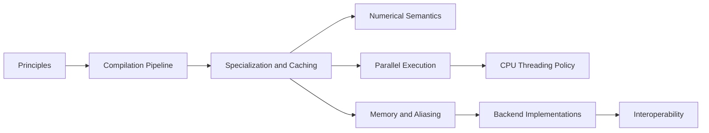

# Design and Implementation

This section explains how Tack works and why it is built the way it is. It
is written for contributors, and for advanced users who want to understand
what happens between a `@tack.kernel` call and the machine code that runs.

Each page covers one part of the system at three levels:

- **Design**: the problem, the approach taken, the alternatives that were
  rejected, and the tradeoffs accepted.
- **Implementation**: the modules, classes, functions, data structures and
  algorithms involved, and the order in which they run. Source locations
  are given as file paths plus function or class names.
- **Contract**: what the part guarantees, what it requires of callers, and
  what happens when a requirement is violated (which exception, raised
  where).

## How this section relates to the others

| Section | Answers | Use it when |
|---------|---------|-------------|
| [Contracts](../contracts/index.md) | **What** is guaranteed: the kernel language contract, backend capabilities, the runtime API, and how conformance is tested | you need to know whether a behavior can be relied on |
| **Design and Implementation** (this section) | **Why** it is designed this way and **how** it is implemented | you need to understand, review or change a part of the system |
| [Developer's Guide](../developers-guide/index.md) | **How to** carry out a task: module layout, each compiler stage, adding a feature | you are about to make a change and want a walkthrough |

Where a design page and the normative
[kernel language contract](../reference/language-contract.md) disagree,
the contract states the intended behavior and the code shows the current
behavior. The design pages describe the code and point out such gaps.

## Reading order

Start with **Principles**; most later decisions follow from it. Then read
**Compilation Pipeline** and **Specialization and Caching** together:
between them they describe the life of every kernel call. The remaining
pages can be read in any order, as the topic requires.

## Pages

**[Principles](principles.md).** The ideas the rest of the system follows:
Python syntax with Tack's own semantics; translate or reject, never
silently drop; one kernel source with backend capabilities declared rather
than probed; specialization with a cache key that names everything
specialized on; correctness by default, with faster paths only where a
per-call check justifies them; runtime policies measured rather than
hard-coded; and independent oracles as the definition of correctness. Each
principle comes with its costs.

**[Compilation Pipeline](compilation-pipeline.md).** The end-to-end path
from `Kernel.__call__` through `resolve_variant`, template rewrite, source
validation, the AST transform and device-function inlining, the immutable
IR template, the per-variant passes, verification at every pass boundary,
code generation and native compilation, to dispatch. For each stage: its
input and output, the invariants it establishes, what it rejects and with
which exception, and whether it runs on a cache hit.

**[Specialization and Caching](specialization-and-caching.md).** What a
compiled variant is and exactly what goes into its key: argument types and
categories, vector widths, texture extents, template structure and
constants, the shape signature of dimensions baked into code, and the CPU
disjoint-fields bit. It covers cache structure, lifetime and thread
safety, the correctness argument behind the key, worked examples of which
calls reuse a variant and which recompile, and how to avoid unnecessary
variants.

**[Numerical Semantics](numerical-semantics.md).** How Tack implements its
numerical rules: fixed-width integer types and promotion, division and
power, floating-point precision and exceptional values, the compiler
settings that keep fast math off, and reductions.

**[Parallel Execution](parallel-execution.md).** The execution model: one
top-level parallel iteration space, sequential inner loops, ordering
within an iteration, workgroups, barriers, block reductions and atomics,
and how each backend maps them onto threads or grids.

**[Memory and Aliasing](memory-and-aliasing.md).** Fields, views and
imported storage that may share memory; why generated code makes no
unconditional no-alias promise; and how the CPU's disjoint-fields
specialization recovers performance safely.

**[CPU Threading Policy](cpu-threading.md).** How the CPU backend decides,
per dispatch, whether to run a loop range serially or spread it across its
thread pool, using measured per-kernel cost and measured fan-out cost
rather than a fixed threshold.

**[Backend Implementations](backend-implementations.md).** How each of the
five backends (CPU through LLVM, Metal, CUDA, HIP and Level Zero) turns the
shared IR into native code, allocates and moves memory, and launches work,
along with the device-specific fallbacks each one needs.

**[Interoperability](interoperability.md).** Sharing memory with other
libraries and frameworks without copying: wrapping external pointers,
DLPack, exported device memory, and VTK interop.
