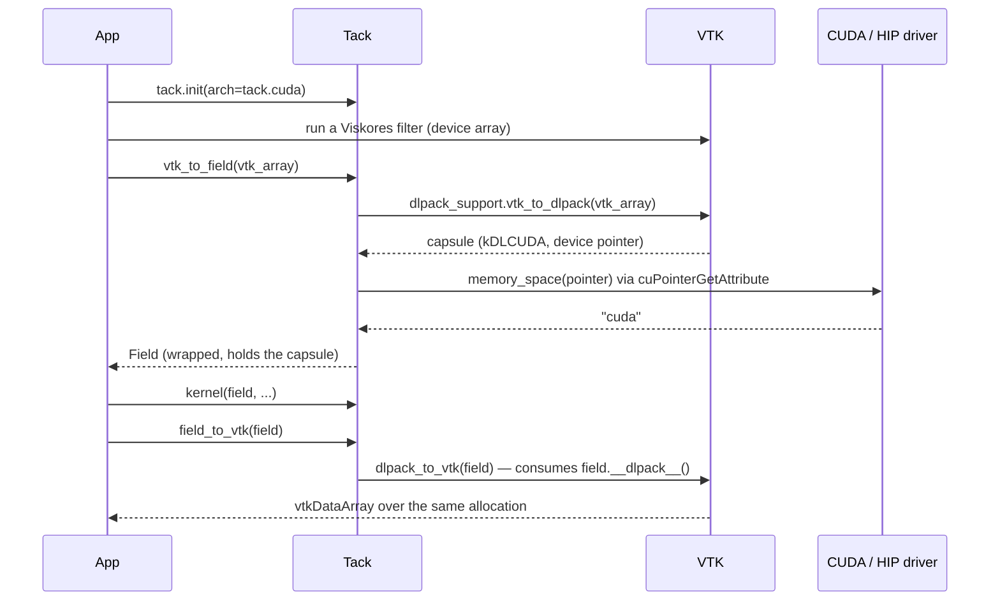

# Interoperability

Tack rarely owns a whole application. Its fields have to reach PyTorch,
CuPy, NumPy and VTK, and their arrays have to reach Tack kernels, without a
copy through the host. This page describes the three mechanisms — DLPack,
raw pointers and OS-handle export — then the VTK layer built on DLPack, and
finally Level Zero, where sharing a pointer is not enough and the design
had to share a *context* instead.

Ownership and the `DeviceBuffer` hierarchy are covered in [Memory and
Aliasing](memory-and-aliasing.md); this page assumes them.

## The mechanisms

| Mechanism | Direction | Zero-copy | Who keeps the memory alive |
|---|---|---|---|
| `field.__dlpack__()` | Tack → other | yes | Tack pins the field until the consumer's deleter runs |
| `tack.from_dlpack(x)` | other → Tack | yes (unless `copy=True`) | the field holds the producer's capsule and calls its deleter when collected |
| `tack.field_from_ptr(ptr, ...)` | other → Tack | yes | the caller, by hand |
| `field.export_memory()` | Tack → another graphics/compute API | Metal: yes; CUDA: yes for `exportable=True` fields, otherwise one copy | the exporting buffer |
| `tack.interop.vtk` | both | yes | as DLPack |

## DLPack export

`Field.__dlpack__(*, stream=None, max_version=None, dl_device=None,
copy=None)` (`lang/field.py`) delegates to `field_to_dlpack` in
`lang/dlpack.py`. `copy=True` raises `BufferError`: an export is always a
view. `stream` and `dl_device` are accepted and not used; every Tack
dispatch has already completed when it returns, so there is no pending
work for a consumer's stream to wait on.

**Legacy or versioned.** A consumer passing `max_version >= (1, 0)` gets a
DLPack 1.0 `DLManagedTensorVersioned` in a `"dltensor_versioned"` capsule;
otherwise it gets the legacy `DLManagedTensor` in a `"dltensor"` capsule.
The distinction matters because only the versioned struct has a `flags`
field, and so only it can carry `DLPACK_FLAG_BITMASK_READ_ONLY`, which Tack
sets for a non-writable field. Exported the legacy way, a read-only field
arrives as writable — the legacy protocol cannot say otherwise. The two
structs are never read interchangeably: `dl_tensor` sits at the *end* of
the versioned struct and at the start of the legacy one.

**Device mapping.** `_get_device_info` dispatches on the buffer class:

| Buffer | DLPack device type | Pointer exported |
|---|---|---|
| `NumpyBuffer` | `kDLCPU` (1) | the array's data |
| `MetalBuffer` | `kDLCPU` (1) | the shared view's data — unified memory is host-addressable |
| `CUDABuffer` | `kDLCUDA` (2) | the device pointer |
| `HIPBuffer` | `kDLROCM` (10) | the device pointer |
| `L0Buffer` | `kDLOneAPI` (14) | the USM device pointer |

The device id is always `0`. Shapes are copied into a `c_int64` array, and
strides are always C-contiguous element strides with `byte_offset = 0` —
there is nothing else to describe, since a field has no slicing. Every
field dtype maps to a DLPack type; anything else raises `TypeError`.

### Keeping an export alive

An exported capsule points at the field's memory, so the field, the
managed-tensor struct, and the shape and stride arrays must all outlive the
consumer. `field_to_dlpack` pins them in the module dictionary `_prevent_gc`
under a fresh integer key, and stores that key in the struct's
`manager_ctx`. The key is the crux: DLPack calls the deleter with only the
managed-tensor pointer, so the producer's bookkeeping key has to travel
inside it. Keys come from `itertools.count(1)` — starting at 1 because a
zero would round-trip through `c_void_p` as `None`.

Two paths unpin:

- **The consumer adopted the capsule.** By protocol it renamed the capsule
  to `"used_dltensor"` (or `"used_dltensor_versioned"`) and will call the
  tensor's deleter when it is done. `_dlpack_deleter` and
  `_dlpack_deleter_versioned` are separate functions because the deleter
  receives only a pointer and cannot tell which layout to read
  `manager_ctx` from.
- **Nobody adopted it.** A capsule collected while still named
  `"dltensor"` or `"dltensor_versioned"` was never consumed, so the capsule
  destructor, `_destroy_capsule`, releases the pin itself.

`_destroy_capsule` takes every helper it needs — `PyCapsule_IsValid`,
`PyCapsule_GetPointer`, `_release`, both struct types — as **default
arguments**, and `_release` does the same for `ctypes.cast`,
`ctypes.POINTER` and the pin table. A capsule can outlive the `tack.lang.dlpack`
module: a consumer that failed part-way through an import has been seen
holding one until interpreter exit, when module globals are already torn
down. A global lookup in the destructor then raised `NameError` inside an
ignored ctypes callback, and the field stayed pinned. Defaults are bound
when the function is defined, so they survive the module.
`test_an_unadopted_capsule_is_released_without_module_globals` in
`tests/test_dlpack.py` runs the destructor with an empty globals dictionary
to hold that line. The helpers also use raw `c_void_p` pointers rather than
`py_object`, so capsule teardown never touches the capsule's reference
count.

## DLPack import

`tack.from_dlpack(source, copy=False)` wraps a tensor without copying. With
`copy=True` it instead calls `np.from_dlpack(source)` (or uses `source`
directly if it is a NumPy array) and copies into a new field with
`field_like`, so the copying path accepts host tensors.

The zero-copy path is `dlpack_to_field(source, writable=True)`:

1. **Get a capsule.** `_request_capsule` calls
   `source.__dlpack__(max_version=(1, 0))` and falls back to
   `source.__dlpack__()` if the producer raises `TypeError` because it
   predates DLPack 1.0. Asking for the versioned form first matters: NumPy
   refuses to export a read-only array over the legacy protocol. A bare
   capsule is used as given.
2. **Check it is unconsumed.** A capsule not named `"dltensor_versioned"`
   or `"dltensor"` has already been taken: `ValueError`.
3. **Honor read-only.** A versioned tensor with the read-only flag makes
   the field non-writable, overriding the default. Host writes to it raise
   `RuntimeError`, and a dispatch that binds it where the kernel may store
   raises `ValueError` (see
   [Memory and Aliasing](memory-and-aliasing.md#wrapped-buffers)).
4. **Validate the tensor.** A null data pointer raises `ValueError`; a
   dtype with no Tack equivalent, or `lanes != 1`, raises `TypeError`;
   non-C-contiguous strides raise `ValueError`, because reading with the
   wrong stride produces plausible-looking wrong numbers. Null strides mean
   C-contiguous and are accepted.
5. **Match the device to the backend.** `_DEVICE_BACKENDS` maps the DLPack
   device type to the backends that can wrap it:

    | DLPack device type | Backend |
    |---|---|
    | `kDLCPU`, `kDLCUDAHost`, `kDLROCMHost` | `cpu` |
    | `kDLCUDA`, `kDLCUDAManaged` | `cuda` |
    | `kDLROCM` | `hip` |
    | `kDLOneAPI` | `level_zero` |

    `kDLMetal` is deliberately absent. Its `data` is an opaque
    `id<MTLBuffer>` handle, not an address, and `byte_offset` locates the
    tensor inside that buffer; wrapping one would need the handle turned
    back into a PyObjC object and an offset carried through `MetalBuffer`
    and the argument-buffer binding, neither of which exists. So a
    `kDLMetal` tensor raises `ValueError` up front, on any backend, with a
    message saying to move the tensor to host memory and import it with
    `copy=True`. Any other unknown device type raises `ValueError`. A known one on the wrong
    backend raises `RuntimeError` — importing CUDA memory while running the
    CPU backend is a mistake, not something to paper over with a copy. The
    tensor's device id is not compared.
6. **Wrap.** `field_from_ptr(data + byte_offset, dtype, shape,
   writable=...)`, which runs the backend's
   [memory-space check](memory-and-aliasing.md#memory-space-validation).
7. **Adopt.** Rename the capsule to its `used_` name, so no one else
   releases it, and attach a `_CapsuleHold` to the field as
   `_dlpack_hold`.

*Adopting* is the DLPack term for taking over the producer's deleter.
`_CapsuleHold` keeps the capsule referenced and calls the managed tensor's
deleter exactly once — from `release()` or from its own `__del__`, which
swallows errors because interpreter teardown can remove `ctypes` first. The
hold is on the `Field`, not the buffer, so `Field.reshape()` copies it to
the view; the producer is told the memory is free only when the last field
over it is collected. The source object itself may be dropped immediately.

Unlike `field_from_ptr`, which defaults to read-only, an imported field is
writable unless the producer says otherwise: DLPack exchange is meant to
share memory in both directions, and the versioned flag is how a producer
opts out.

!!! note "Metal and DLPack"

    A Metal field exports as `kDLCPU`, which is correct — its memory is
    host-addressable — but the Metal backend does not import `kDLCPU`
    tensors, including its own. Wrapping a host pointer as an `MTLBuffer`
    without copying needs a page-aligned address, which host allocations
    have only by accident of size, so support would work or fail depending
    on how big the array happened to be. The refusal appends Metal's
    `dlpack_refusal_note`, which says so and points to `copy=True`.
    `kDLMetal` tensors are refused before any backend sees them (step 5).

## Raw pointers

`tack.field_from_ptr(ptr, dtype, shape, writable=False)` is the lowest
level: no capsule, no deleter, no device type. Tack validates every
pointer with `as_address()` and `memory_space()` where the backend
distinguishes device memory, wraps them without taking ownership, and leaves lifetime entirely to
the caller. The per-backend details are in [Memory and
Aliasing](memory-and-aliasing.md#wrapped-buffers). Use it for in situ
frameworks and simulation codes that hand over a device pointer, and prefer
DLPack whenever the producer speaks it, because then lifetime is handled.

## Exporting device memory to other APIs

DLPack hands a pointer to another library in the same process and on the
same API. A renderer on Vulkan or another process needs an OS-level handle
instead. `Field.export_memory()` returns an `ExportedMemory` record of plain
Python values — `backend`, `size`, `allocation_size`, `handle`,
`handle_type` and `device_uuid` — so the consumer needs no GPU library to
read it, and dispatches on `handle_type`.

| Backend | `handle_type` | Handle |
|---|---|---|
| Metal | `mtl_buffer` | the `MTLBuffer`'s Objective-C object pointer (`objc.pyobjc_id`) |
| CUDA (Linux) | `posix_fd` | a file descriptor from `cuMemExportToShareableHandle` |
| CUDA (Windows) | `win32_kmt` | a legacy global KMT handle |

Other buffers raise `RuntimeError` (`Backend ... does not support memory
export`). CUDA memory from `cuMemAlloc` cannot be exported as an OS handle,
so `CUDABuffer.export_memory()` copies the field once, device to device,
into a lazily created `ExportableCUDABuffer` and exports that — later
kernel writes to the original are not reflected in the export. A field
allocated with `tack.field(..., exportable=True)` is an
`ExportableCUDABuffer` from the start, and its export is zero-copy. The
exportable buffer is allocated through CUDA's virtual memory management API
(`cuMemCreate`, `cuMemAddressReserve`, `cuMemMap`, `cuMemSetAccess`),
rounded up to the allocation granularity, which is why `allocation_size`
can exceed `size`. The handle is created once and cached; the device UUID
lets the consumer match devices across APIs.

!!! warning "Who closes the descriptor"

    `ExportableCUDABuffer.__del__` closes a POSIX descriptor it exported. A
    consumer whose import call takes ownership of the descriptor — as
    Vulkan's `VK_KHR_external_memory_fd` import does on success — should
    import a duplicate made with `os.dup()`. A Win32 KMT handle is not a
    kernel handle and is never closed.

## VTK

`tack.interop.vtk` (`packages/tack-vis/src/tack/interop/vtk.py`) is a thin
layer over DLPack and VTK's `vtkmodules.util.dlpack_support`. If that module
is missing, both functions raise `RuntimeError` saying so. Host arrays work
with any VTK that has it; device arrays need VTK built with Viskores.

**`vtk_to_field(vtk_array, flatten=False)`** asks VTK for a capsule
(`dlpack_support.vtk_to_dlpack`) and imports it with `tack.from_dlpack`.
VTK always exports `(tuples, components)`. A single-component array comes
back 1-D, and `flatten=True` returns a flat `(tuples * components,)` field —
the interleaved layout Tack's own visualization algorithms take. Both are
`reshape()` views, which carry the DLPack hold, so the VTK array may be
dropped as soon as the call returns.

**`field_to_vtk(field, n_components=None, name=None)`** works out the
layout first, before touching VTK, so a shape mistake is reported as one
(`ValueError` for a contradictory or non-dividing `n_components`, or for a
field of three or more dimensions without one). It reshapes the field to
`(tuples, components)` if needed and passes it to
`dlpack_support.dlpack_to_vtk`, which consumes the field's `__dlpack__`.
Tack's pin keeps the field alive until VTK calls the deleter, which is
VTK's responsibility when the array is released.

### CUDA and HIP

On CUDA and HIP, Tack relies on the pointer alone. The DLPack device type
selects the backend, and `memory_space()` asks the driver whether the
address is device, pinned or managed memory. The interop module's own
premise is that these runtimes keep one context per device for the whole
process, so a device pointer means the same thing to every library.



`CUDABackend` adopts whatever context is current on the calling thread when
it starts and creates its own with `cuCtxCreate` only if there is none; see
[Backend Implementations](backend-implementations.md#cuda).

## Level Zero: one context, shared out of band

### Why a pointer is not enough

A Level Zero USM pointer is meaningful only inside the context that
allocated it, and DLPack has no field for a context. `kDLOneAPI` and an
address say *which device*, not *which context*. Two libraries that each
create their own context therefore cannot legitimately exchange pointers,
however well DLPack is implemented on both sides.

A probe on an Intel Data Center GPU Max 1100 with oneAPI 2025.2.1
(2026-10-05) established the facts the design rests on:

- Both queue constructions Kokkos uses for its SYCL backend live in the
  SYCL platform's default context.
- Memory allocated with raw `zeMemAllocDevice` in that context's native
  handle is device memory to SYCL, and a SYCL kernel writes it correctly.
- **The driver does not distinguish contexts.** A pointer from a private
  context is also device memory to SYCL, `zeMemGetAllocProperties` reports
  it as device memory in the other context, and a SYCL kernel reads and
  writes it correctly. The Level Zero specification does not sanction
  this, so nothing may rely on it — and no runtime check can catch the
  mistake.

The alternatives were all worse. Relying on the driver's leniency is
relying on unspecified behavior that happens to work. Copying through the
host defeats the point. Putting a context in DLPack is a change to a
standard neither project controls. So the context travels *once, out of
band*: the other library reports the handles of the context its device
queue uses, and Tack allocates in that context instead of its own. DLPack
itself is unchanged.

### Adopting a context

`LevelZeroBackend` declares `init_options = frozenset({"external_context"})`,
so

```python
tack.init(arch=tack.level_zero,
          external_context={"driver": d, "device": dev, "context": ctx})
```

passes the dictionary to `LevelZeroBackend.__init__`. All three handles are
required and must be non-null; otherwise `ValueError` names the missing
ones. Tack does not fill in a driver or device of its own, because a driver
or device found separately need not be the one the context was created
against. With the handles adopted, `_query_device` runs against the given
device, `self._context` wraps the given context, and `_create_queues`
creates Tack's command queue and lists *in* that context. Every later
`zeMemAllocDevice` — every `tack.field()` — allocates there.
`LevelZeroBackend.shares_external_context` reports whether this happened.

The rejection of unknown options lives in `tack.init()`
(`runtime/dispatch.py`), which compares the keywords against the
constructor class's `init_options` before constructing it. The reason is
specific to this feature: if `tack.init(arch=tack.cpu,
external_context=...)` or a misspelled keyword were silently ignored, Tack
would start a private context while the caller believed memory was shared —
exactly the failure no runtime check can detect later.

**An adopted context is never destroyed.** In fact Tack destroys no Level
Zero object at all: `LevelZeroBackend.__del__` skips cleanup, because the
driver may already be unloaded at interpreter shutdown. The command queue
and lists Tack created inside the adopted context are likewise left alone.

### From VTK

`tack.interop.vtk.init_level_zero()` is the convenience form. It calls
`dlpack_support.level_zero_handles()` and passes the result to
`tack.init(arch=tack.level_zero, external_context=handles)`. If that
function is absent or returns nothing, it raises `RuntimeError`: the VTK is
too old, was built without Viskores on Kokkos' SYCL backend, or is not
running on a Level Zero device.

What VTK must provide is one function: `level_zero_handles()` in
`vtkmodules.util.dlpack_support`, returning the integer `driver`, `device`
and `context` handles of the SYCL queue its Viskores device runs on, or a
falsy value when there is none. This requires a VTK with
`level_zero_handles`, which is not yet in VTK master. With an older VTK the
other backends are unaffected, and on Level Zero the guard below refuses
every exchange.

```mermaid
sequenceDiagram
    participant App
    participant VTK as VTK / Viskores (SYCL)
    participant Tack
    participant L0 as Level Zero driver
    App->>VTK: import vtkmodules (SYCL queue in the default context)
    App->>Tack: tack.interop.vtk.init_level_zero()
    Tack->>VTK: dlpack_support.level_zero_handles()
    VTK-->>Tack: {driver, device, context}
    Tack->>L0: queries on that device; queues in that context
    Note over Tack: shares_external_context is True
    App->>Tack: f = tack.field(...)
    Tack->>L0: zeMemAllocDevice(shared context)
    App->>Tack: field_to_vtk(f)
    Tack->>VTK: level_zero_handles() — same context? yes
    Tack->>VTK: dlpack_to_vtk(f) — kDLOneAPI pointer
    VTK-->>App: device vtkDataArray over Tack's allocation
    App->>Tack: vtk_to_field(vtk_array)
    Tack->>VTK: same-context check, then vtk_to_dlpack
    Tack->>L0: memory_space(pointer) via zeMemGetAllocProperties
    Tack-->>App: Field over VTK's allocation
```

### The guard, and why only Tack can enforce it

Both `vtk_to_field` and `field_to_vtk` call
`_require_shared_level_zero_context` before exchanging anything. When the
active backend is Level Zero, it asks VTK for its handles again and compares
the context with `backend._context`. If VTK has no handles, or the contexts
differ, it raises `RuntimeError` and tells the caller to start Tack with
`init_level_zero()` instead of `tack.init(arch=tack.level_zero)`. On other
backends it does nothing.

The check has to live in Tack. VTK cannot detect the mistake, because the
driver vouches for a pointer from any context, so VTK's own pointer-type
check passes; and on some drivers the memory even reads correctly, which
makes cross-context exchange a mistake that works until it does not. Tack
is the only party that knows which context it allocated in.

The guard covers `tack.interop.vtk` only. A `kDLOneAPI` tensor imported
directly with `tack.from_dlpack` from some other oneAPI library passes the
device-type and `memory_space()` checks whatever its context, because
neither DLPack nor the driver can say. Start Tack in that library's context
with `external_context` first.

### Lifetime coupling

Sharing a context couples lifetimes in a direction Tack cannot see.

- **The owner must outlive Tack's use of the context.** Tack allocates
  with `zeMemAllocDevice` and frees with `zeMemFree` in the adopted
  context, and it holds no reference that keeps the context alive. If the
  owning library destroys the context while Tack fields or the backend
  still exist, those frees and any further dispatch act on a destroyed
  context. The owning library must keep its context alive until Tack's
  fields and backend are gone.
- **Fields from before `init_level_zero()` belong to the old context.** A
  field allocated under a plain `tack.init(arch=tack.level_zero)` keeps a
  reference to the backend that allocated it, so its memory remains valid
  in that private context — but it cannot be exchanged with VTK, and the
  guard refuses it. Allocate fields after adopting the context.

This design was validated on 2026-10-05 on the Intel Data Center GPU Max
1100, with a VTK build carrying `level_zero_handles`: Tack's VTK interop,
Level Zero context and DLPack tests ran their device cases, and Viskores
operated on a Tack-allocated field with writes through VTK visible to Tack.

## Summary of failures

| Situation | Raised by | Exception |
|---|---|---|
| `copy=True` passed to `__dlpack__` | `Field.__dlpack__` | `BufferError` |
| Dtype with no DLPack equivalent on export | `field_to_dlpack` | `TypeError` |
| Capsule already consumed | `dlpack_to_field` | `ValueError` |
| Null data, non-contiguous strides, unknown device type | `dlpack_to_field` | `ValueError` |
| Unknown dtype or `lanes != 1` | `dlpack_to_field` | `TypeError` |
| Tensor on a device the active backend cannot wrap | `dlpack_to_field` | `RuntimeError` |
| Integer pointer in the wrong memory space | `field_from_ptr` | `ValueError` |
| Address given to Metal's `wrap_ptr` | `MetalBackend.wrap_ptr` | `TypeError` |
| Export from HIP, Level Zero or CPU | `Field.export_memory` | `RuntimeError` |
| Unknown option to `tack.init` | `tack.init` | `ValueError` |
| Missing or null `external_context` handle | `LevelZeroBackend.__init__` | `ValueError` |
| VTK lacks `dlpack_support` or `level_zero_handles` | `tack.interop.vtk` | `RuntimeError` |
| Level Zero contexts differ during VTK exchange | `_require_shared_level_zero_context` | `RuntimeError` |
