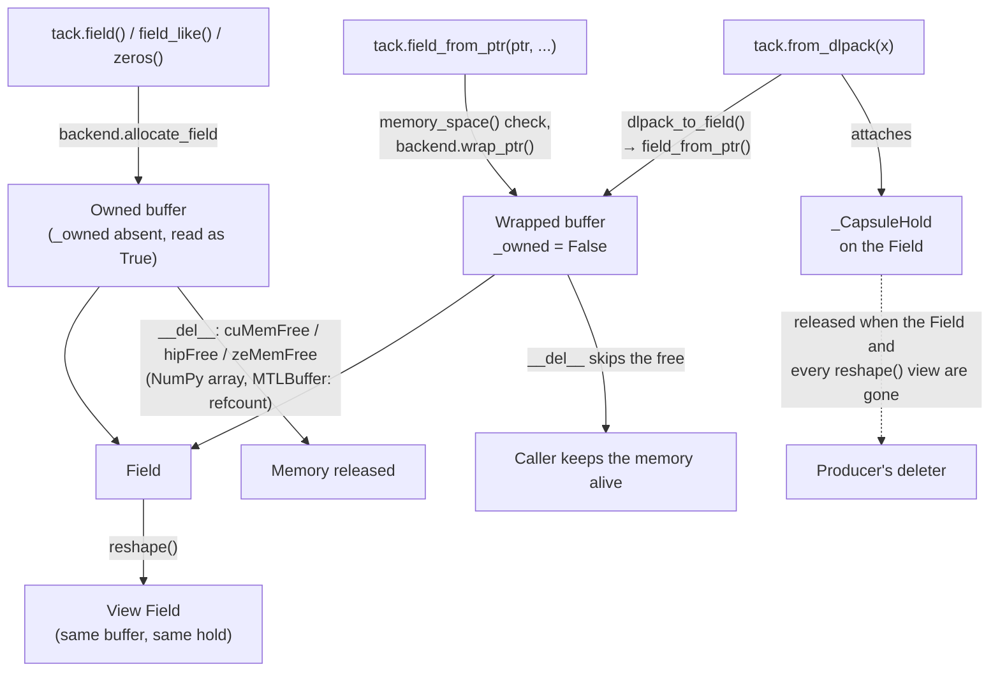

# Memory and Aliasing

A Tack kernel never sees a NumPy array or a device allocation directly. It
sees *fields*, and a field is a thin description — dtype and shape — wrapped
around a backend-specific *buffer*. This page explains how that split works,
who owns the memory behind a field and when it is freed, and why Tack lets
two field arguments refer to the same bytes, which is the single decision
that shapes most of the code generation described here.

The normative statements live in the
[kernel language contract](../reference/language-contract.md#memory-and-aliasing);
this page explains how the implementation meets them and what that costs.

## Field and DeviceBuffer

`Field` (`packages/tack-core/src/tack/lang/field.py`) holds four things:

| Attribute | Meaning |
|---|---|
| `dtype` | A `ScalarType` (`tack.f32`, `tack.u8`, ...) |
| `shape` | A tuple of dimensions; what kernels and `to_numpy()` see |
| `_buffer` | The `DeviceBuffer` that owns, or refers to, the storage |
| `_writable` | Whether the storage may be written: by `from_numpy()` and `fill()` on the host, and by kernel stores and atomics |

Everything that touches memory goes through the buffer. `DeviceBuffer` is a
small abstract interface — `from_numpy()`, `to_numpy()`, `fill()`, `nbytes`
and `address` — plus a `backend_name` class attribute that exists only so a
diagnostic can say which backend allocated a stray field (see
`_fields_from_another_backend` in `lang/kernel.py`).

Why a separate buffer rather than a `Field` subclass per backend? Because a
field's *shape* is a property of how kernels index the data, while the
*buffer* is a property of where the bytes live. Separating them lets
`Field.reshape()` produce a new field over the same buffer without knowing
anything about the backend, and lets `field_from_ptr()` describe memory
Tack did not allocate with the same `Field` class.

### The five buffers

| Backend | Buffer | Allocation | Zeroed by | Host ↔ device |
|---|---|---|---|---|
| CPU | `NumpyBuffer` | `np.zeros`, or `np.empty` + `fill(0)` under NUMA interleave | allocation | `np.copyto` / `.copy()` |
| Metal | `MetalBuffer` | `newBufferWithLength_options_`, shared storage mode | `_view[:] = 0` | `np.copyto` into the shared view / `.copy()` |
| CUDA | `CUDABuffer` | `cuMemAlloc` | `cuMemsetD8` | `cuMemcpyHtoD` / `cuMemcpyDtoH` |
| HIP | `HIPBuffer` | `hipMalloc` | `hipMemset` | `hipMemcpy` |
| Level Zero | `L0Buffer` | `zeMemAllocDevice` (at least one byte) | a host-to-device copy of zeros | `zeCommandListAppendMemoryCopy` on the immediate command list |

Every allocation is zero-initialized, so a fresh field reads as zeros on
every backend.

**CPU.** `NumpyBuffer._data` *is* the storage. When libnuma is available,
`CPUBackend.allocate_field` (`runtime/cpu.py`) allocates with `np.empty`
inside a `_NumaInterleave` scope and then touches every page with
`fill(0)`, so first-touch placement spreads pages across NUMA nodes instead
of landing them all on the allocating thread's node.

**Metal.** Apple Silicon memory is unified, so a `MetalBuffer` keeps both
the `MTLBuffer` and a NumPy view (`_view`) made from
`contents().as_buffer(nbytes)`. Host transfers are memory copies within the
same physical memory; there is no DMA. `to_numpy()` still returns a copy.

**CUDA, HIP, Level Zero.** The buffer holds a device pointer and transfers
are explicit. `from_numpy()` makes the source C-contiguous in the field's
dtype (`np.ascontiguousarray`), then copies `nbytes`. `fill()` builds a full
host array and copies it; there is no device-side fill.

`Field.from_numpy()` validates before the buffer is involved: it converts
the array to the field's dtype if needed, raises `ValueError` on a shape
mismatch, and calls `_check_writable()`, which raises `RuntimeError` for a
read-only field.

### Views and reshape

`Field.reshape(new_shape)` returns a new `Field` over the *same* buffer. It
checks that the element count matches (`ValueError` otherwise) and copies
`_writable`. If the original holds a DLPack import (`_dlpack_hold`, see
[Interoperability](interoperability.md)), the reshaped field holds it too —
otherwise dropping the original would release memory the view still uses.

The buffer keeps the shape it was allocated with, so `Field.to_numpy()`
reshapes the buffer's result to the field's own shape, and the CPU and
Metal buffers' `from_numpy()` reshape the incoming array to the buffer's
shape before copying (the element count was already checked against the
field's shape). `reshape` is the
only view operation; there is no slicing, so every view of a buffer covers
all of it.

`tack.Vector.field(n, dtype, shape)` allocates a flat buffer of
`prod(shape) * n` elements and records `_vector_n` and `_logical_shape` on
the field. The storage is ordinary; the vector-ness is metadata that kernel
dispatch uses for scalarization.

## Ownership and lifetime

Who frees a field's memory depends on how the field came to exist. There are
three origins, and the backends encode them slightly differently.



### Owned buffers

Fields from `tack.field()` and its helpers own their storage. On CPU and
Metal, Python reference counting does the work: the NumPy array or the
`MTLBuffer` object goes away with the buffer. The device backends free
explicitly in `__del__`:

- `CUDABuffer.__del__` calls `cuMemFree`, unless the buffer's context is
  gone (see [below](#when-the-cuda-context-goes-away)).
- `HIPBuffer.__del__` calls `hipFree`.
- `L0Buffer.__del__` calls `zeMemFree` against `self._backend._context`.
  Each `L0Buffer` keeps a reference to the backend that allocated it, which
  keeps that backend — its context handle and command lists — alive for as
  long as any of its buffers exist.

All three wrap the free in `try/except` and ignore failures, because
`__del__` can run at interpreter shutdown after the driver bindings are
gone.

### Wrapped buffers

`tack.field_from_ptr(ptr, dtype, shape, writable=False)` wraps memory Tack
did not allocate. Each backend's `wrap_ptr()` builds the buffer with
`__new__`, skipping allocation:

| Backend | Accepts | Ownership effect |
|---|---|---|
| CPU | a NumPy array, or an integer address | Array: a `view(...).reshape(...)` of it, which keeps the source array alive. Address: `np.frombuffer` over a ctypes array at that address — nothing keeps the memory alive. |
| Metal | an `MTLBuffer` object (anything with `contents`) | The buffer references the `MTLBuffer` object, which keeps it alive. An integer raises `TypeError`: an address cannot be turned back into an `MTLBuffer`. |
| CUDA | an address: an integer, NumPy integer or `CUdeviceptr` | `_owned = False`; also records the current context's token |
| HIP | an address: an integer or anything `int()` accepts | `_owned = False` |
| Level Zero | an address, as for HIP | `_owned = False`, stored as `c_void_p` |

The `__del__` methods test `getattr(self, '_owned', True)` and skip the free
for wrapped buffers. That flag is the whole ownership protocol: Tack never
frees what it did not allocate, and it does not extend the lifetime of raw
external memory either. The caller must keep that memory valid for as long
as the field — and every reshaped view of it — is in use. The contract
states this as a caller constraint; violating it is undefined behavior, not
an error Tack can detect.

`field_from_ptr()` defaults to `writable=False`, and a read-only DLPack
tensor imports as a non-writable field. `_writable` guards the host-side
`from_numpy()` and `fill()` (`RuntimeError`) and kernel dispatch. Each
variant records, in `KernelVariant.written_fields`, the index and name of
every field argument the kernel may store to or use as an atomic target,
from `written_field_params` (all of them when a store can't be traced).
`check_writable_fields()` runs on every dispatch, over only those indices,
and raises `ValueError` before the launch when one of them is bound to a
read-only field. The warm-path cost is about 0.15 µs. Generated code itself
does not enforce read-only access; the dispatch check is complete because
a store the analysis cannot trace makes every field count as written.

### Memory-space validation

A pointer of the wrong kind — a host address handed to the CUDA backend —
would make a kernel fault inside the driver. So `field_from_ptr()` asks the
backend before wrapping, whatever form the pointer arrives in:

```python
if backend.device_memory_spaces:
    if as_address(ptr) is None:
        raise TypeError(...)
    space = backend.memory_space(ptr)
    if space not in backend.device_memory_spaces:
        raise ValueError(...)
```

`device_memory_spaces` is a capability declared on each backend (see
`Backend` in `runtime/backend.py`); an empty set means "this backend does
not distinguish", and no check is made, which is why `MTLBuffer` objects
and CPU NumPy arrays need none. Where the set is non-empty, every pointer
is checked: a NumPy integer or a `CUdeviceptr` holding a host address is
refused like a Python `int`, and a value that is not an address at all
raises `TypeError`.

| Backend | `memory_space()` asks | `device_memory_spaces` |
|---|---|---|
| CPU | nothing — always `"cpu"` | empty (no check) |
| Metal | nothing — inherits `"cpu"` | empty (no check; only `MTLBuffer` objects are accepted anyway) |
| CUDA | `cuPointerGetAttribute(CU_POINTER_ATTRIBUTE_MEMORY_TYPE)` | `cuda`, `cuda_pinned`, `cuda_managed` |
| HIP | `hipPointerGetAttributes` | `hip`, `hip_pinned`, `hip_managed` |
| Level Zero | `zeMemGetAllocProperties` in the backend's context | `level_zero` (USM device or shared) |

CUDA and HIP treat a failed driver query as host memory — that is the
documented reply for an ordinary host allocation. Level Zero reports
unknown memory as a *successful* query of type unknown, so there a failed
query is a genuine fault and raises `RuntimeError` from `_check_ze`. All
three first pass the value through `as_address()` (`runtime/kernel_utils.py`),
which returns `None` for anything that is not an integer in `[0, 2**64)`,
so a non-address is answered `"cpu"` without calling the driver. The
separation is deliberate: a broad `except` around the driver call once
answered `"cpu"` for every HIP pointer, which rejected every HIP device
import.

!!! warning "Level Zero cannot tell contexts apart"

    Intel's driver answers `zeMemGetAllocProperties` for pointers from *any*
    context on the device, so `memory_space()` confirms that a pointer is
    device memory, not that it belongs to Tack's context. See
    [Interoperability](interoperability.md) for how cross-context exchange
    is prevented.

### When the CUDA context goes away

CUDA device pointers do not outlive their context: `cuCtxDestroy`
invalidates every allocation in it, and a later copy through one of those
pointers faults inside the driver — a segmentation fault, not a `CUresult`
Tack could check. The usual way to get there is switching backends:

```python
tack.init(arch=tack.cuda)
f = tack.field(dtype=tack.f32, shape=(64,))
tack.init(arch=tack.cpu)   # the CUDA backend, and its context, are dropped
f.to_numpy()               # must not touch the dead pointer
```

A buffer cannot discover this from its own pointer, so it has to be told.
`runtime/cuda_backend.py` keeps a module-level registry, `_CONTEXTS`, of
`_ContextToken` objects — one per context Tack knows about — with three
fields:

- `users` — how many live `CUDABackend` objects share the context.
  `tack.init()` constructs the new backend before dropping the old one, so
  two backends routinely overlap; only the last one out may destroy the
  context.
- `owned` — `False` for a context an embedding application made current
  before Tack started. Tack adopts such a context and never destroys it.
- `alive` — set to `False` by `CUDABackend.__del__` immediately *before*
  `cuCtxDestroy`, and only for an owned context whose `users` reached zero.

`CUDABuffer` records the current context's token at allocation, and
`wrap_ptr` does the same. `_live(verb)` checks it before every operation
that touches device memory — `from_numpy`, `to_numpy`, `fill` (through
`from_numpy`), `export_memory`, and the `device_ptr` property, which is what
a kernel launch reads. A dead token raises `RuntimeError` beginning
`Cannot <verb> this CUDA field: the CUDA context this field was allocated
in has been destroyed`, and `__del__` skips `cuMemFree`, because the context
took the allocation with it.

HIP and Level Zero have no equivalent, and need none today: `HIPBackend`
uses the runtime-managed device context and its `__del__` does nothing, and
`LevelZeroBackend.__del__` deliberately skips all cleanup, so neither ever
destroys a context under a live buffer.

## Alignment

**CPU loads and stores promise only byte alignment.** `LLVMCodeGen` in
`codegen/llvm_gen.py` emits every field `load` and `store` with `align=1`.
The contract gives the two reasons: imported buffers may start at any byte,
and a byte-sized element type gives no four-byte guarantee even inside an
owned buffer. The numerical regression suite checks imported buffers at a
one-byte offset for all ten scalar types.

**Atomics require natural alignment.** An atomic read-modify-write must be
aligned to its element width. `check_atomic_support`
(`lang/atomic_support.py`) returns each atomic target's parameter index and
required alignment (`dtype.bits // 8`), and `resolve_variant` stores them on
the `KernelVariant` as `atomic_targets`. `check_atomic_alignment` then tests
`field._buffer.address % alignment` before the cold compile *and* on every
cached dispatch, because a cached variant can be called with a different,
imported, misaligned buffer. A violation raises `ValueError`
(`Kernel '<name>': atomic target parameter N requires K-byte alignment`)
before any storage is updated. Allocated fields always satisfy this; only
imported pointers can fail it.

**GPU code uses typed pointers.** The C-family and MSL generators declare
field parameters as typed pointers (`float*`, `__global double*`, ...) and
index them directly, so an imported device pointer is expected to be
aligned for its element type. Allocations made by the backends are.

## The aliasing model

### What is promised

Two field arguments may refer to overlapping storage. The contract requires
it ([LC2](../reference/language-contract.md#regression-baseline)): passing
the same field twice, passing two `reshape()` views of one buffer, and
passing imported pointers that overlap must all preserve program order
*within each iteration*. A store through one argument followed by a load
through another must observe the store. This does not make cross-iteration
races valid — two iterations writing the same element is still the
caller's bug.

### Why overlap is allowed by default

The alternative is the C `restrict` model: declare that distinct arguments
never overlap. That was Tack's earlier behavior — unconditional `noalias` on
LLVM field parameters, `__restrict__` on CUDA and HIP — and it produced
wrong answers rather than errors. LC2's reproduction (write `1` through
`a`, write `2` through an aliased `b`, read `a`) returned `1` on CPU at the
contract baseline. The patterns that trigger it are ordinary:

- **Views.** `reshape()` is how a flat buffer is seen as 2-D and back, and
  the interop layer hands out reshaped views of imported arrays
  (`vtk_to_field(..., flatten=True)`).
- **The same field twice.** An in-place update `f(a, a)` is ordinary
  Python.
- **Imported memory has no identity.** Two `field_from_ptr()` or
  `from_dlpack()` calls over overlapping external memory produce distinct
  `Field` objects with distinct buffers. Object identity says nothing about
  storage.

So the contract makes overlap legal everywhere and lets a backend recover
the lost optimization only where it can prove, per call, that it is safe.

### How each backend preserves program order

| Backend | Field parameter | Why it is safe |
|---|---|---|
| CPU | LLVM pointer without `noalias` (default variant) | LLVM must assume any two pointers may alias |
| CUDA / HIP | `T* name` — no `__restrict__` | `CUDACodeGen.generate` says it directly: restrict would let the compiler reuse a value across a store through another field |
| Level Zero | `__global T* name` — no `restrict` | `OpenCLCodeGen.generate` emits plain `__global` pointers |
| Metal | a member of one argument buffer | MSL itself forbids overlap between separate buffer arguments; see below |

**Metal is the exception, because MSL forbids overlap by construction.**
There is no `restrict` keyword to remove: section 5.2 of the Metal Shading
Language specification states that device buffers passed as separate kernel
arguments must not overlap. Binding two aliasing fields to two
`[[buffer(n)]]` slots is outside the language, and on an Apple M1 Max four
overlap cases failed numerically (the contract's regression baseline,
"Metal validation, 2026-10-03").

The fix is indirect binding. `MSLCodeGen.generate` (`codegen/msl_gen.py`)
emits one struct holding every non-texture field pointer, with `[[id(i)]]`
equal to the parameter's position:

```c
struct __tack_buffer_args__ {
    device float* a [[id(0)]];
    device float* b [[id(1)]];
};

kernel void k(constant __tack_buffer_args__& __tack_buffers__ [[buffer(0)]],
              uint __tid__ [[thread_position_in_grid]])
{
    device float* a = __tack_buffers__.a;
    device float* b = __tack_buffers__.b;
    ...
}
```

The kernel has a single buffer argument, so the separate-argument rule has
nothing to apply to, and the field pointers inside it may alias. Textures
keep their own `[[texture(n)]]` namespace; unpacked scalars (seen only when
generating source directly) remain `constant T&` arguments after the
argument buffer. Argument buffers are a Metal 2 feature.

On the runtime side, `_compile_kernel` in `runtime/metal.py` creates an
`MTLArgumentEncoder` with `newArgumentEncoderWithBufferIndex_(0)`, and each
`CompiledMetalKernel` allocates one shared-storage argument buffer. On
*every* dispatch, `CompiledMetalKernel.__call__` encodes each field's
`MTLBuffer` into the argument buffer and declares its residency with
`useResource_usage_(..., Read | Write)` — indirectly referenced resources
need that explicit declaration, and it is refreshed each time because a
cached variant can receive different buffers, or a different alias
relationship, from one call to the next. The argument buffer itself is
reused across dispatches, which is safe because dispatch waits for
completion before returning. No GPU backend specializes on alias
relationships: one variant serves every combination.

#### Loops that store to a field get a function of their own

The argument buffer brought a miscompilation with it, found on an M1 Max
in October 2026. In the kernel entry function, Apple's compiler reads a
field element once before a loop and never again when the element's
address does not depend on the thread, the loop also stores to another
field of the same type, and the trip count is a runtime value:

```python
for t in range(1):
    for k in range(n):
        total[0] += x[k]        # left at start + x[n - 1]
        counter[0] += 1         # correct
```

The generated MSL was correct and one thread ran it. Every case was right
on the commit before the argument buffer, when each field was its own
buffer argument. With `total[t]` (an address that depends on the thread),
with a literal trip count, with one field, with fields of different
types, or with the statements written out instead of looped, the result
was right.

What does and does not avoid it, each tried on thirty variations of the
loop (`test_field_updates_in_loops.py`):

| Change to the generated source | Wrong results |
|---|---|
| none | 20 of 30 |
| the kernel body in a `noinline` function called by the entry | 0 |
| the same function without `noinline` | 20 |
| `volatile` on the pointers of the fields the kernel writes | 0 |
| `__restrict` on the field pointers | 20 |
| field pointers, the thread index, or both passed through opaque `noinline` identity functions | 20 |
| the struct by `device` reference, no local pointer copies, `const` pointers | wrong (tried on the first case only) |
| size optimization, language versions 2.4 to 3.2 | 10 of the 15 i32 cases, as with none |

So `msl_gen` emits the body of a kernel as `__tack_body__`, a `noinline`
function taking the entry's parameters, whenever a sequential loop of the
kernel contains a store or an atomic (`_stores_inside_sequential_loop`);
the entry declares any workgroup arrays, which MSL allows only there, and
calls it. Kernels without such a loop keep the single function: applied to
them, a body function cost 7-15% for a kernel that does one memory
operation per thread (16M-element `a * x + y`, 0.83 to 0.95 ms). For the
kernels that get one it cost 2.6% (an all-pairs force accumulated into
`force[i]`) and 0.2% (a per-row histogram).
`volatile` was the alternative; it also has to be carried through every
pointer copy and atomic cast the generator emits.

Where in Apple's compiler it happens is known; why is not. The offline
`metal` front end (version 32023.921) compiles the shader to correct
LLVM IR: inside the loop it loads `total[0]`, stores it, loads
`counter[0]` and stores it, in both forms. Compiled to a library offline
and loaded with `newLibraryWithURL`, that IR gives the same wrong result,
so the fault is in the back end that turns the IR into GPU code when the
pipeline is created, which no tool shows. The IR of the two forms differs
in one thing: in the kernel entry the struct parameter carries
`"air-buffer-no-alias"` and the pointers loaded from it carry an
`air-alias-scope-arg(0)` alias scope, and in the separate function they
carry neither. Removing the scope, the attribute, the parameter's
`readonly`, or all of them from the IR before building the library
changes nothing, so that is not the cause either. The rule is therefore
wider than the observed trigger (any store in any sequential loop), and
it rests on `noinline` being honored, as the 64-bit accumulator helpers
already do. A standalone report to Apple would be the shader in
`test_field_updates_in_loops.py` and the thirty-case table above.

### The CPU disjoint-fields specialization

Dropping `noalias` is not free on the CPU. Without it LLVM must reload a
field after every store through another field, and its loop vectorizer
must guard a loop that accumulates through a field with runtime overlap
checks. So the CPU backend compiles a second variant *with* `noalias` and
uses it only for calls it has checked.

The pieces, in `runtime/kernel_utils.py` unless noted:

1. **`written_field_params(ir_func)`** finds the parameters the kernel may
   store to: targets of `IRFieldStore` and `IRAtomicOp`, propagated to a
   fixed point through `IRAssign` copies of names — which is how a store
   through an inlined device function's parameter is traced back to the
   kernel argument. Stores into local or shared allocations are ignored. A
   store through anything it cannot trace returns `None`, meaning "assume
   every field is written". The result is memoized on the IR template, and
   `_written_flags` turns it into one boolean per parameter.
2. **`NumpyBuffer.span`** (`lang/field.py`) is the half-open byte range
   `[start, end)` the array occupies, from NumPy's `byte_bounds`. It is
   cached on the buffer together with the array it was computed from, so a
   dispatch normally pays one attribute read per field.
3. **`fields_disjoint(ir_func, effective_args)`** collects the spans of
   every `Field` argument and of each `Texture3D` argument's private
   storage (the copy the kernel samples), skipping empty ones, and returns
   `True` when no *written* span intersects any *other* span. Fields that
   are only read may overlap each other — `dot(x, x)` qualifies, because
   nothing read through one pointer can change under the other. A buffer
   without a `span` makes the answer `False`. Kernels write a handful of
   fields at most, so it compares pairs directly instead of sorting.
4. **`resolve_variant(..., specialize_disjoint=True)`** — the CPU backend
   passes the module flag `_SPECIALIZE_DISJOINT` from `runtime/cpu.py` —
   evaluates `fields_disjoint` on every dispatch, appends the answer to the
   variant key, and on a miss records it on the variant's IR as
   `disjoint_fields`.
5. **`LLVMCodeGen`** adds the `noalias` attribute to field parameters, and
   only to field parameters, when `disjoint_fields` is set. Otherwise the
   function makes no promise.

The answer comes from byte ranges, never from object identity, so it is
correct for views and for partial overlaps of imported storage. A kernel
has at most two CPU variants per specialization, and a program that
alternates between aliased and disjoint calls alternates between them
without recompiling. Both variants must agree on every race-free program:
the specialization changes speed, not results.
`tack.inspect(kernel, *args, mode="source")` on CPU shows the variant those
particular arguments would run.

**NumPy 1 and 2.** `byte_bounds` lives in the top-level `numpy` namespace
in NumPy 1 and in `numpy.lib.array_utils` in NumPy 2. `lang/field.py`
chooses the location once, at import. An earlier version imported it from
the NumPy 2 location unconditionally, and because every CPU dispatch reads
`span`, every kernel call under NumPy 1.26 raised `ModuleNotFoundError`.

**Cost and benefit.** The check runs on every CPU dispatch, so it is paid
even by kernels that gain nothing. The measurements recorded when it was
introduced (2026-10-03, single-threaded, kernels of 65,536 and 1,048,576
elements) show both sides:

| Host | Per-dispatch cost of the check | Effect on kernel time |
|---|---|---|
| Intel Xeon E5-2650 (Sandy Bridge), Linux | 3.1–3.8 µs, on 16-element dispatches taking 40–55 µs | store-accumulator −44% / −70%, stencil −5% / −22%; the rest within run-to-run spread |
| Apple M1 Max, macOS | 1.0–1.6 µs | stencil −8% at 1M elements; 65K-element kernels 1–11% slower |

On the older x86 core, the vectorizer's runtime overlap checks are what
made the no-promise code two to three times slower on the store-accumulator
pattern, and the promise removes them. On Apple silicon the runtime-checked
path was already fast, so there the check is overhead. The tradeoff was
accepted as bounded on one side and large on the other, and the
specialization is on by default. Setting
`tack.runtime.cpu._SPECIALIZE_DISJOINT = False` before the first dispatch
turns it off. A per-kernel "these fields never alias" declaration, which
would avoid the per-dispatch check, has not been tried.

!!! note "GPU backends do not specialize"

    `fields_disjoint` needs host-visible byte ranges, and only `NumpyBuffer`
    has a `span`; every other buffer makes the answer `False`. GPU
    backends do not pass `specialize_disjoint`, so they compile one variant
    with no aliasing promise.

## Summary of guarantees

| Topic | Guarantee | Enforced in | On violation |
|---|---|---|---|
| Fresh allocation | Zero-initialized on every backend | buffer constructors | — |
| Host transfer shape | `from_numpy` shape must equal `field.shape` | `Field.from_numpy` | `ValueError` |
| Read-only host writes | `from_numpy`/`fill` refused when `_writable` is false | `Field._check_writable` | `RuntimeError` |
| Read-only kernel writes | A read-only field bound to a parameter the kernel may store to is refused, on every dispatch | `check_writable_fields` | `ValueError` |
| Pointer kind | Pointers must be device addresses where the backend distinguishes | `field_from_ptr` | `TypeError` (not an address), `ValueError` (wrong space) |
| Dead CUDA context | Buffer refuses to touch its memory | `CUDABuffer._live` | `RuntimeError` |
| Atomic alignment | Natural alignment, checked on every dispatch | `check_atomic_alignment` | `ValueError` |
| Overlapping fields | Program order within an iteration | code generation (no `noalias`/`restrict`; Metal argument buffer) | — |
| External lifetime | Caller keeps wrapped memory alive | not checked | undefined behavior |
| In-kernel bounds | Not promised | not checked | undefined behavior |

See also [Specialization and Caching](specialization-and-caching.md) for
how the variant key is built, [Backend
Implementations](backend-implementations.md) for each backend in full, and
[Interoperability](interoperability.md) for DLPack ownership.
