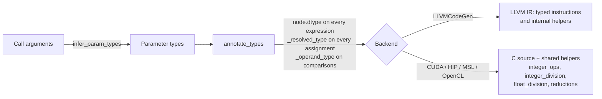
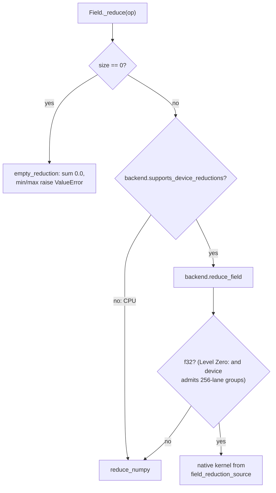

# Numerical Semantics

This page explains how Tack decides what an arithmetic expression *means*
and how each backend is made to compute exactly that. The normative rules
live in the [kernel language contract](../reference/language-contract.md),
section [Types and numerical behavior](../reference/language-contract.md#types-and-numerical-behavior);
this page summarizes each rule, records why it was chosen over the
alternatives, and walks through the modules that implement it. Where this
page and the contract differ, the contract states the guarantee and this
page describes the current code.

The short version: Tack is **fixed-width and Python-flavored**. Integers
wrap at their annotated width like NumPy arrays; `//`, `%` and `/` follow
Python's definitions rather than C's; floating-point code is compiled with
safe math on every backend; and inputs where no portable answer exists
(zero divisors, oversized shifts, out-of-range float-to-int conversion) are
documented caller constraints rather than checked at run time.

## Design goals

| Goal | Consequence |
|---|---|
| One answer per defined program, on every backend | Every rule is enforced in Tack's own type annotation and code generation, never delegated to a target language's implicit conversions |
| Python-first semantics where Python's rule is cheap | Floor division, divisor-signed remainder, true division, Boolean results of `0`/`1` |
| Fixed-width storage, not big integers | Arithmetic wraps modulo 2^N at each node; promotion picks a type that holds both operands |
| No undefined behavior leaking from C | C-family emitters compute in unsigned carriers and reconstruct signed values with representable casts |
| No silent precision loss | Signed-with-`u64` mixes are rejected; f32 is never silently narrowed from f64 |
| Small compiler | No runtime checks for division by zero or shift ranges; those are caller constraints |

## Where the semantics are decided

All backends share one typing pass. Code generators read the result and
never re-derive types from the target language.



- `packages/tack-core/src/tack/lang/type_inference.py`: `infer_param_types`
  types the parameters from the actual arguments; `promote_types` is the
  single binary promotion rule.
- `packages/tack-core/src/tack/lang/ir_type_annotate.py`: `annotate_types`
  sets `dtype` on every expression node, `_resolved_type` on every
  `IRAssign` and `_operand_type` on every `IRCompare`.
- `packages/tack-core/src/tack/codegen/llvm_gen.py`: `LLVMCodeGen` for CPU.
- `packages/tack-core/src/tack/codegen/integer_ops.py`,
  `integer_division.py`, `float_division.py` and `reductions.py`: helper
  emitters shared by `CUDACodeGen`, `HIPCodeGen`, `MSLCodeGen` and
  `OpenCLCodeGen`.

Because the annotation is computed per compiled variant (see
[Specialization and Caching](specialization-and-caching.md)), every dtype a
helper depends on is part of the variant key through the argument types.

## Typing

### Parameters and literals

`infer_param_types` gives fields their element type. Python `int`
arguments and integer literals go through `integer_type_for_value`
(`lang/types.py`): i32 if the value fits, else i64, else u64; anything
outside `[-2^63, 2^64 - 1]` raises `TypeError`. Python `float` arguments are
f32, unless *any* field or texture argument is f64, in which case they are
f64. Float literals in the kernel body are f32.

That float-context rule has a consequence worth knowing. An f64 output
field does not widen an f32 *field* computation, but it does make a Python
float scalar argument f64, and the scalar then widens the expression it
appears in:

```python
@tack.kernel
def scale(a, out, s):          # a: f32 field, out: f64 field, s: Python float
    for i in range(a.shape[0]):
        out[i] = a[i] * s      # s is f64 here, so the product is f64
```

!!! warning "Float literals are f32, even in f64 expressions"
    A literal such as `0.1` is annotated f32 wherever it appears, so
    `x * 0.1` with an f64 `x` multiplies by `0.10000000149011612`, the f32
    value of `0.1` widened to f64. Casting the literal does not help:
    `tack.f64(0.1)` widens the already-rounded f32 constant. To use an exact
    f64 constant, pass it as a Python float argument (which is f64 when an
    f64 field is present), or compute it from integers in f64, for example
    `tack.f64(1) / tack.f64(10)`.

### Binary promotion

`promote_types(a, b)` is used for arithmetic, comparisons (recorded as
`_operand_type`), conditional-expression arms, integer `min`/`max`, and the
join of every assignment to one local variable. Its rule:

1. Equal types promote to themselves.
2. Any floating operand wins: f64 if present, otherwise f32.
3. Integers of the same signedness promote to the wider type.
4. Mixed signedness promotes to the narrowest **signed** type with at least
   `max(signed.bits, unsigned.bits + 1)` bits. Nothing fits for a signed type
   with u64, so that raises `TypeError` ("use an explicit integer cast").

| Operands | Result | Why |
|---|---|---|
| i8, u8 | i16 | i16 holds -128..255 |
| i8, u16 | i32 | |
| i32, u32 | i64 | C would choose u32 and turn `-1` into 4294967295 |
| i16, u32 | i64 | |
| u8, u64 | u64 | same signedness |
| i64, u64 | `TypeError` | no Tack integer holds both ranges |
| i64, f32 | f32 | floating wins; large integers can round |

**Why preserve both ranges.** C's usual arithmetic conversions make
`i32 + u32` unsigned, so a comparison like `-1 < 1u` is false. Before the
annotations governed every emitter, the GPU generators inherited that rule
implicitly while the CPU generator followed LLVM widths, and the backends
disagreed. Integer promotion that preserves both ranges never changes a
value, so comparisons and `min`/`max` operate on mathematical values.

**Why reject signed with u64 instead of choosing f64** (NumPy's choice):
an implicit trip through binary64 silently rounds integers above 2^53,
which is exactly the kind of quiet divergence the contract exists to
remove. An explicit `tack.i64(...)` or `tack.u64(...)` cast states the
intended wrap.

### Result-type rules that differ from promotion

`_annotate_expr` special-cases a few operators:

| Expression | Result type | Notes |
|---|---|---|
| int `/` int | f32 | [True division](#true-division) |
| int `**` int, `pow(int, int)` | the base's type | exponent type ignored; negative literal exponent raises `TypeError` |
| `a << n`, `a >> n` | type of `a` | count type does not widen |
| comparisons, `not`, `and`, `or` | i32 | values are `0`/`1` |
| `abs(int)` | the argument's type | |
| `min`/`max` | promotion of all arguments | |
| other math builtins | f64 if any argument is f64, else f32 | `sqrt(i64_value)` is f32 |
| `block_sum`/`block_min`/`block_max` | f32 | non-f32 input raises `TypeError` |

### One type per local variable

A local gets a single storage slot: an `alloca` on CPU, one declared C
variable elsewhere. `annotate_types` therefore runs a fixpoint over all
assignments (at most `_MAX_JOIN_ROUNDS` rounds; the join only widens, so it
settles quickly) and gives each local the promotion of every type assigned
to it. The motivating bug was `total = 0.0` followed by additions from an
f64 field: the first assignment typed `total` as f32 and every later
addition was narrowed. Loop variables, parameters and allocations are
pinned and do not join. An impossible join (signed with u64) raises
rather than being dropped.

## Integer arithmetic

### Wrapping at every node

**Rule** ([contract](../reference/language-contract.md#types-and-numerical-behavior),
"fixed-width arithmetic and integer conversion"): integer `+`, `-`, `*`,
unary `-`, `~`, `&`, `|`, `^` and `<<` produce the low N bits at the node's
annotated width, interpreted as two's complement for signed types. Each
nested operation wraps before its value is used.

| Expression (operand types) | Result |
|---|---|
| `tack.i8(a + 1)` with i8 `a = 127` | `-128` (the sum is i32 `128`; the cast wraps) |
| `a + a`, i8 `a = 127` | `-2` |
| `a * a`, u16 `a = 65535` | `1` |
| `abs(a)`, i8 `a = -128` | `-128` |
| `a >> 1`, i8 `a = -8` | `-4` (arithmetic) |
| `a >> 1`, u8 `a = 200` | `100` (logical) |
| `a + b`, i32 `-1`, u32 `4294967295` | `4294967294` (i64) |

**Why wrap.** Python integers do not overflow, but a fixed-width compiled
language cannot follow them. The two realistic alternatives were C's
(promote small types to `int`, leave signed overflow undefined) and
NumPy's (wrap at the array's width). Inheriting C's rule gave different
results on CPU and GPU, and its undefined behavior lets a vendor compiler assume an
overflow never happens, so an overflowing loop counter could be optimized
into anything. Wrapping is what the hardware does, matches NumPy arrays,
and is cheap to express on every target.

**LLVM** (`LLVMCodeGen._emit_binop`, `_emit_int_binop`): operands are
coerced to the annotated width and the operation is emitted as a plain
`add`/`sub`/`mul`/`shl` **without `nsw` or `nuw` flags**, which LLVM
defines as wrapping. Unsignedness is not part of an LLVM integer type, so
the generator tracks unsigned values (`_unsigned_vals`) to choose `zext`
over `sext`, `uitofp` over `sitofp`, `lshr` over `ashr`, `icmp_unsigned`
over `icmp_signed`, and `umin`/`umax` atomics.

**C-family** (`IntegerCodeGen` in `codegen/integer_ops.py`): every integer
operation becomes a typed helper such as `__tack_add_i8__`. Inside, the
operands are converted to an **unsigned carrier of at least 32 bits**, the
operation runs there (unsigned arithmetic is defined to wrap in C), and the
result is truncated to the N-bit unsigned type:

```c
__device__ inline unsigned short __tack_mul_u16__(unsigned short a, unsigned short b) {
    return ((unsigned short)((((unsigned int)a) * ((unsigned int)b))));
}
__device__ inline signed char __tack_bits_i8__(unsigned char x) {
    return x <= 127ULL ? (signed char)x : (signed char)(-1 - (signed char)((unsigned char)~x));
}
__device__ inline signed char __tack_add_i8__(signed char a, signed char b) {
    return __tack_bits_i8__(((unsigned char)((((unsigned int)a) + ((unsigned int)b)))));
}
```

The 32-bit floor on the carrier matters: in C, `unsigned short * unsigned
short` promotes both operands to *signed* `int`, and `65535 * 65535`
overflows it, which is undefined. The `__tack_bits_*` function turns the
N-bit pattern back into a signed value using only casts of in-range values
(out-of-range conversion to a signed type is implementation-defined in C).
Metal has a defined bit reinterpretation, so `IntegerCodeGen(bitcast=True)`
emits `as_type<char>(x)` instead. Signed right shift avoids C's
implementation-defined `>>` on negative values by shifting the complement.
Helpers take their operands as parameters, so each operand is evaluated
exactly once. Only the helpers a kernel uses are emitted.

!!! note "Metal 64-bit addition workaround"
    On the M1 Max where it was found, Metal's pipeline compiler crashed
    when a wrapping 64-bit addition that updates a local from its own
    previous value was optimized inside a loop with a runtime bound.
    `MSLCodeGen._emit_assign` detects that shape and emits a separate
    `__attribute__((noinline))` i64/u64 add helper for it. The contract
    records this as needing validation on other Apple GPUs.

### Conversions

Integer-to-integer casts and integer field stores reduce the value modulo
2^N of the destination and reinterpret with the destination's signedness.
Widening follows the **source** signedness: i8 `-1` to u64 is `2^64 - 1`;
u8 `255` to i64 is `255`. In LLVM, `_emit_cast` chooses `zext`/`sext` from
the source annotation. In C, `IntegerCodeGen.convert` emits a plain cast
when the destination is unsigned or the conversion widens, and routes
narrowing-to-signed through the unsigned type and `__tack_bits_*`.

Floating-to-integer conversion truncates toward zero (`int(-2.7) == -2`),
using `fptosi`/`fptoui` on CPU and a C cast elsewhere. The input must be
finite and its truncated value must fit; see
[Caller constraints](#caller-constraints-and-no-portable-result).

### Floor division and remainder

**Rule:** for integer operands, `a // b` rounds toward negative infinity
and `a % b` has the divisor's sign, so `a == (a // b) * b + a % b`. The
operation runs in the promoted integer type.

| Expression | Tack (Python) | C truncation |
|---|---|---|
| `-7 // 3` | `-3` | `-2` |
| `-7 % 3` | `2` | `-1` |
| `7 // -3` | `-3` | `-2` |
| `7 % -3` | `-2` | `1` |

**Why Python's rule.** Kernel authors write Python and test against NumPy,
which also floors. The divisor-signed remainder is what index arithmetic
wants: `(i - 1) % n` wraps to `n - 1` at `i = 0` instead of producing `-1`
and an out-of-bounds read. Before this rule was enforced, the GPU emitters
truncated toward zero, as C does, contrary to the Python source.

**LLVM** (`LLVMCodeGen._emit_integer_division`): unsigned types use
`udiv`/`urem` directly. Signed types compute `srem` and `sdiv`, then subtract
one from the quotient (or add the divisor to the remainder) when the
remainder is nonzero and its sign differs from the divisor's.

**C-family** (`codegen/integer_division.py`): `integer_division_expr`
emits an unsigned `/` or `%` inline, and for signed types a typed helper
with the same correction:

```c
__device__ inline int __tack_floordiv_i32__(int a, int b) {
    int q = a / b;
    int r = a % b;
    int adjust = r != 0 && ((r < 0) != (b < 0));
    return q - adjust;
}
```

Operands are converted to the annotated type before the call, so C's own
promotions never pick the operation's signedness.

### True division

**Rule:** integer `a / b` converts each operand to f32 and returns an f32
quotient: `7 / 2 == 3.5`. With a floating operand, `/` uses the promoted
floating type. Request f64 explicitly with `tack.f64(a) / tack.f64(b)`; an
f64 destination field alone does not widen the division.

**Why f32 and not f64.** Python's `/` is true division, so returning a
float is the Python-compatible part; truncating integer division (the old
GPU behavior) is now spelled `//`. The precision follows Tack's default
floating type: Metal has no f64 at all and Level Zero devices may lack it,
so an f64 result would make plain integer `/` unsupported on those
backends. The price is that integers above 2^24 lose precision in the
conversion. Signed/u64 pairs are allowed here, unlike in integer promotion,
because each operand is converted to f32 independently.

Implementation: `_annotate_expr` sets the f32 dtype; LLVM coerces both
operands to `float` and emits `fdiv`; C-family generators emit
`((float)(a)) / ((float)(b))`.

### Integer power

**Rule:** for two integer operands, `a ** e` and `pow(a, e)` have the
**base's** type and equal the exact power modulo 2^N. i8 `3 ** 5` is `-13`;
u8 `20 ** 2` is `144`; `0 ** 0` is `1`. A negative integer literal exponent
raises `TypeError` from `_check_integer_exponent`; cast the base to a
floating type for negative powers.

**Why.** The old lowering went through floating `pow`, which loses exact
results above 2^24 (f32) or 2^53 and made `**` and `pow` disagree. Keeping
the base's type matches the wrapping rule: the result is what repeated
wrapping multiplication would give. The exponent's type cannot widen the
result, so an i8 base with a u64 exponent is still i8.

**Implementation:** exponentiation by squaring. LLVM emits an internal
`__tack_pow_<type>__` function (`LLVMCodeGen._emit_integer_power`) that
converts the exponent to i64 and halves it with a *logical* shift, so even
a negative dynamic exponent terminates within 64 iterations. The C-family
helper from `IntegerCodeGen` takes the exponent as an unsigned 64-bit value
and multiplies in the unsigned carrier.

## Floating-point arithmetic

### Precision

f32 and f64 expressions compute at their annotated precision; floating
operands promote to f64 if present, otherwise f32. Math builtins convert
their arguments to the annotated precision before the call (all four
C-family generators cast each argument explicitly, which also avoids
OpenCL's overload ambiguity for integer arguments). An integer argument to
`sqrt` or a trigonometric, exponential or logarithmic function is f32 unless
another argument is f64.

### Floating floor division and remainder

**Rule:** with a floating operand, `//` and `%` convert both operands to the
promoted floating type and return that type; `//` returns an integer-valued
float. The algorithm is CPython's: a truncating `fmod`, corrected to the
divisor's sign, with the quotient reconstructed from it and snapped to the
nearest integral value.

**Why not `floor(a / b)`.** The rounded quotient can land exactly on an
integer that the true quotient does not reach. In binary64 `0.1` is
slightly larger than one tenth, so:

| Expression (f64) | Python and Tack | `floor(a / b)` |
|---|---|---|
| `0.5 // 0.1` | `4.0` | `5.0` |
| `1.0 // 0.1` | `9.0` | `10.0` |
| `0.5 % 0.1` | `0.09999999999999998` | |

Converting to an integer and back was also rejected: the old GPU lowering
did that, which overflowed for large or nonfinite quotients and threw away
f64 precision.

**Implementation:** `float_division_helpers` (`codegen/float_division.py`)
emits one helper per operator and precision; `LLVMCodeGen._emit_float_division`
builds the same function in LLVM IR with `frem`, `llvm.floor` and
`llvm.copysign`. The C form for `//`:

```c
__device__ inline double __tack_floordiv_f64__(double a, double b) {
    double r = fmod(a, b);
    double q = (a - r) / b;
    if (r != 0.0) {
        if ((r < 0.0) != (b < 0.0)) {
            r += b;
            q -= 1.0;
        }
    }
    if (q == 0.0) return copysign(0.0, a / b);
    double result = floor(q);
    if (q - result > 0.5) result += 1.0;
    return result;
}
```

The call site converts both operands first,
`__tack_floordiv_f64__((double)(x), (double)(y))`, so integer operands are
converted exactly once and the helper never sees mixed types.

The explicit `copysign` calls give signed zeros the contract's signs: a zero
remainder takes the divisor's sign and a zero quotient the true quotient's
sign. NaN in either operand or an infinite dividend yields NaN for both
operators; a finite dividend over an infinite divisor follows CPython
(for example `-1.0 // inf == -1.0` and `-1.0 % inf == inf`). These rely on
safe compiler math, described next.

### Safe math by default

Every kernel on every backend compiles with value-preserving floating-point
options:

| Backend | Where | Setting |
|---|---|---|
| CPU | `codegen/llvm_gen.py` | no LLVM fast-math flags on any instruction |
| CUDA | `runtime/cuda_backend.py`, `_compile_ptx` | `--ftz=false --prec-div=true --prec-sqrt=true --fmad=true`, no `--use_fast_math` |
| Metal | `runtime/metal.py`, `_compile_kernel` and `_get_reduce_pipeline` | `MTLCompileOptions.setFastMathEnabled_(False)` |
| HIP | `runtime/hip_backend.py` | `hiprtcCompileProgram` with no options |
| Level Zero | `runtime/level_zero_backend.py` | build flags `-cl-std=CL2.0` only; no relaxed-math option |

The same settings apply to the runtime field-reduction kernels.

**Why.** Under the previous defaults (CUDA `--use_fast_math`, Metal's
default fast mode) the Metal compiler demonstrably replaced nonfinite
identity expressions such as `x - x` with zero, folded `NaN != NaN` to false,
and reassociated parenthesized sums. Those are not low-bit differences;
they change which branch runs. A single safe policy also means no math mode
has to participate in the variant key. The cost is throughput on
arithmetic-heavy kernels, and an opt-in fast mode is an open question; any
such mode would have to join the specialization key.

**Contraction is permitted, reassociation is not.** `--fmad=true` lets CUDA
fuse `a * b + c` into one rounding; other compilers may do the same. Fusing
is usually faster and at least as accurate per operation, and forbidding it
would cost throughput on every GPU, so the contract permits it without
requiring it. CPU and GPU can therefore differ in the last bits of such
expressions. Regrouping `(a + b) + c` as `a + (b + c)` is never allowed.

### NaN, infinity and signed zero

| Behavior | How it is implemented |
|---|---|
| `NaN != NaN` is true; other comparisons with NaN are false | LLVM uses `fcmp` unordered for `!=` and ordered for the rest |
| NaN is true in a condition | LLVM `_to_i1` tests `fcmp une x, 0` |
| `x - x`, `x * 0` are not folded to zero | safe-math settings above |
| `-x` flips the sign of zero; `abs` clears it | `fneg` and `llvm.fabs` on CPU; `fabsf`/`fabs` on CUDA, HIP and OpenCL; `abs` on Metal |
| `floor`, `ceil` keep signed zero | intrinsics; plus the Level Zero f64 workaround below |
| Floating `/` by zero gives signed infinity or NaN | ordinary IEEE division, no Python exception |

**Floating `min`/`max`** return the numeric operand when exactly one input
is NaN, NaN when both are, and either zero sign on a `0.0`/`-0.0` tie. CPU
uses `llvm.minnum`/`llvm.maxnum`, CUDA/HIP `fminf`/`fmaxf` (`fmin`/`fmax` for
f64), OpenCL `fmin`/`fmax`, Metal `min`/`max` on floats. The rule matches
IEEE 754's `minNum`/`maxNum` and the native instructions, and it is
order-independent. Python's built-in `min` is not: `min(nan, 1.0)` is `nan`
but `min(1.0, nan)` is `1.0`. Field reductions and atomics have their own,
different extrema rules (below, and in
[Parallel Execution](parallel-execution.md)).

!!! warning "Intel f64 `floor`/`ceil`"
    On an Intel Data Center GPU Max 1100 with intel-opencl-icd
    25.05.32567.17, the double-precision `floor` and `ceil` builtins return
    `+0.0` for `floor(-0.0)` and `ceil(-0.1)`. `OpenCLCodeGen._expr_call`
    wraps f64 `floor`/`ceil` in `copysign(result, x)`. Since `floor` and
    `ceil` never change the operand's sign, this is exact for every input,
    including infinities, and a no-op where the runtime is already correct.
    It is applied unconditionally rather than per device.

### Denormals and accuracy

Nonzero denormal inputs, intermediates and results are outside the portable
domain: CUDA is asked for `--ftz=false`, but safe math does not imply
gradual underflow on every device. There is no blanket ULP bound for math
builtins; they use the standard backend routines. The tests state their
own regression tolerances (four ULP for arithmetic and `sqrt`, eight ULP for
bounded transcendental checks), which are not general guarantees.

## Reductions

`Field.sum()`, `min()`, `max()` and `mean()` (`lang/field.py`) reduce all
logical elements regardless of shape and return a Python `float`. The
contract section is
[Field and parallel reductions](../reference/language-contract.md#field-and-parallel-reductions).



`mean()` returns NaN for an empty field and otherwise `sum() / size` in
host binary64.

| Input | `sum` | `min` / `max` |
|---|---|---|
| empty | `0.0` | `ValueError` |
| contains NaN | NaN | NaN |
| `inf` and `-inf` | NaN | `-inf` / `inf` |
| `[0.0, -0.0]` | either zero sign | `-0.0` / `0.0` |
| `[-0.0, -0.0]` | either zero sign | `-0.0` / `-0.0` |
| i8 `[100, 100]` | `200.0` (i64 accumulator) | |
| u64 `[2^64 - 1, 2]` | `1.0` (wraps modulo 2^64) | |

**Host path** (`runtime/reductions.py`, `reduce_numpy`): integer sums use an
explicit i64 or u64 NumPy accumulator, independent of the platform's
default integer, and wrap. Extrema use NumPy's NaN-propagating `min`/`max`
and then fix zero ties from the sign bits.

**Native path** (`codegen/reductions.py`, `field_reduction_source`): one
256-lane tree per workgroup in shared memory, then one atomic combine per
group into the output (native `atomicAdd` or `atomic_float` for sums, a
compare-and-swap loop for extrema). Out-of-range lanes contribute the
identity: `0.0f`, or `+inf`/`-inf` written as bit patterns. The extrema
combiner, shared by all four dialects and by block reductions, is:

```c
__device__ inline float tack_reduce_min_f32(float a, float b) {
    if (a != a || b != b) return __uint_as_float(0x7fc00000u);
    if (a == 0.0f && b == 0.0f)
        return __uint_as_float(__float_as_uint(a) | __float_as_uint(b));
    return a < b ? a : b;
}
```

OR-ing the bit patterns of two zeros yields `-0.0` if either is negative,
which is the minimum's tie rule; the maximum uses AND, yielding `+0.0`
unless both are negative. Both are independent of the order in which
groups arrive, which is what makes extrema reproducible while sums are not.

**Why the extrema differ from scalar `min`/`max`.** A reduction asks "what
is the smallest value in this data"; silently skipping a NaN would hide
corrupted input, so NaN propagates. The scalar builtin is used for clamping,
where preferring the number is the useful behavior. Order-independent zero
ties make the reduction result deterministic.

**Order and accuracy.** The sum's group partials are combined atomically in
arrival order, so low bits can differ between calls. The contract's
absolute error budget is `|computed - exact| <= gamma_n * sum(|x|)` with
`gamma_n = n*u / (1 - n*u)` (`u = 2^-24` for f32, `2^-53` for f64), valid
when no partial sum overflows or underflows and `n*u < 1`. It covers both
the tree and the serial NumPy path; there is no compensated or
deterministic sum mode.

**Limits.** CUDA, HIP and Metal pass the element count to the native kernel
as 32-bit unsigned bits packed with `struct.pack('I', n)`, so a field with
2^32 or more elements fails in that packing (a `struct.error`) rather than
reducing; the contract places such sizes outside its domain. Level Zero
passes a 64-bit count, and falls back to the host when its device cannot
run 256-lane groups, because the tree is written for exactly 256 lanes.

**Block reductions** (`tack.block_sum`, `block_min`, `block_max`) require
f32 input: `annotate_types` raises `TypeError` otherwise, and an explicit
`tack.f32(...)` cast is the fix. They were previously annotated with the
input's type while the GPU code stored `float`, so the annotation and the
emitted code disagreed. Their execution model is described in
[Parallel Execution](parallel-execution.md).

## Caller constraints and "no portable result"

Some operations have inputs with no portable answer. Tack does not check
them at run time; checks would cost every dispatch and a GPU has no good way
to raise an exception. The contract calls these **caller constraints**.

| Operation | Constraint |
|---|---|
| integer `//`, `%` | divisor nonzero; not the signed minimum with divisor `-1` |
| integer `/` | divisor nonzero (stated by the contract even though the f32 division itself would produce an infinity or NaN) |
| floating `//`, `%` | divisor nonzero |
| `<<`, `>>` | count in `[0, N)` for the left operand's width |
| integer `**` | dynamic exponent nonnegative |
| float to integer | input finite and its truncation fits the destination |
| `range(a, b, step)` with a dynamic step | step positive |

"No portable result" means more than "some unspecified number". The
target compiler may assume the case cannot occur, so the outcome can differ
between backends, between optimization levels, and between a cold compile
and the same code inlined elsewhere. It need not be a value at all: on an
x86-64 host the CPU backend's integer division by zero raised a hardware
trap that terminated the Python process. Guarding the operation is the
supported pattern, and guards are honored: an operation in the unselected
arm of an `if`, a conditional expression, or a short-circuit operand is not
executed.

```python
for i in range(n):
    out[i] = a[i] // b[i] if b[i] != 0 else 0   # division never runs for b == 0
```

## Tests and their oracles

| Test module (`packages/tack-core/tests/`) | Rule pinned | Oracle |
|---|---|---|
| `test_integer_semantics.py` | wrapping, all 64 integer cast pairs, promotion, shifts, comparisons, exact builtins, full-width literals, one-byte-misaligned imports | Python big integers reduced modulo 2^N; also structural checks that GPU helpers use unsigned arithmetic |
| `test_integer_division.py` | integer `//`/`%` at every width, exhaustive valid i8 pairs, mixed promotion, guarded zero divisors | Python integer `//` and `%` |
| `test_division_and_power.py` | true division (f32 result, explicit f64), integer power for all 64 base/exponent type pairs | Python modular exponentiation; division with a four-ULP regression tolerance |
| `test_float_division.py` | floating `//`/`%`: signs, boundaries, overflow, NaN/inf/signed zero, every float/int type pair | NumPy's typed `divmod` after explicit conversion; exact zeros and classes, four ULP otherwise |
| `test_float_semantics.py` | safe math without `//`, exceptional classes, unsafe folds, comparisons, scalar min/max, grouping, contraction, math builtins | NumPy at the same precision; an exact `fractions.Fraction` oracle accepts either the separate or the fused multiply-add result; generated C++ run under UBSan on the host |
| `test_reduction_semantics.py` | extrema classes and zero ties across groups and tails, exact and bounded sums, integer accumulators, empty fields, block f32 requirement | exact expected values; `math.fsum` with the `gamma_n` budget; C++/OpenCL syntax checks and UBSan-run helpers |
| `test_integer_expression_differential.py` | compositions where an intermediate wrap, cast or promotion decides a later operation | an independent oracle written from the contract text with Python integers, sharing no code with the compiler; a deliberately naive wrap-only-at-the-end oracle is shown to disagree |

The integer tests compare exactly: a defined integer program has one answer
on every backend. Floating tests state a tolerance and a domain, because
the contract does not promise bitwise agreement across backends. Several
modules also compile the generated C-family source with Clang on the host
(syntax checks, and UndefinedBehaviorSanitizer runs of the helpers); those
complement, but do not replace, execution on each GPU. See
[Conformance and Validation](../contracts/conformance.md).
