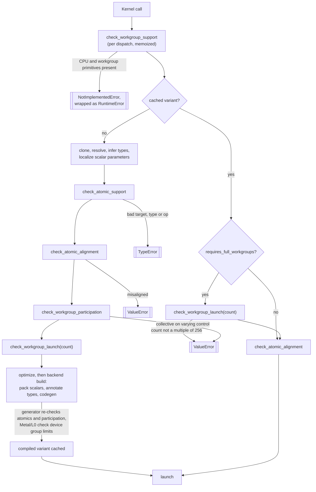

# Parallel Execution

This page describes how a Tack kernel executes in parallel: the single
top-level iteration space and how each backend maps it onto threads, the
rules for early exits, the workgroup model behind shared memory, barriers
and block reductions, and atomic field updates. For each it gives the
design rationale, the implementing functions, and the contract: what is
guaranteed, what the caller must ensure, and which exception is raised
where.

The normative text is in the [kernel language contract](../reference/language-contract.md),
sections [Execution and ordering](../reference/language-contract.md#execution-and-ordering),
[Workgroups and synchronization](../reference/language-contract.md#workgroups-and-synchronization)
and [Atomic field updates](../reference/language-contract.md#atomic-field-updates).
How the CPU decides between serial and threaded execution is a separate
page, [CPU Threading Policy](cpu-threading.md).

## The iteration space

### One top-level parallel loop

A kernel has exactly one top-level `for` loop over `range(...)` or
`tack.ndrange(...)`, a statement directly in the kernel body.
`KernelTransformer.visit_For` (`lang/ast_transform.py`) lowers the first
`for` it meets outside a loop through `_visit_parallel_for` to
`IRParallelFor`; every loop nested inside it becomes an `IRSequentialFor`.
Each parallel iteration owns its local variables. There is **no defined
order between iterations**, so a kernel must not let two iterations make
conflicting accesses to the same memory unless it uses an atomic or a
supported synchronization. Within one iteration, statements run in program
order and a load sees that iteration's earlier stores (LC1).

The frontend enforces the single loop while lowering, with a source
position. A kernel without a parallel loop raises `UnsupportedSyntaxError`
at its definition ("definition at line 1, column 1 has no parallel loop:
..."). A second top-level loop, or a loop inside a top-level `if` or
`while`, raises it at that loop ("for loop at line 4, column 5 is outside
the parallel loop. A kernel has one parallel loop, ..."). The IR verifier
(`lang/ir_verify.py`) checks the same invariant ("kernel must contain
exactly one top-level parallel loop") on every later stage, as a backstop
for passes rather than as the user's diagnostic. Multiple parallel phases
are written as separate kernels; since dispatch is synchronous, the second
kernel sees everything the first wrote.

**Why one loop.** A single flat index space is the one shape every backend
supports with no runtime machinery: a grid on a GPU, a range split into
chunks on the CPU. Multiple loops in one kernel would need either a global
barrier between them (which an ordinary GPU launch does not provide) or several
launches hidden behind one call, with the variant cache, scalar packing and
launch-size checks all made per phase.

### Normalizing the range

Every backend launches its grid over `[0, n)`, so the frontend rewrites any
other range into that form before code generation:

| Source | Lowered to |
|---|---|
| `for i in range(n)` | `ParallelFor i in [0, n)` |
| `for i in range(3, 7)` | `ParallelFor t in [0, 7 - 3)`; body starts with `i = 3 + t` |
| `for i in range(1, 8, 3)` | `ParallelFor t in [0, ((8 - 1) + (3 - 1)) // 3)`; body starts with `i = 1 + t * 3` |
| `for i, j in tack.ndrange(w, h)` | `ParallelFor t in [0, w * h)`; `i = t // h`, `j = t % h` |

The fresh index name comes from `fresh_name`, so it cannot collide with
user names. Moving the start into the body fixed LC5, where every backend
used only the end of the range and `range(3, 7)` wrote indices `0` to `6`.
An empty or reversed interval produces a count of zero or less, and nothing
runs: the GPU backends return before launching (CUDA rejects an empty
grid), and the CPU loop's signed comparison fails immediately. Literal zero
or negative steps are rejected by `lang/source_validation.py`; a dynamic
step must be positive, and that is a caller constraint.

### The launch count is evaluated per dispatch

The bound of the parallel loop never reaches generated code. Each backend's
kernel takes the count as a parameter (`__loop_end__` on CPU, `__n__` on
CUDA/HIP/OpenCL, the grid size on Metal), and
`kernel_utils._get_loop_range` evaluates the bound expression on the host
for every dispatch, in Python integers, through `_resolve_range_expr`. It
understands constants, scalar arguments, `x.shape[k]`, `len(x)` and `+`,
`-`, `*`, `//` on those; anything else raises `RuntimeError` ("Cannot
resolve loop range expression"). Because the bound is not compiled in, a
new array length reuses the compiled variant; see
[Specialization and Caching](specialization-and-caching.md).

### Mapping iterations to threads

| | CPU | Metal | CUDA / HIP | Level Zero |
|---|---|---|---|---|
| Kernel shape | function over `[__loop_start__, __loop_end__)`, called per chunk | one thread per iteration | one thread per iteration | one work-item per iteration |
| Index source | i64 loop variable | `uint [[thread_position_in_grid]]`, widened to `long` | `(long long)blockIdx.x * blockDim.x + threadIdx.x` | `(long)get_group_id(0) * (long)get_local_size(0) + (long)get_local_id(0)` |
| Group size | n/a | `min(maxTotalThreadsPerThreadgroup, 256)` | 256 | `min(256, maxGroupSizeX, maxTotalGroupSize)` |
| Launch | chunks on a thread pool, or serial | `dispatchThreads` with the exact count | `ceil(n / 256)` blocks | `ceil(n / group)` groups |
| Tail handling | loop condition | exact grid; final group may be smaller | `if (idx >= __n__) return;` | `if (idx >= __n__) return;` |
| Largest launch | no limit | 2^32 (`_MAX_LAUNCH`) | CUDA: max `gridDim.x` × 256; HIP: the same, capped at 2^32 − 256 | `maxGroupCountX` × group size |

Loop variables are 64-bit on every backend (`long long` for CUDA/HIP,
`long` for MSL and OpenCL, i64 in LLVM), so index arithmetic derived from
them does not overflow 32 bits for large fields. The thread index itself
must be formed at that width too. CUDA's `blockIdx.x`, `blockDim.x` and
`threadIdx.x` are 32-bit unsigned, so `CUDACodeGen._emit_parallel_for`
casts `blockIdx.x` to `long long` *before* the multiply; a 32-bit product
would wrap once a launch reached 2^32 threads, and those threads would
repeat the first iterations while the tail never ran. HIP inherits the
generator, and the native reduction kernels in `codegen/reductions.py` use
the same expression. OpenCL's `get_global_id` is declared `size_t`, but on
an Intel Data Center GPU Max 1100 (compute runtime 25.05, IGC 2.7.11) work
item 2^32 + k of a launch read k, with or without driver optimization: the
first 2^32 indices ran twice and the rest never. `OpenCLCodeGen` and the
OpenCL reduction kernel therefore build the index from `get_group_id(0)`,
which is not affected, widened before the multiply.

**Every iteration runs, or the launch is refused.** Each GPU backend's
`execute` calls `check_launch_size()` (`runtime/kernel_utils.py`) with the
iteration count before launching, and raises `ValueError` ("Kernel '`k`':
`N` iterations exceed the `M` that one CUDA launch can index; split the
work across several launches.") rather than letting a driver refuse the
grid with a bare error code or a narrowed count wrap. The limits in the
table above come from what each backend can index. CUDA's is its device's
maximum `gridDim.x` times 256. HIP's is the same, capped at 2^32 − 256,
because the AMD dispatch packet holds the total work-item count in 32 bits.
Level Zero's group count is a `uint32` that ctypes would truncate, so its
limit is `maxGroupCountX` times the group size. Metal's thread position is a
`uint`, so one dispatch indexes at most 2^32 threads.
`test_launch_limits.py` runs 2^32 + 256 iterations on CUDA and Level Zero
and checks that the last 256 run, and checks the refusal on HIP and Metal.

### Statements outside the parallel loop

Statements before or after the top-level loop are emitted outside it. On a
GPU every thread executes them; on the CPU they run once per call of the
compiled function, which is once per chunk, threading probe or timing
sample. They have no defined execution count, so they must be
unobservable however often they run. `KernelTransformer._visit_body` checks
each statement outside the loop after lowering it
(`_check_outside_parallel_loop`) and accepts only local assignments, field
loads, `tack.shared`/`tack.local_array` declarations and `thread_id()`
reads. A field or array store, an atomic, a barrier, a block reduction or a
`print` raises `UnsupportedSyntaxError` naming the construct and its line
and column ("store at line 2, column 5 is outside the parallel loop. ..."),
including inside top-level `if` and `while` statements.

The check runs on lowered IR rather than on the source AST, because device
functions and template methods are resolved and inlined only during
lowering, and effects also arrive through vector stores, tuple unpacking and
augmented stores. Nested and inlined bodies are checked first, so the error
names the innermost statement, in the device function or method where it
was written ("Device function '`bump`' (inlined into kernel '`k`'):
atomic_add() at line 3, column 5 ..."). The IR verifier rejects any
`IRFieldStore`, `IRAtomicOp`, `IRBlockReduce`, `IRBarrier` or `IRPrint`
outside the loop at every later stage.

Local assignments are not unobservable on their own. On the CPU a local
assigned before the loop and reassigned inside it would carry its value
from one iteration to the next within a chunk, where every GPU thread
starts afresh. `_localize_outer_scalars` (`runtime/kernel_utils.py`)
therefore gives every scalar parameter and outer local that the loop body
assigns a fresh per-iteration local seeded from the outer value, so each
iteration starts from the values the outer statements bound, on every
backend.

### Early exits

| Construct | Behavior | Rejected with |
|---|---|---|
| `continue` in the parallel loop | ends this iteration only (LC8) | |
| `continue` in a nested loop | next iteration of that loop | |
| `break` in a nested loop | leaves that loop | |
| `break` in the parallel loop | | `UnsupportedSyntaxError` |
| `return` in a kernel | | `UnsupportedSyntaxError` |
| `return` in a `@tack.func` | ends the function on that path | inside a loop: `UnsupportedSyntaxError` |

`UnsupportedSyntaxError` (`lang/source_validation.py`) derives from
`NotImplementedError` and names the kernel and the source line and column.
`Kernel.__call__` re-raises it unchanged.

**Why reject `break` from the parallel loop.** In Python, `break` stops a
loop after a prefix of its iterations. Parallel iterations have no order,
so there is no prefix to keep; any implementation would make the set of
completed iterations depend on scheduling. A kernel that wants to stop
early should test a condition at the top of the iteration and `continue`.

**Implementation of `continue`.** `_mark_outermost_continues` flags each
`continue` that belongs to the parallel loop (it descends into `if`
branches but not into nested loops). On CPU, `LLVMCodeGen._emit_parallel_for`
gives the loop a separate latch block, and `continue` branches to it, so the
header's phi always receives the incremented index. On GPU, the kernel body
*is* one iteration, so `CUDACodeGen._emit_stmt` and `MSLCodeGen._emit_stmt`
emit an outermost `continue` as `return;` (OpenCL inherits the CUDA
lowering).

### Evaluation order within an iteration

The frontend fixes evaluation order before any backend sees the code:
operands and arguments evaluate left to right, `and`/`or` and conditional
expressions short-circuit, an augmented assignment evaluates its index once,
and sequential `range` arguments are captured once before the loop. The
details are in [Compilation Pipeline](compilation-pipeline.md) and the
contract's [Execution and ordering](../reference/language-contract.md#execution-and-ordering)
section. They matter here because guarding an operation is how a kernel
stays inside a caller constraint (see
[Numerical Semantics](numerical-semantics.md#caller-constraints-and-no-portable-result))
and because a collective may not hide inside a short-circuited operand,
as described below.

## The workgroup model

Shared memory (`tack.shared`, `tack.shared_like`), `tack.barrier()`,
`tack.thread_id()` and the block reductions `tack.block_sum`, `block_min`
and `block_max` all assume that iterations are grouped into **workgroups**
whose lanes run concurrently and can wait for one another. GPU hardware
provides that; a CPU thread pool does not.

### Capability: `supports_workgroups`

`Backend.supports_workgroups` (`runtime/backend.py`) is `False` by default.
`MetalBackend`, `CUDABackend`, `HIPBackend` and `LevelZeroBackend` set it to
`True`; `CPUBackend` inherits `False`.

`workgroup_features` (`lang/workgroup_support.py`) walks the IR and collects
every primitive that needs the model: `shared`, `shared_like`, `barrier`,
`thread_id` and `block_<op>`. The walk is structural, so a primitive in an
unreachable branch or an inlined device function still counts.
`check_workgroup_support` raises `NotImplementedError` naming the kernel,
the backend and the primitives when the backend lacks the capability. It
runs at three points:

| Caller | When | Exception seen by the user |
|---|---|---|
| `resolve_variant` (`runtime/kernel_utils.py`) | every dispatch, before the cache lookup; features are memoized on the immutable IR template, so a warm dispatch does no new scan | `RuntimeError` ("Kernel 'k' failed on CPUBackend: ..."), because `Kernel.__call__` wraps `RuntimeError` subclasses, and `NotImplementedError` is one |
| `_prepare_ir` (`lang/inspect_kernel.py`) | every `tack.inspect` mode | `NotImplementedError` |
| `LLVMCodeGen.generate` | direct code generation, on fresh mutable IR | `NotImplementedError` |

Private scratch storage remains available on CPU through
`tack.local_array` and `tack.local_array_like`, which lower to a stack
allocation. Ordinary kernels, host field reductions and supported atomics
are unaffected.

**Why reject rather than emulate.** Before this check, the CPU lowering
turned barriers into no-ops, `thread_id()` into zero, block reductions into
the identity, and shared arrays into stack arrays. Kernels compiled and ran
but computed something else, and code that relied on it looked portable when
it was not: one example used `shared_like` for what was really per-lane
scratch, which on a GPU let lanes overwrite each other's values, and now
uses `local_array_like`. Real emulation means running 256 lanes of a group
cooperatively on one CPU thread, either as fibers or by splitting the
kernel at every barrier and carrying live values across the split. That is
a substantial compiler feature; until it exists, an honest error is
preferable to a wrong answer. The contract states plainly that no CPU
workgroup emulator is supplied.

### The 256-lane requirement

Barriers and block reductions (the *collectives*) require **complete
256-lane workgroups**. `WORKGROUP_SIZE = 256` lives in
`lang/workgroup_participation.py`. Shared memory and `thread_id()` without
a collective do not have this requirement, and those kernels keep partial
final groups and device-chosen smaller groups.

`requires_full_workgroups` reports whether a kernel contains any
`IRBarrier` or `IRBlockReduce`. `check_workgroup_launch` raises
`ValueError` when the selected group size is not 256 or when a positive
iteration count is not a multiple of 256. The count is the normalized one,
so `range(0, 1024, 2)` (512 iterations) passes and `ndrange(16, 16)` (256)
passes; zero or negative counts run nothing and pass.

| Check | Where |
|---|---|
| Cold dispatch: count, before optimization and compilation | `resolve_variant`, after `check_workgroup_participation` |
| Cached dispatch: count, without repeating any analysis | `resolve_variant`, from `KernelVariant.requires_full_workgroups` |
| Metal: the pipeline's thread limit admits 256 | `CompiledMetalKernel.__init__`, and again on every call |
| Level Zero: device X and total group limits admit 256 | `LevelZeroBackend._compile_kernel` before building, and `CompiledL0Kernel.__call__` |
| Inspection: count | `_prepare_ir` |
| CUDA/HIP: launch width | always 256 (`WORKGROUP_SIZE`), the width of the generated reduction tree |

**Why complete groups.** On CUDA, HIP and OpenCL, lanes past the end of the
range execute `if (idx >= __n__) return;` and never reach a later barrier,
and both the CUDA and OpenCL specifications require every lane of the group
to reach it. Metal instead launches a smaller final group, so a 256-entry
reduction tree would read lanes that do not exist. Automatic padding was
rejected because the padded lanes would execute the user's loop body for
indices past the end of the range, which the body does not guard against.

**Why a fixed 256.** The generated reduction tree is a fixed 256-entry
shared array halved from stride 128 down to 1, and the CUDA/HIP launch
width is the same constant, so the tree and the launch cannot disagree.
A per-device or user-chosen width would have to enter the variant key and
every tree. CUDA and HIP always launch 256-lane blocks; Metal and Level
Zero query their limits, and a pipeline or device that cannot run 256 lanes
is rejected rather than silently launching fewer lanes into a 256-entry
tree. The
contract calls the fixed width "Tack's implementation domain, not a
general hardware limit".

### Uniform participation

A barrier inside `if i % 2 == 0:` is reached by half the lanes of a group.
Tack therefore
requires that every collective sit on control flow that is **provably
uniform across the workgroup**, meaning that every lane of the group takes
the same path. Divergent participation can hang the group or leave shared
memory and reduction results undefined. The analysis is `_Uniformity` in
`lang/workgroup_participation.py`, entered through
`check_workgroup_participation`. It is conservative: it proves a restricted
domain and rejects everything else.

**Classifying values.** Each expression is *uniform* or *varying*:

| Uniform | Varying |
|---|---|
| constants and resolved dimension sizes | the parallel loop variable |
| scalar kernel parameters | `tack.thread_id()` |
| `x.shape[k]` and `len(x)` | field, local-array and shared-memory loads |
| loads from a packed scalar buffer (`_is_scalar_pack`) at a uniform index | texture samples |
| results of `block_sum`/`block_min`/`block_max` | anything computed from a varying value |
| operators, casts and calls whose operands are all uniform | |

**Propagating through statements.** `_Uniformity.body` walks statements
with an environment mapping each variable to uniform or varying and a flag
for whether the current control flow is uniform:

- An assignment makes its target uniform only if the value is uniform **and**
  the assignment executes under uniform control. Assigning a constant
  inside a lane-dependent branch makes the variable varying.
- An `if` analyzes both branches with `uniform and condition`, then joins the
  two environments: a variable is uniform afterward only if it is uniform in
  both branches.
- A `break`, `continue` or `return` under varying control is an *escape*.
  After the statement that contains it, the rest of the enclosing body is
  treated as varying, because some lanes have left.
- A `for` or `while` loop is iterated to a fixed point (`_Uniformity.loop`):
  the environment carried around the back edge is joined with the entry
  environment until nothing changes, so a condition that becomes varying in
  a later iteration is caught. The loop body is uniform only if the loop's
  bounds or condition are uniform and the body has no varying escape, so a
  varying `break` *after* a barrier still invalidates the barrier, because
  it changes which lanes run the next iteration. Escapes that leave only the
  loop do not propagate further; returns and parallel-loop `continue`s do.
- A collective reached while control is varying, or outside the parallel
  loop, fails.

The analysis runs on IR after device-function inlining and scalar-parameter
localization, so a barrier inside a `@tack.func` is checked in context.

**Accepted and rejected examples:**

```python
for i in range(n):
    s = tack.shared(tack.f32, 256)
    s[tack.thread_id()] = data[i]
    if n > 0:                      # scalar parameter: uniform
        tack.barrier()             # accepted
    total = tack.block_sum(data[i])
    if total > 0.0:                # collective result: uniform
        tack.barrier()             # accepted
    if data[i] > 0.0:              # varying, but contains no collective
        out[i] = s[0]
    tack.barrier()                 # accepted: control has reconverged
```

| Rejected pattern | Reason |
|---|---|
| `if i % 2 == 0: tack.barrier()` | lane-dependent condition |
| `for j in range(i % 3): tack.barrier()` | varying loop bound |
| `if data[0] > 0: tack.barrier()` | loads are varying, even from one element |
| `p = 1; if i % 2: p = 0` then `if p: tack.barrier()` | `p` is assigned under varying control |
| `if i % 2: continue` then `tack.barrier()` | some lanes have left the iteration |
| `if (i // 256) % 2 == 0: tack.barrier()` | uniform per group mathematically, but not provable |
| `x = tack.block_sum(v) if n > 0 else 0.0` | collective in a conditional-expression arm |
| `n > 0 and tack.block_sum(v) > 0` | collective in a later short-circuit operand |
| `while tack.block_sum(v) > j:` | collective in a `while` condition |

**Why `i // 256` is rejected.** With complete 256-lane groups, every lane of
one group has the same `i // 256`, so the branch is in fact uniform. Proving
it requires knowing how loop indices map onto groups, including after range
normalization (`i = start + t * step`) and `ndrange` flattening, and doing
arithmetic reasoning over the expression. The analysis deliberately tracks
only "derived from a lane value or not". It can be extended without changing
any accepted program. Until then, restructure so that every lane reaches
the collective: compute the lane's contribution under the condition, then
call the collective unconditionally.

**Why collectives may not appear inside expressions that skip evaluation.**
The C-family generators emit a block reduction as statements (the tree)
at the point the expression is rendered, and return the result variable.
Inside a conditional arm, a later `and`/`or` operand or a `while`
condition, those statements would run unconditionally, or only once, instead
of under the expression's guard. Rejecting them even for uniform predicates
keeps the generated code faithful; assign the reduction to a variable in an
ordinary statement first.

Failures raise `ValueError` with the kernel name, the primitive and an IR
path such as `body[0].body[0].then_body[0]`. Dispatch does not wrap
`ValueError`, so it reaches the caller as is.

### Where the checks run



The generators repeat the atomic and participation checks on the IR they
receive (`CUDACodeGen.generate`, `MSLCodeGen.generate`,
`OpenCLCodeGen.generate`, `LLVMCodeGen.generate`), because direct code
generation is a public tool that may be handed mutable IR; they never trust
annotations left by an earlier pass. Scalar packing runs between the two
checks, which is why packed buffers are marked `_is_scalar_pack`: their
loads must stay uniform for the generator's second check.

### Barrier and memory semantics

| Backend | `tack.barrier()` emits | Fences |
|---|---|---|
| CUDA / HIP | `__syncthreads();` | shared and global memory, for the block |
| Metal | <code>threadgroup_barrier(mem_flags::mem_threadgroup &#124; mem_flags::mem_device);</code> | threadgroup and device memory |
| Level Zero | <code>barrier(CLK_LOCAL_MEM_FENCE &#124; CLK_GLOBAL_MEM_FENCE);</code> | local and global memory |

A user barrier orders memory among the lanes of **one workgroup**: a value
one lane writes to shared memory or to a field before the barrier is
visible to the other lanes of its group after it. It is not a grid-wide
barrier; different workgroups are never synchronized inside a launch. The
barriers internal to block reductions fence only shared memory, which is all
the tree needs. Shared memory starts uninitialized, and bounds, races and
termination remain the kernel author's responsibility; the analysis above
proves participation only.

### Block reductions

`tack.block_sum(v)`, `block_min(v)` and `block_max(v)` combine one f32
value from each lane of the workgroup and give every lane the result.
`annotate_types` raises `TypeError` for non-f32 input (see
[Numerical Semantics](numerical-semantics.md#reductions)). The generators
(`CUDACodeGen._expr_block_reduce`, `MSLCodeGen._expr_block_reduce`,
`OpenCLCodeGen._expr_block_reduce_ocl`) emit a tree; abridged CUDA output,
with the combine step elided:

```c
__shared__ float __breduce_smem_0__[256];
int __breduce_tid_0__ = threadIdx.x;
__breduce_smem_0__[__breduce_tid_0__] = (float)(value);
__syncthreads();
for (int __s = 128; __s > 0; __s >>= 1) {
    if (__breduce_tid_0__ < __s) {
        __breduce_smem_0__[__breduce_tid_0__] = combine(...);
    }
    __syncthreads();
}
float __breduce_result_0__ = __breduce_smem_0__[0];
__syncthreads();
```

The final barrier, after every lane has read the result, protects against a
fast lane starting the next loop iteration and overwriting the shared array
before slower lanes have read it, so the caller needs no barrier of their
own. Extrema use the same NaN-propagating, order-independent combiner as
field reductions; sums may vary in low bits with the reduction order.

## Atomic field updates

`tack.atomic_add(field, index, value)`, `atomic_min` and `atomic_max` update
one element of a global field indivisibly. They are statements:
`lang/source_validation.py` rejects any use as an expression with
`UnsupportedSyntaxError`, and no previous value is returned.

### Per-backend domain

`Backend.supported_atomic_dtypes` is a derived property: the backend's entry
in `ATOMIC_DTYPES` (`lang/atomic_support.py`) intersected with its
`supported_dtypes`. All three operations share one domain per backend:

| Backend | Atomic field types |
|---|---|
| CPU | i8, u8, i16, u16, i32, u32, i64, u64, f32, f64 |
| CUDA, HIP | i32, u32, i64, u64, f32, f64 |
| Metal, Level Zero | i32, u32, f32 |

The domain is independent of `supports_workgroups`: atomics work on CPU, and
atomic-only kernels need neither complete groups nor uniform control.
Widths outside the domain are rejected even where ordinary fields of that
width work. Emulating an 8- or 16-bit atomic with a compare-and-swap on the
containing 32-bit word was rejected: it would atomically rewrite
neighboring elements that ordinary stores may be writing at the same time.
Portable code stays within i32, u32 and f32.

### Target tracing

`check_atomic_support` requires that the first argument resolve to exactly
one **global field parameter**. It records, for every name, the set of
places its value can come from: a parameter is its own source; an
assignment `g = f` copies `f`'s sources to `g`; any other assignment, a
loop variable, or a local or shared allocation adds an unknown source. The
copies are propagated to a fixed point, which follows the pointer copies
that device-function inlining introduces. The target is accepted only when
it has a single source, that source is a parameter, the parameter is a field
and it is not a texture. Local arrays, shared memory, textures, scalars, and
names that could refer to more than one field all raise `TypeError`
("requires a global field parameter target"). An unsupported operation or
element type also raises `TypeError`. The check sets each atomic node's
dtype from the parameter rather than trusting an earlier annotation.

It runs before optimization in `resolve_variant`, in every inspection mode,
and in every generator. The check is structural: an atomic in unreachable
code, or in a kernel launched with an empty range, is still checked.
`Kernel.__call__` re-raises `TypeError` with the kernel name prefixed.

### Alignment

An atomic target must be naturally aligned: 1, 2, 4 or 8 bytes for its
width. Fields Tack allocates always are; imported pointers
(`tack.field_from_ptr`, DLPack) need not be. `check_atomic_support` returns
`(parameter index, alignment)` pairs, which the variant stores as
`atomic_targets`. `check_atomic_alignment` checks each target's
`_buffer.address` before the cold compile and again on every cached
dispatch, without repeating the IR analysis, and raises `ValueError` before
any storage is touched. Ordinary loads and stores still accept unaligned
imported buffers.

### Ordering and scope

Updates to the same element are indivisible among all participants of the
launch: CPU worker threads, or all workgroups on the executing GPU. The
memory order is **relaxed**. An atomic is not a fence and cannot publish
other data: writing a result, then atomically setting a flag, does not make
the result visible to a reader that sees the flag. There is no system scope
spanning the host or other devices. Dispatch is synchronous, so the
supported way to consume a cross-workgroup result is to read it after the
kernel returns, from the host or from the next kernel. Floating `atomic_add`
rounds at the field's precision in an unspecified interleaving, so its
result is not bitwise reproducible.

The contributed value is converted to the field's dtype once, before the
read-modify-write; integer addition wraps; integer extrema compare with the
field's signedness. Floating atomic extrema are defined only for finite
values, including zeros (the sign of a zero tie is unspecified); NaN and
infinity are outside their domain. They do **not** inherit the stronger
NaN and signed-zero rules of field and block reductions.

### Lowering

| Backend | add | min / max | Notes |
|---|---|---|---|
| CPU (`LLVMCodeGen._emit_atomic_op`) | `atomicrmw add` / `fadd`, monotonic | integer: `atomicrmw min`/`max`, `umin`/`umax` for unsigned; floating: compare-and-swap loop | `_emit_atomic_float_minmax` loads the bits atomically, selects with an ordered compare, and retries `cmpxchg` on the integer bits |
| CUDA / HIP (`CUDACodeGen._emit_atomic_op`) | 32-bit: `atomicAdd`; 64-bit: CAS helper | i32/u32: `atomicMin`/`atomicMax`; f32: `atomicMinFloat`/`atomicMaxFloat` CAS with `fminf`/`fmaxf`; 64-bit: CAS helper | `cuda_atomic64_helpers` (`codegen/atomics.py`) implements every i64, u64 and f64 operation as a 64-bit integer CAS loop, so optional native f64-add and signed-i64 overloads are not needed |
| Metal (`MSLCodeGen._emit_atomic_op`) | `atomic_fetch_add_explicit` on `atomic_int`, `atomic_uint` or `atomic_float`, relaxed | integer: `atomic_fetch_min/max_explicit`; f32: CAS loop that exits early when no update is needed | f32 add uses `atomic_float` |
| Level Zero (`OpenCLCodeGen._emit_atomic_op`) | integer: `atomic_fetch_add_explicit`; f32: CAS loop | integer: `atomic_fetch_min/max_explicit`; f32: CAS with `fmin`/`fmax` | every operation is `memory_order_relaxed`, `memory_scope_device` |

Every compare-and-swap loop compares integer bit patterns (so a stored NaN
cannot make the comparison fail forever), starts from an atomic read rather
than an ordinary load that would race with writers, and captures the
contributed value once outside the retry loop, so the user's expression is
not re-evaluated.

**Why explicit device scope on OpenCL.** The legacy OpenCL `atomic_*`
functions guarantee only workgroup scope in the specification, which is not
enough for updates from different workgroups to the same element. The C11
`*_explicit` forms with `memory_scope_device` state the required scope;
the native field reduction's final combine uses them too.

## Exceptions summary

| Situation | Exception | Raised by |
|---|---|---|
| `break` in the parallel loop, `return` in a kernel, atomic or barrier used as a value | `UnsupportedSyntaxError` (a `NotImplementedError`) | `lang/source_validation.py` |
| No parallel loop, a second one, or one inside a top-level `if` or `while` | `UnsupportedSyntaxError` | `KernelTransformer._visit_parallel_for`, `visit_FunctionDef` |
| Store, atomic, barrier, block reduction or `print` outside the parallel loop | `UnsupportedSyntaxError` | `KernelTransformer._check_outside_parallel_loop` |
| Launch longer than one grid of the backend can index | `ValueError` | `check_launch_size` |
| Loop bound the host cannot evaluate | `RuntimeError` | `_resolve_range_expr` |
| Workgroup primitive on CPU | `RuntimeError` at dispatch; `NotImplementedError` from inspection and `LLVMCodeGen` | `check_workgroup_support` |
| Collective on control flow not proven uniform | `ValueError` | `check_workgroup_participation` |
| Partial group, or a device/pipeline that cannot run 256 lanes, with collectives | `ValueError` | `check_workgroup_launch` |
| `block_*` on a non-f32 value | `TypeError` | `annotate_types` |
| Atomic on an unsupported type, operation or target | `TypeError` | `check_atomic_support` |
| Misaligned atomic target | `ValueError` | `check_atomic_alignment` |

The capability attributes referenced on this page are collected, with the
rest of each backend's declared capabilities, in
[Backend Capabilities](../contracts/backend-capabilities.md). Tests:
`test_outside_parallel_loop.py` (effects outside the loop, directly and
through inlined functions and template methods, the one-loop rule, and
per-iteration outer locals), `test_launch_limits.py`,
`test_workgroup_contract.py` (CPU rejection in dispatch, every inspection
mode and direct LLVM, before any side effect), `test_workgroup_participation.py`
(every rejected pattern above on all four generators and on dispatch,
partial-group rejection cold and cached, stepped and `ndrange` counts,
Metal and Level Zero group-limit enforcement, repeated reductions in loops),
`test_block_reduce.py`, `test_shared_like.py`, and `test_atomic_contract.py`
(unsigned boundaries, wrapping, contended CPU workers, updates across groups
and tails, aliased and inlined targets, cached alignment checks, LLVM
verification and generated-source compilation), all in
`packages/tack-core/tests/`.
