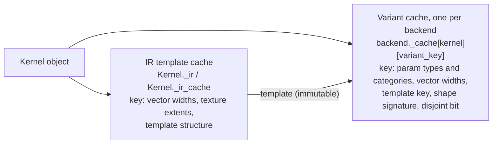

# Specialization and Caching

A Tack kernel is not compiled once. It is compiled once per **variant**: a
specialization for one combination of the facts that the compiler bakes
into generated code. This page defines what a variant is, lists exactly
what goes into its key and why, describes the cache that holds variants
and how long they live, and gives the user-facing consequences.

The governing requirement is in the contract's
[Specialization and compilation identity](../reference/language-contract.md#specialization-and-compilation-identity)
section: *reusing compiled code must have the same defined behavior as
compiling the current call independently.* Every fact baked into code or
its calling convention must therefore be part of the key. Conversely,
runtime scalar values and the outer launch length alone should not force a
recompile.

## What a variant is

`KernelVariant` in `packages/tack-core/src/tack/runtime/kernel_utils.py`
holds one compiled specialization:

| Attribute | Contents |
|-----------|----------|
| `ir` | the post-pass IR (before GPU scalar packing), kept so the launch range can be evaluated on every dispatch without rerunning passes |
| `payload` | whatever the backend's `build` callback returned: the JIT'd function on the CPU; the compiled kernel, `pack_info` and pack buffers on GPU |
| `requires_full_workgroups` | whether every launch must be a multiple of 256 lanes |
| `atomic_targets` | atomic parameter indices and their alignments, rechecked against each call's storage |

Variants are produced and looked up only by `resolve_variant()`, the
single entry point all five backends share. The
[Compilation Pipeline](compilation-pipeline.md) page describes the steps
that build one.

## Two caches, two keys

Specialization happens at two levels, because some facts change what the
*frontend* emits and others only change what the *passes* resolve.



| Cache | Owner | Key | Built by |
|-------|-------|-----|----------|
| IR template | `Kernel` (`lang/kernel.py`) | `Kernel._make_cache_key(vector_fields, template_args, texture_fields)`, or none at all for the plain `Kernel._ir` | template rewrite, source validation, AST transform, `verify_ir('lowered')` |
| Compiled variant | each backend instance (`backend._cache`) | `kernel_variant_key(...)` | clone, IR passes, verification, codegen, native compile |

Every input to the IR template key also reaches the variant key, either
directly (vector widths, template structure) or indirectly (texture
extents arrive as `_texture_shape` on the parameter and, through each
`IRTextureSample`, in the shape signature). Two calls that share a
variant therefore always share an IR template.

## The variant key, element by element

`kernel_variant_key(ir_func, kernel, vector_fields, template_args,
shape_sig, disjoint)` returns a five-tuple:

```python
(param_sig, vec_sig, tmpl_key, shape_sig, disjoint)
```

The kernel itself is not in the tuple: each kernel has its own slot in the
cache (see [below](#cache-structure-and-lifetime)).

### `param_sig`: types and categories

One entry per IR parameter, computed in a single pass because it runs on
every dispatch:

```python
(p.type_annotation, p._is_field, p._is_texture, p._texture_shape)
```

These come from `infer_param_types` (`lang/type_inference.py`) and the
backend's `store_texture_shapes`, run on a private `_KeyProbe` rather than
on the shared template (see [Concurrency](#concurrency)).

| Component | Values | What it bakes in |
|-----------|--------|------------------|
| `type_annotation` | a field's dtype; for a Python `int`/`np.integer`, `i32`, `i64` or `u64` chosen by `integer_type_for_value` from the *value*; for a `float`/`np.floating`, `f32`, or `f64` when any field argument is `f64` | every expression's type, the arithmetic emitted, the C/LLVM parameter type, the pack buffer an argument lands in |
| `_is_field` | field (or texture) versus scalar | the calling convention: pointer versus value on the CPU; buffer binding versus packed scalar on GPU |
| `_is_texture` | hardware texture versus not | sampler code versus loads; HIP and Level Zero set it to `False` to choose software sampling when the device has no image support or the extent exceeds its 3-D image limit |
| `_texture_shape` | `Texture3D.shape_3d` | the extents used in sampling code |

### `vec_sig`: vector widths

`tuple(sorted(vector_fields.items()))`: the component count of each
`tack.Vector.field` argument. Width determines how many component loads
the frontend emits and the stride between vectors, so two widths need two
lowerings and two compiled kernels. Leaving width out of the key once let a
width-2 variant serve a width-3 call and return wrong norms; that is
contract regression **LC3**.

### `tmpl_key`: template structure and constants

For calls with `@tack.data_oriented` arguments, `Kernel._make_cache_key`
contributes one part per template parameter:

```python
("tmpl_<index>",
 _ClassToken,                                   # identity of the class
 ((name, type(v), bits_or_value), ...),         # class-level constants
 ((name, dtype, shape, vector_n), ...),         # field attributes
 (runtime_attr_name, ...))                      # instance scalar names
```

(plus a leading `("vec", …)` part when vector fields are present).

- **Class identity.** Two classes with the same name can have different
  methods, so the actual class is keyed, through a `_ClassToken` (below)
  rather than the class object itself.
- **Constants.** Class-level numeric attributes are inlined as literals,
  so their values belong in the key. Each is stored with its Python type
  (`1` and `1.0` lower differently). Floats are stored as their
  `struct.pack('!d', v)` bit pattern, which distinguishes `0.0` from
  `-0.0` and gives NaN a key equal to itself despite `NaN != NaN`. An
  instance attribute that shadows a class attribute keeps the constant
  role, with the instance's value.
- **Field attributes.** Their dtype, full shape and vector width.
- **Runtime scalar names.** Instance scalars are runtime parameters, so
  their *values* are not keyed. Their *names* are, because adding or
  removing one changes the parameter layout.

!!! note
    Template field attributes are keyed by their full shape, which is
    stricter than plain field arguments (those specialize only on the
    dimensions in the shape signature). Changing the length of a template's
    field therefore lowers a new IR template and compiles a new variant even
    when no dimension is baked in. This over-specializes, which is safe; it
    is a cost, not a correctness issue.

### `shape_sig`: dimensions baked into code

`resolve_ir` substitutes field dimensions as literals: `a[i, j]` becomes
`i * 8 + j` when `a.shape[1] == 8`. That literal is part of the compiled
code's identity. `shape_signature(template, name_to_field)` reports
exactly the dimensions a kernel bakes in, as a tuple of concrete sizes.

It is built from `ir_shape_deps(ir_func)`, which scans the template once
and memoizes the result on it as `_shape_deps` (it depends on the source,
not on the arguments):

- `_dependent_nodes` yields every node whose value reaches generated code,
  **skipping the parallel loop's `end`**.
- Each `IRDimSize(field, d)` contributes `(field, d)`. The field name is
  mapped through `_static_field_aliases`, which follows the
  `__<func>_<param>_<N>__ = param` copies that `@tack.func` inlining creates.
- Each `IRTextureSample` contributes all three dimensions of its texture.

`shape_signature` then looks up each `(name, d)` in this call's arguments,
using `shape_3d` for textures, `_logical_shape` for vector fields and
`shape` otherwise. A kernel with no baked-in dimensions gets the empty
tuple, so the common 1-D kernel pays nothing for shape keying.

**Why the parallel loop's end is excluded.** It never reaches generated
code. Code generators read it from the `__loop_end__` parameter, and
`_get_loop_range` evaluates it against the arguments on every dispatch.
`resolve_ir` leaves it unresolved for the same reason. Without the
exclusion, `for i in range(x.shape[0])`, the most common line in any
kernel, would compile a new variant for every array length.

| Kernel line | Baked-in dimensions |
|-------------|---------------------|
| `for i in range(x.shape[0]): out[i] = x[i] * 2` | none |
| `for i in range(1, x.shape[0] - 1): …x[i-1] + x[i+1]…` | none (the start moves into the body as a constant) |
| `out[i] = x[x.shape[0] - 1 - i]` | `x.shape[0]` |
| `for i, j in tack.ndrange(a.shape[0], a.shape[1]): out[i, j] = a[i, j]` | `a.shape[1]`, `out.shape[1]` (the row count only sets the launch) |
| `v = tex.sample(u, v, w)` | all three extents of `tex` |

### `disjoint`: the CPU no-overlap bit

Fields may share storage: the same field passed twice, two views of one
allocation, or imported pointers. Generated code therefore never promises
`noalias`/`restrict` unconditionally (contract regression **LC2**; see
[Memory and Aliasing](memory-and-aliasing.md)). Without that promise,
though, LLVM must reload after every store and cannot vectorize a loop
that accumulates through a field.

The CPU backend recovers that case with a second variant. It calls
`resolve_variant(..., specialize_disjoint=True)` (the module constant
`_SPECIALIZE_DISJOINT` in `runtime/cpu.py`), and on every dispatch
`fields_disjoint(template, effective_args)` decides whether this call
qualifies:

1. `written_field_params(template)` finds the field parameters the kernel
   may store to, directly, atomically, or through `@tack.func` pointer
   copies, by a fixed point over name copies. If a store goes through a
   name it cannot trace back to a parameter or a local allocation, it
   returns `None` and every field counts as written. The result, and a
   per-parameter flag tuple, are memoized on the template.
2. Each field argument's byte range comes from its buffer's `span`
   (`NumpyBuffer.span`, cached per array). A buffer without a `span` makes
   the answer `False`.
3. The call qualifies when no written range overlaps any other field's
   range. Read-only fields may overlap each other freely: `dot(x, x)` still
   qualifies.

The answer is the last key element and is stored on the variant's IR as
`disjoint_fields`. `LLVMCodeGen` then adds `noalias` to field parameters
only in that variant. Both variants must agree on every race-free program,
so overlapping and non-overlapping calls of one kernel each get correct
code; a kernel that is sometimes called with aliased fields simply has two
variants. GPU backends never pass `specialize_disjoint`, so for them the
element is always `False`.

The check costs a little on every CPU dispatch. Whether that pays for
itself depends on the host and the kernel; the tradeoff is discussed in
[Memory and Aliasing](memory-and-aliasing.md).

## What is deliberately not in the key

| Not keyed | Why that is safe |
|-----------|------------------|
| Scalar argument values (within one inferred type) | scalars are runtime parameters; on GPU they are rewritten into the pack buffers on each dispatch |
| The outer launch length | read from `__loop_end__`, evaluated per dispatch |
| Template instance scalar values | runtime parameters; only their names are keyed |
| Field contents and addresses | never baked in; the only address-derived fact is the CPU `disjoint` bit |
| The kernel's name | each `Kernel` object has its own cache slot |
| The backend | each backend instance has its own cache |
| A floating-point math mode | there is one fixed policy (see [Numerical Semantics](numerical-semantics.md)); a selectable mode would have to join the key |
| Device-function bindings | consulted only when an IR template is built; rebinding afterwards is unsupported, so recreate the kernel |

## Cache structure and lifetime

Each backend creates its cache in `__init__` with `new_kernel_cache()`:

```python
backend._cache: WeakKeyDictionary[Kernel, dict[variant_key, KernelVariant]]
```

`kernel_cache_slot(cache, kernel)` returns, or creates, the kernel's inner
dictionary.

**Keyed on the `Kernel` object, held weakly.** An earlier cache was keyed
on `id(kernel)`. A garbage-collected kernel frees its address, and a new
kernel allocated there with the same name and argument types silently ran
the old kernel's code. Keying on the object removes that hazard, and
holding it weakly releases compiled code and its device modules when the
kernel goes away. Most kernels are module-level objects that live as long
as the process, and so do their variants.

**One cache per backend instance.** `tack.init()` constructs a new backend
with a new, empty cache. Variants compiled before the switch stay with the
old backend object, and fields allocated by the old backend are rejected
with a `RuntimeError` when dispatched on the new one.

**Every cache is registered.** `new_kernel_cache` appends a weak reference
to the module-level `_kernel_caches` list. `drop_variants(kernel, is_stale)`
walks every live cache, not only the active backend's, which matters for
template-class retirement.

### Template-class lifetime: `_ClassToken`

Keying a variant on a template class object would keep the class alive as
long as the kernel. A class defined inside a function and created on every
call would then leave one IR template and one variant behind per call,
forever. Instead, `lang/kernel.py` keys on a `_ClassToken`:

- `_class_token(cls)` returns the class's token from `_class_tokens`, a
  `WeakKeyDictionary` from class to token, creating it on first use and
  registering `weakref.finalize(cls, _retire_class, token)`.
- Each token records the kernels specialized on it (`token.kernels`, a
  `WeakSet`).
- When the class is collected, `_retire_class` removes every IR template
  in those kernels' `_ir_cache` whose key names the token, and calls
  `drop_variants` to remove every variant whose template key (the third
  key element) names it, in every live backend cache.

The token provides identity without a strong reference: distinct classes
never share a variant, and a collected class takes its specializations with
it.

## Concurrency

The warm path takes no lock: the IR template lookup and the variant lookup
are dictionary reads.

- **IR templates** are built under `_transform_lock` with a re-check, so a
  template is lowered once even when several threads miss together.
- **Key derivation** writes argument types onto a per-dispatch `_KeyProbe`
  rather than the shared template, so concurrent dispatches with different
  dtypes cannot read each other's annotations.
- **Variant construction** is not locked. Two threads that miss on the
  same key both build. `kernel_cache_slot` uses `setdefault`, so neither
  replaces the other's slot dictionary, and the second `slot[key] = variant`
  overwrites the first. Each thread returns the variant it built, and both
  are correct, so the only cost is a duplicate compile.

## Hit versus miss

| Step | Hit | Miss |
|------|:---:|:----:|
| classify arguments (templates, vectors, textures) | ✓ | ✓ |
| IR template lookup (a template key is built for template/vector/texture calls) | ✓ | ✓ |
| `check_workgroup_support` (memoized on the template on the CPU, immediate on GPU) | ✓ | ✓ |
| type inference on the `_KeyProbe`, `shape_signature`, `fields_disjoint` (CPU) | ✓ | ✓ |
| build the key, look up the variant | ✓ | ✓ |
| `clone_ir`, resolve, infer, check, localize, atomic/workgroup analysis, optimize | | ✓ |
| `verify_ir` at each boundary | | ✓ |
| GPU clone and scalar packing, `annotate_types`, codegen, native compile | | ✓ |
| `check_workgroup_launch` (collective kernels), `check_atomic_alignment` | ✓ | ✓ |
| evaluate the launch range, update pack buffers (GPU), launch | ✓ | ✓ |

A hit clones nothing, runs no passes and performs no verification. The
memoized template facts (`_shape_deps`, `_written_flags`,
`_workgroup_features`) keep the remaining per-dispatch work proportional to
the parameter count rather than to the kernel's size.

## The correctness argument

The design rests on one rule: **anything a pass or code generator bakes
into the compiled code must be named by the key.** Leaving something out
causes silent wrong numbers, while keying too much only costs compile time.
The table pairs each baked-in fact with the key element that names it:

| Baked into the variant | By | Named by |
|------------------------|----|----------|
| parameter types, expression types, pack layout | inference, annotation, packing | `param_sig[*].type_annotation` |
| pointer versus value calling convention | codegen, packing | `param_sig[*]._is_field` |
| sampler versus software sampling, texture extents | codegen, `store_texture_shapes` | `param_sig[*]._is_texture`, `_texture_shape`, `shape_sig` |
| vector scalarization | AST transform | `vec_sig` (and the IR template key) |
| inlined template methods, class constants, template parameter layout | template rewrite | `tmpl_key` |
| dimension literals in index arithmetic and loops | `resolve_ir` | `shape_sig` |
| `noalias` on field pointers | `LLVMCodeGen` | `disjoint` |
| everything derived from the source | all stages | the per-kernel slot |

This rule has been learned the hard way. The cache was once keyed on
`id(kernel)` (reused addresses ran another kernel's code); then on types
alone (a new row stride reused code with the old stride baked in); then
without vector widths (**LC3**). Each was a silent wrong-numbers bug. The
regression tests for this area are in
`packages/tack-core/tests/test_variant_cache.py`, `test_kernel_cache.py`,
`test_field_shape.py` and `test_disjoint_fields.py`.

## Worked examples

The variant counts below were observed on the CPU backend at this release
by inspecting `backend._cache[kernel]` after each call, starting from an
empty cache. All fields are `f32` unless noted. The disjoint bit is `True`
for every call except the aliased one.

```python
@tack.kernel
def scale(x, out, a):
    for i in range(x.shape[0]):
        out[i] = x[i] * a
```

| Call | Variants | Why |
|------|:-------:|-----|
| `scale(x8, o8, 2.0)`, then lengths 16 and 32 | 1 | the only dimension is the launch bound |
| `scale(x8, o8, 3.5)` | 1 | a new scalar value is a runtime argument |
| `scale(x8, o8, 3)` | 2 | `int` infers `i32`, not `f32` |
| `scale(x8, o8, 2**40)` | 3 | beyond the `i32` range, so `i64` |
| `scale(x8_f64, o8_f64, 2.0)` | 4 | new field dtype, and the float scalar becomes `f64` |
| `scale(x, x, 2.0)` | 5 | the written field overlaps another field, so the disjoint bit is `False` |

| Kernel | Calls | Variants |
|--------|-------|:-------:|
| `out[i] = x[x.shape[0] - 1 - i]` | lengths 8, 16, 32 | 3 |
| the same with `n` passed as a scalar: `out[i] = x[n - 1 - i]` | lengths 8, 16, 32 | 1 |
| `tack.ndrange(a.shape[0], a.shape[1])` over 2-D fields | shapes `(4, 8)`, `(16, 8)`, `(4, 9)` | 2 |
| `range(1, x.shape[0] - 1)` stencil | lengths 8, 16, 32 | 1 |
| `out[i] = v[i].dot(v[i])` with `tack.Vector.field` | widths 2, then 3 | 2 (and 2 IR templates) |

For a `@tack.data_oriented` class with a class constant `factor`, an
instance scalar `offset` and an instance field `data`:

| Call | Variants | IR templates | Why |
|------|:-------:|:------------:|-----|
| first call | 1 | 1 | |
| new `offset` value | 1 | 1 | instance scalars are runtime parameters |
| `data` of a different length | 2 | 2 | template field shapes are keyed |
| `s.factor = 3.0` on the instance | 3 | 3 | it shadows a class constant, so it stays a constant |
| an equivalent class defined inside a function | 4 | 4 | different class identity |
| ... after that class is garbage-collected | 3 | 3 | `_retire_class` dropped its specializations |

## Costs and advice

Variants multiply: every distinct combination of dtypes, scalar types,
vector widths, baked-in dimensions, template constants and (on the CPU)
aliasing produces its own compile. Each cold compile pays for cloning,
the pass pipeline, verification at every boundary, code generation and
the native compiler. The first call of a large kernel is noticeably slower
than a warm one, and a workload that keeps producing new variants never
reaches the warm path.

To keep the number of variants down:

- **Pass lengths as scalars** when a dimension would otherwise appear
  inside the body. `def reverse(x, out, n)` compiles once; reading
  `x.shape[0]` in the index compiles once per length. Dimensions that
  appear only in the outermost `range` never specialize.
- **Keep scalar types stable.** Integer scalars are typed by value: a
  value that crosses the `i32` range selects a new `i64` variant. Float
  scalars follow the precision of the field arguments.
- **Use instance attributes for values that change, class attributes for
  true constants.** Class constants are baked in, and each new value
  compiles a new variant.
- **Define `@tack.data_oriented` classes once, at module level.** A class
  defined per call is a new identity each time. Its variants are released
  when it is collected, but each call still pays a cold compile.
- **Expect re-specialization when a template's field changes shape.** Its
  full shape is part of the template key.

Specializing on baked-in dimensions is usually worth it: a known row
stride lets LLVM and the vendor compilers fold and vectorize around it.
The advice above is for the cases where the set of shapes is open-ended.

## Related pages

- [Compilation Pipeline](compilation-pipeline.md): what runs on a miss.
- [Memory and Aliasing](memory-and-aliasing.md): the overlap policy behind
  the disjoint bit.
- [Principles](principles.md): specialization over generality, and its
  costs.
- [Template System](../developers-guide/07-templates.md): how templates
  are rewritten.
