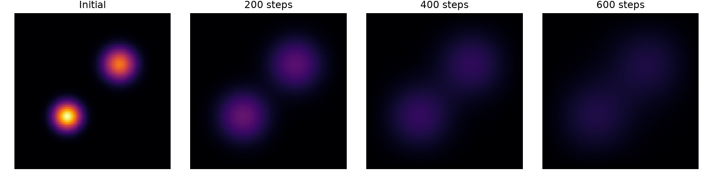
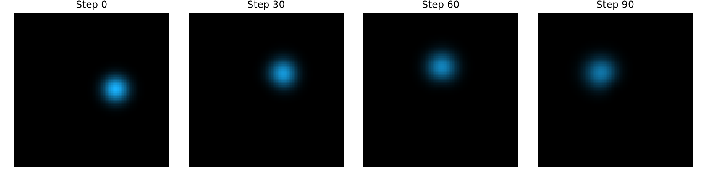
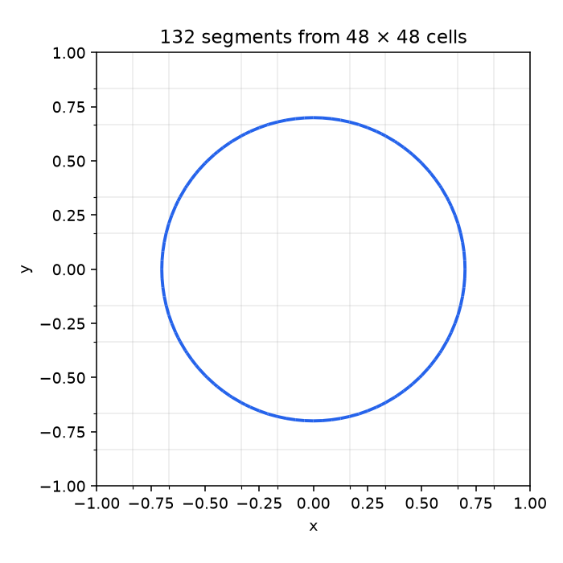
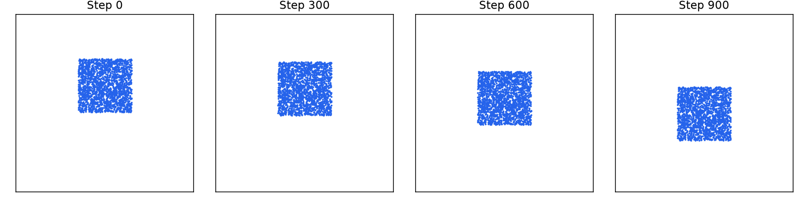
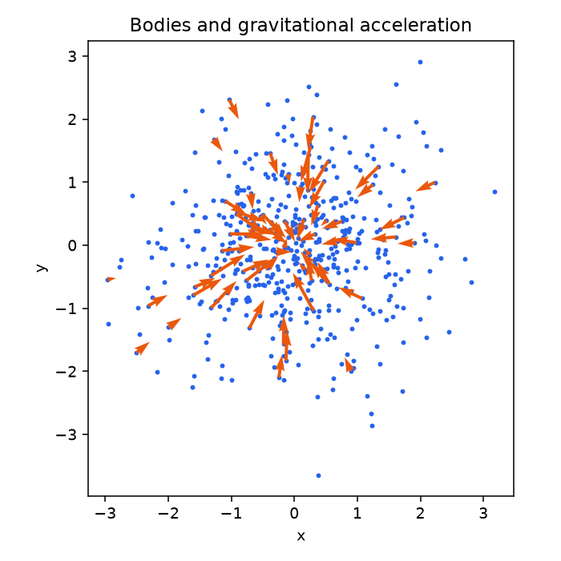
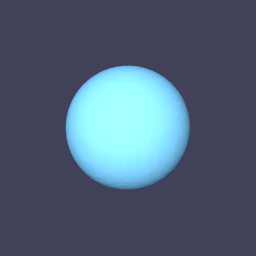

# Worked examples

These examples develop a complete application from its data layout to the host
loop and a check of the result. Start with heat diffusion, then choose the subject
that interests you. Every script is included below its explanation and available
as a download; it needs no separate examples repository.

The scripts target the current Tack checkout. They use NumPy and the selected
backend, with Matplotlib needed only for `--output`. Install from source as in
[Getting Started](../01-getting-started.md), then run from the repository root:

```bash
uv run python docs/examples/heat.py --arch cpu --check
uv run --with matplotlib python docs/examples/heat.py --output heat.png
```

With an installed Tack environment, download a script and use `python heat.py`.
Install Matplotlib separately if you want its figure. `--check` uses smaller
inputs and checks a numerical reference or independent properties; it is not
a performance benchmark. `--arch` requires the named backend to initialize.

| Example | What you will learn | Prerequisites |
|---|---|---|
| [Heat diffusion](heat.md) | Stencils, boundaries, two buffers, host timesteps | Fields and kernels |
| [Advecting dye](dye.md) | Vector fields, interpolation, device functions | Vectors and loops |
| [Trail-following agents](physarum.md) | Random state, templates, scatter and diffusion | Vectors and atomics |
| [Marching squares](contours.md) | Count, scan, allocation and ordered output | Local arrays and scans |
| [Particle-to-grid simulation](mpm.md) | Matrix fields, interpolation and atomic scatter | Vectors, matrices and atomics |
| [Tiled N-body forces](nbody.md) | Shared memory and barriers, with a CPU path | Sequential loops and workgroups |
| [Isosurface to image](isosurface.md) | Connect compute, visualization and rendering | Fields and templates |

## Images from the examples

[](heat.md)

[](dye.md)

[](physarum.md)

[](contours.md)

[](mpm.md)

[](nbody.md)

[](isosurface.md)

These figures were generated by running the scripts on CPU. GPU results may
differ in low floating-point bits, random-direction transcendental rounding, or
long simulation trajectories. See [Numerical checks](../15-debugging-and-timing.md#choose-a-tolerance-for-the-computation).

## Origins and licenses

The heat and isosurface examples adapt existing Tack examples. Dye, Physarum,
marching squares and MPM adapt public Taichi examples; N-body adapts NVIDIA Warp's
tile example. Each page links to the original source and explains the teaching
changes. The adapted Taichi and Warp scripts retain Apache-2.0; other scripts
use Tack's BSD-3-Clause license. See the [notices](../../examples/NOTICE.txt) and
[Apache license text](../../examples/LICENSE-APACHE-2.0.txt).
