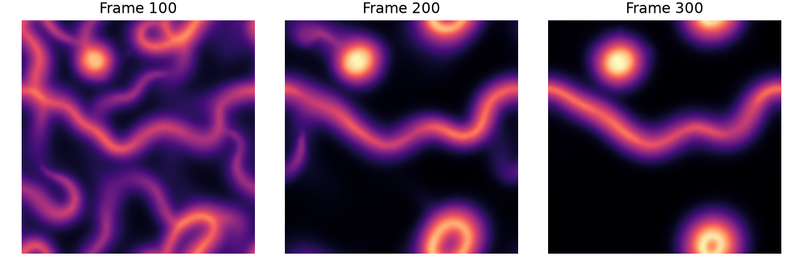

# Agents that follow a trail

Agents sense a trail, turn toward a stronger signal, move, and deposit more of
the trail. A diffusion step spreads and evaporates it. Simple local rules form
visible paths, while the implementation brings together templates, random state,
atomics and separate simulation stages.



**Origin:** adapted from [Taichi's Physarum example](https://github.com/taichi-dev/taichi/blob/master/python/taichi/examples/simulation/physarum.py),
Copyright © The Taichi Authors, Apache-2.0. Taichi credits
[Sage Jenson's Physarum work](https://sagejenson.com/physarum) for the model and
visual inspiration. This teaching version changes the steering parameters and
turn rule, separates the stages, and uses Tack's explicit random state. It is
a procedural agent model inspired by trail formation, not a biological solver.

## Put related state in a class

`Agents` owns a position vector and a heading scalar for each agent. Its class
constants describe how far and at what angles agents look. Its instance values
describe this particular simulation:

```python
--8<-- "docs/examples/physarum.py:model"
```

The initialization kernel is a method. `random.seed(i, 0)` gives each agent its
own stream; each draw returns a value and the next state. Reusing the same seed
would repeat the sequence. The sensing helper wraps cell indices modulo the
grid size, making the domain periodic.

## Keep sensing separate from depositing

The move kernel reads a completed trail. The deposit kernel then adds one unit
at each agent's new cell. Several agents may land in the same cell, so this is a
scatter and requires `atomic_add`. Diffusion gathers a 3×3 neighbourhood into
a separate output buffer:

```python
--8<-- "docs/examples/physarum.py:move"
```

Combining sensing and deposition in one launch would let the sensed trail
depend on which agents had already deposited. Keeping the calls separate gives
the stages a defined ordering. The vector position update wraps in floating
coordinates; the subsequent integer cell index is therefore within the grid.

The host coordinates the stages:

```python
--8<-- "docs/examples/physarum.py:loop"
```

Here `expected_mass` is diagnostic host state. It predicts the total trail after
adding one deposit per agent and multiplying by the evaporation factor.

## Run and validate

```bash
uv run python docs/examples/physarum.py --check
uv run --with matplotlib python docs/examples/physarum.py --output physarum.png
```

The check verifies that positions remain in the periodic domain, values remain
finite and nonnegative, and total trail matches the independent recurrence
`M_next = (M + number_of_agents) * evaporation`. It does not demand bitwise
identical long trajectories: sensing decisions can amplify small differences.

The figure uses `log1p(trail)` with a common colour scale to reveal both weak
and strong trails. Try changing sensing distance or evaporation while holding
initialization fixed. Increase particle count and watch for atomic contention;
time the stages individually before choosing an optimization.

## Complete program

[Download physarum.py](../../examples/physarum.py). The adapted code is
[Apache-2.0 licensed](../../examples/LICENSE-APACHE-2.0.txt).

```python
--8<-- "docs/examples/physarum.py"
```
